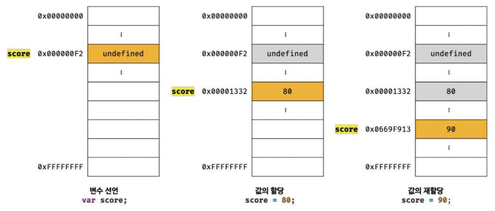
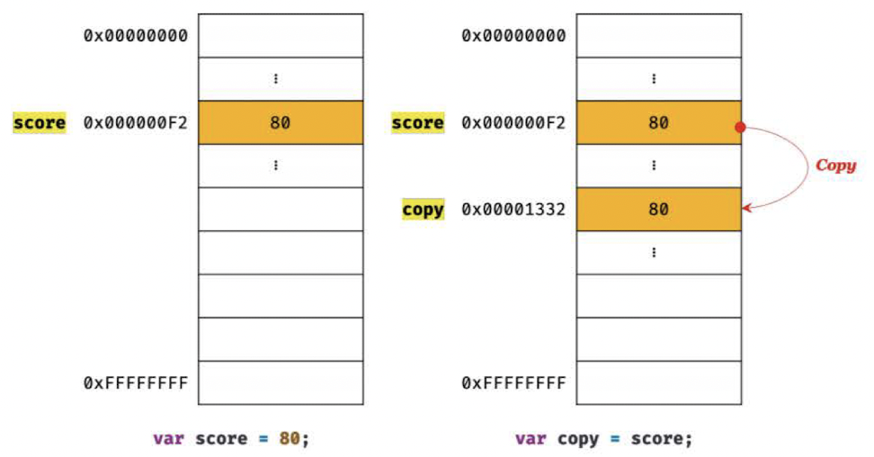
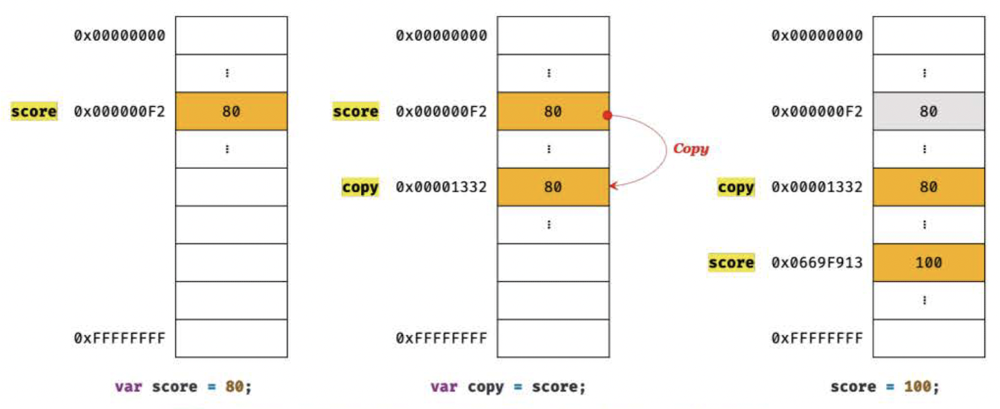
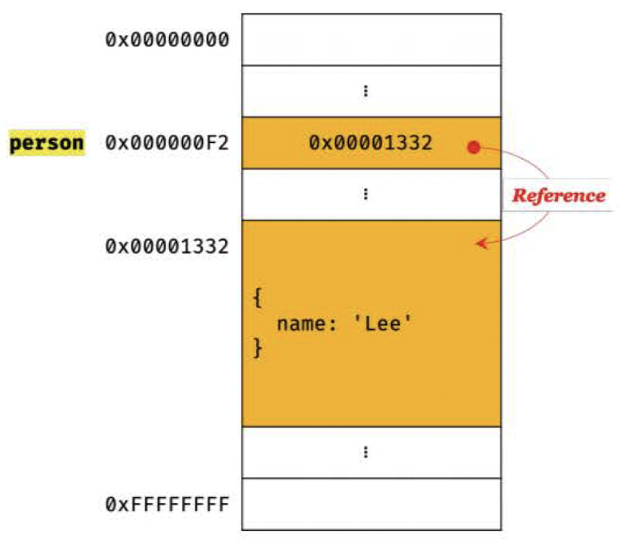
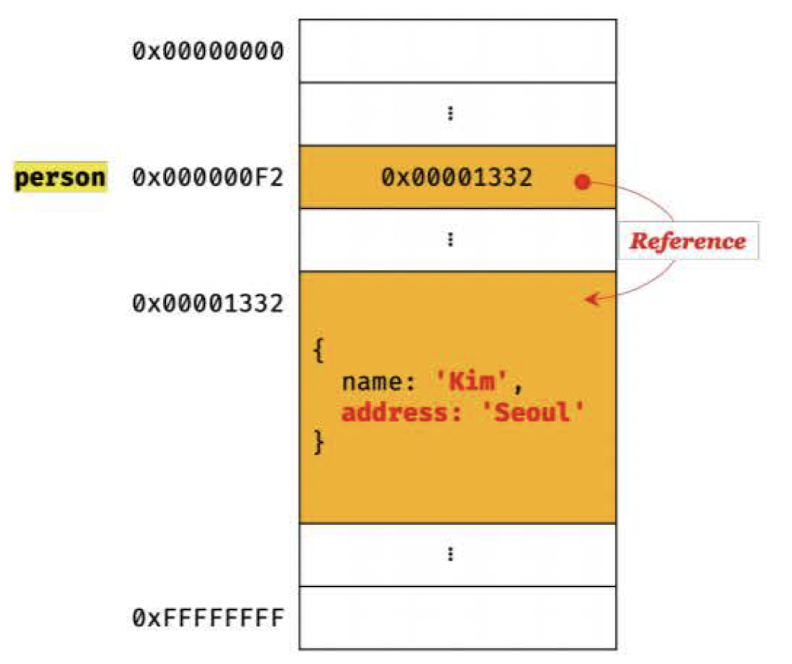

# 11장 원시 값과 객체의 비교

- 자바스크립트의 데이터 타입은 6가지 원시 타입(숫자, 문자열, 불리언, undefined, null, 심벌)과 객체(참조) 타입으로 구분할 수 있다.

- 원시타입과 객체(참조) 타입은 크게 세 가지 측면에서 다르다.

  1. 원시 타입의 값(원시 값)은 변경 불가능한 값이다. 이에 비해 객체 타입의 값(객체)은 변경 가능한 값이다.
  2. 원시 값을 변수에 할당하면 변수(확보된 메모리 공간)에는 실제 값이 저장된다. 이에 비해 객체를 변수에 할당하면 변수에는 참조 값이 저장된다.
  3. 원시 값을 갖는 변수를 다른 변수에 할당하면 원본의 원시 값이 복사되어 전달된다.(값에 의한 전달) 이에 비해, 객체를 가리키는 변수를 다른 변수에 할당하면 원본의 참조 값이 복사되어 전달된다.(참조에 의한 전달)

- **변수**는 '하나의 값을 저장하기 위해 확보한 메모리 공간 자체' 혹은 '그 메모리 공간을 식별하기 위해 붙인 이름'
- **값**은 '변수에 저장된 데이터'로서 '표현식이 평가되어 생성된 결과'

<br>

---

<br>

## 11.1 원시 값

### 11.1.1 변경 불가능한 값

- 값의 **"불변성(immutability)"**: 원시 타입의 값(원시 값)은 변경 불가능한 값(immutable value)이다.(한 번 생성된 원시 값은 읽기 전용 값으로서 변경할 수 없다.)

```javascript
var score;

score = 80;
score = 90;
```



- 변수가 참조하던 메모리 공간의 주소가 변경된 이유는 변수에 할당된 원시 값이 변경 불가능한 값이기 때문이다.
- 변수 값을 변경하기 위해 원시 값을 재할당하면 새로운 메모리 공간을 확보하고 재할당한 값을 저장한 후, 변수가 참조하던 메모리 공간의 주소를 변경한다.
- 불변성을 갖는 원시 값을 할당한 변수는 **재할당 이외에 변수 값을 변경할 수 있는 방법이 없다**. (변수 값을 변경할 수 있다면, 예기치 않은 값의 변경, 상태 변경을 추적하기 어렵기 때문.)

### 11.1.2 문자열과 불변성

- 유사 배열 객체(array-like object)
  - 배열처럼 인덱스로 프로퍼티 값에 접근할 수 있고, length 프로퍼티를 갖는 객체이다.
  - **문자열**은 배열처럼 인덱스를 통해 각 문자에 접근 가능하고, length 프로퍼티를 가지므로 **유사 배열 객체**이다. 또한 for문으로 순회할 수 있다.

```javascript
var str = "string";

console.log(str[0]); // s
console.log(str.length); // 6
console.log(str.toUpperCase()); // STRING

console.log(str); // string
```

**문자열은 변경 불가능한, 읽기 전용 원시 값**이기 때문에 변경할 수 없다. 예기치 못한 변경으로부터 자유롭기 때문에 신뢰성을 보장한다. 변수에 새로운 문자열을 **재할당하는 것은 가능**하다.

### 11.1.3 값에 의한 전달

```javascript
var score = 80;
var copy = score;

console.log(score); // 80
console.log(copy); // 80
console.log(score === copy); // true

score = 100;

console.log(score); // 100
console.log(copy); // 80
console.log(score === copy); // false
```

- **값에 의한 전달**: 변수에 원시 값을 갖는 변수를 할당하면, 할당받는 변수(copy)에는 할당되는 변수(score)의 원시 값 80이 복사되어 전달된다.
- score 변수와 copy 변수의 값 80은 **다른 메모리 공간에 저장된 별개의 값**이다. score 변수의 값을 변경해도 copy 변수의 값에는 어떠한 영향도 주지 않는다.





- 변수에는 값이 전달되는 것이 아니라 메모리 주소가 전달된다! 변수와 같은 식별자는 값이 아니라 메모리 주소를 기억하는 것! **식별자**는 값이 아닌 **메모리 주소에 붙인 이름**이다. 전달된 메모리 주소를 통해 메모리 공간에 접근하면 값을 참조할 수 있다.
- 두 변수의 원시 값은 서로 다른 메모리 공간에 저장된 별개의 값이 되어, 어느 한 쪽에서 재할당을 통해 값을 변경하더라도 서로 간섭할 수 없다. (중요!!)

<br>

---

<br>

## 11.2 객체

- 객체는 프로퍼티 개수가 정해져 있지 않고, 동적으로 추가하고 삭제할 수 있다. 프로퍼티 값에 제약이 없다.
- 따라서, 원시 값과 같이 확보해야 할 메모리 공간의 크기를 사전에 정해둘 수 없다.
- 원시 값은 상대적으로 적은 메모리를 소비하지만, 객체는 경우에 따라 클 수도 있다.

### 11.2.1 변경 가능한 값

- 객체(참조) 타입의 값인 객체는 변경 가능한 값(mutable value)이다.
- 객체를 할당한 변수가 기억하는 메모리 주소를 통해 메모리 공간에 접근하면 **참조 값(reference value)에 접근**할 수 있다.
- 참조 값은 생성된 객체가 저장된 메모리 공간의 주소, 그 자체이다.
- 재할당 없이 객체를 직접 변경할 수 있다.

```javascript
var person = {
  name: "Lee",
};

console.log(person); // {name: "Lee"}

// 프로퍼티 값 갱신
person.name = "Kim";

// 프로퍼티 동적 생성
person.address = "Seoul";

console.log(person); // {name: "Kim", address: "Seoul"}
```

|  |  |

- 객체가 변경 가능한 이유
  : 객체를 변경할 때마다 원시 값처럼 이전 값을 복사해서 새로 생성한다면 명확하고 신뢰성이 확보되겠지만, 객체는 크기를 사전에 알 수 없고, 크기가 일정하지도 않으며, 프로퍼티 값에 제한이 없어서(객체일 수도 있어서) 효율적 소비가 어렵고 성능이 나빠진다.

- 변경 가능한 값인 객체의 부작용은, 여러 개의 식별자가 하나의 객체를 공유할 수 있다는 것이다.

  - 얕은 복사: 한 단계까지만 복사 (한개의 객체라도 원본 객체를 참조하고 있다면)
  - 깊은 복사: 객체에 중첩되어 있는 참조 가능한 모든 것들을 복사 (원본과의 참조가 완전히 끊어진 객체)

  ```javascript
  const obj = { x: { y: 1 } };

  // 얕은 복사
  const c1 = { ...obj };
  console.log(c1 === obj); // false
  console.log(c1.x === obj.x); // true

  // lodash의 cloneDeep을 사용한 깊은 복사
  const _ = require("lodash");

  const c2 = _.cloneDeep(obj);
  console.log(c2 === obj); // false
  console.log(c2.x === obj.x); // false
  ```

### 11.2.2 참조에 의한 전달

```javascript
var person = {
  name: "Lee",
};

// 얕은 복사
var copy = person;

console.log(copy === person); // true

copy.name = "Kim";

person.address = "Seoul";

console.log(person); // {name: 'Kim', address: 'Seoul'}
console.log(copy); // {name: 'Kim', address: 'Seoul'}
console.log(copy === person); // true
```

- **참조에 의한 전달**: 객체를 가리키는 변수를 다른 변수에 할당하면, 원본의 참조 값이 복사되어 전달된다.


- 원본 person을 사본 copy에 할당하면, 원본 person의 참조 값을 복사해서 copy에 저장한다.
- 원본 person과 사본 copy는 저장된 메모리 주소는 다르지만 동일한 참조 값을 갖는다.
- 원본 person과 사본 copy는 동일한 객체를 가리킨다. (두 개의 식별자가 하나의 객체를 공유한다.)
- **원본 또는 사본 중 어느 한 쪽에서 객체를 변경하면 서로 영향을 주고받는다**.

- 값에 의한 전달과 참조에 의한 전달의 차이: 변수(식별자가 기억하는 메모리 공간)에 저장되어 있는 값이 원시 값이냐 참조 값이냐의 차이

- 예제)

```javascript
var person1 = {
  name: "Lee",
};

var person2 = {
  name: "Lee",
};

console.log(person1 === person2); // ①
console.log(person1.name === person2.name); // ②
```

①: false

- 객체 리터럴은 평가될 때마다 객체를 생성한다.
- person1 변수와 person2 변수가 가리키는 객체는 내용은 같지만 다른 메모리에 저장된 별개의 객체다.
- person1 변수와 person2 변수의 **참조 값**은 전혀 다른 값이다.

②: true

- 프로퍼티 값을 참조하는 person1.name과 person2.name은 값으로 평가될 수 있는 표현식이다. 두 표현식 모두 **원시 값** 'Lee'로 평가된다.
