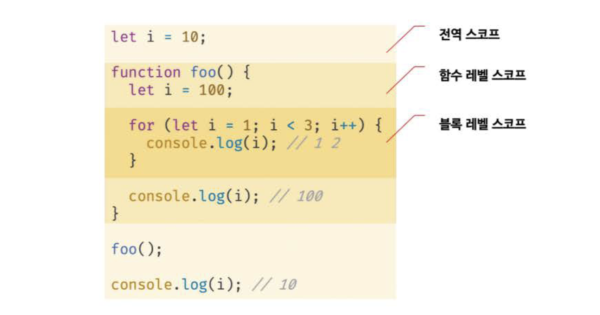
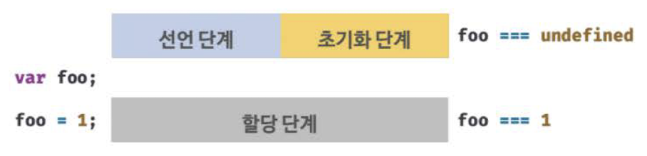

# 15장 let, const 키워드와 블록 레벨 스코프

## 15.1 var 키워드로 선언한 변수의 문제점

- **ES5**까지 변수를 선언할 수 있는 유일한 방법은 **var** 키워드를 사용하는 것이었다.

### 15.1.1 변수 중복 선언 허용

- var 키워드로 선언한 변수는 중복 선언이 가능하다.

```js
var x = 1;
var y = 1;

// var 키워드로 선언된 변수는 같은 스코프 내에서 중복 선언 허용
// 초기화문이 있는 변수 선언문은 자바스크립트 엔진에 의해 var 키워드가 없는 것처럼 동작
var x = 100;

// 초기화문이 없는 변수 선언문은 무시됨
var y;

console.log(x); // 100
console.log(y); // 1
```

- var 키워드로 선언한 변수를 중복 선언하면 **초기화문(변수 선언과 동시에 초기값을 할당하는 문)의 유무에 따라 다르게 동작**한다.
- 동일한 이름의 변수가 이미 선언되어 있는 것을 모르고 **변수를 중복 선언하면서 값까지 할당한다면 의도치 않게 먼저 선언된 변수 값이 변경되는 부작용**이 발생한다.

### 15.1.2 함수 레벨 스코프

- var 키워드로 선언한 변수는 오로지 **함수의 코드 블록만을 지역 스코프로 인정**한다.
- 함수 외부에서 var 키워드로 선언한 변수는 코드 블록 내에서 선언해도 모두 전역 변수가 된다.

```js
var x = 1;

if (true) {
  // x는 전역 변수. 이미 선언된 전역 변수 x가 있으므로, x 변수는 중복 선언됨
  var x = 10;
}

// 의도치 않게 x 변수값이 변경되는 부작용 발생
console.log(x); // 10
```

- for문의 변수 선언문에서 var 키워드로 선언한 변수도 전역 변수가 된다.

```js
var i = 10;

// for문에서 선언한 i는 전역 변수. 이미 선언된 전역 변수 i가 있으므로 중복 선언됨
for (var i = 0; i < 5; i++) {
  console.log(i); // 0 1 2 3 4
}

// 의도치 않게 i 변수값이 변경되는 부작용 발생
console.log(i); // 5
```

- **함수 레벨 스코프**는 전역 변수를 남발할 가능성을 높이고, 이로 인해 의도치 않게 전역 변수가 중복 선언되는 경우가 발생한다.

### 15.1.3 변수 호이스팅

- var 키워드로 변수를 선언하면 **변수 호이스팅**에 의해 변수 선언문이 스코프의 선두로 끌어 올려진 것처럼 동작한다.
- 변수 호이스팅에 의해 var 키워드로 선언한 변수는 변수 선언문 이전에 참조할 수 있다.
- 단, 할당문 이전에 변수를 참조하면 언제나 **undefined를 반환**한다.

```js
// 이 시점에는 변수 호이스팅에 의해 이미 foo 변수가 선언됨 (1. 선언 단계)
// 변수 foo는 undefined로 초기화됨 (2. 초기화 단계)
console.log(foo); // undefined

// 변수에 값을 할당 (3. 할당 단계)
foo = 123;

console.log(foo); // 123

// 변수 선언은 런타임 이전에 자바스크립트 엔진에 의해 암묵적으로 실행됨
var foo;
```

- 변수 선언문 이전에 변수를 참조하는 것은 변수 호이스팅에 의해 에러를 발생시키지는 않지만, 프로그램의 **흐름상 맞지 않으며 가독성을 떨어뜨리고 오류를 발생시킬 여지**를 남긴다.

---

## 15.2 let 키워드

- var 키워드의 단점을 보완하기 위해 **ES6**에서는 새로운 변수 선언 키워드인 **let과 const**를 도입했다.

### 15.2.1 변수 중복 선언 금지

- var 키워드로 변수를 중복 선언해도 에러가 발생하지 않는다. 중복 선언하면서 값까지 할당했다면 의도치 않게 먼저 선언된 변수 값이 재할당되어 변경되는 부작용이 발생한다.
- **let** 키워드로 이름이 같은 변수를 **중복 선언**하면 **문법 에러가 발생**한다.

```js
// var 키워드로 선언된 변수는 같은 스코프 내에서 중복 선언을 허용함
var foo = 123;

// 아래 변수 선언문은 자바스크립트 엔진에 의해 var 키워드가 없는 것처럼 동작함
var foo = 456;

// let이나 const 키워드로 선언된 변수는 같은 스코프 내에서 중복 선언을 허용하지 않음
let bar = 123;

let bar = 456; // SyntaxError: Identifier 'bar' has already been declared
```

### 15.2.2 블록 레벨 스코프

- **var 키워드로 선언한 변수**는 오로지 함수의 코드 블록만을 지역 스코프로 인정하는 **함수 레벨 스코프**를 따른다.
- **let 키워드로 선언한 변수**는 모든 코드 블록(함수, if문, for문, while문, try/catch문 등)을 지역 스코프로 인정하는 **블록 레벨 스코프**를 따른다.

```js
let foo = 1; // 전역 변수

{
  let foo = 2; // 지역 변수
  let bar = 3; // 지역 변수
}

console.log(foo); // 1
console.log(bar); // ReferenceError: bar is not defined
```

- 코드 블록 내에서 선언된 foo 변수와 bar 변수는 블록 레벨 스코프를 갖는 지역 변수다.
- 위 예제에서 **전역에서 선언된 foo 변수와 코드 블록 내에서 선언된 foo 변수는 다른 별개의 변수**다.
- 전역에서는 bar 변수를 참조할 수 없다.
- 함수도 코드 블록이므로 스코프를 만든다. 함수 내의 코드 블록은 함수 레벨 스코프에 중첩된다.



### 15.2.3 변수 호이스팅

- 자바스크립트는 ES6에서 도입된 let, const를 포함한 모든 선언(var, let, const, function, [function\*](https://developer.mozilla.org/ko/docs/Web/JavaScript/Reference/Statements/function*), class 등)을 호이스팅한다.
- 단, ES6에서 도입된 let, const, class를 사용한 선언문은 호이스팅이 발생하지 않는 것처럼 동작한다.

- **var 키워드로 선언한 변수**

  - 런타임 이전에 자바스크립트 엔진에 의해 암묵적으로 **'선언 단계'와 '초기화 단계'가 한번에 진행**된다.
  - 즉, 선언 단계에서 스코프(실행 컨텍스트의 렉시컬 환경)에 변수 식별자를 등록해 자바스크립트 엔진에 변수의 존재를 알린다.
  - 그리고 즉시 초기화 단계에서 undefined로 변수를 초기화한다.
  - 따라서 변수 선언문 이전에 변수에 접근해도 스코프에 변수가 존재하기 때문에 에러가 발생하지 않는다.

```js
// var 키워드로 선언한 변수는 런타임 이전에 선언 단계와 초기화 단계가 실행됨
// 따라서 변수 선언문 이전에 변수를 참조할 수 있음
console.log(foo); // undefined

var foo;
console.log(foo); // undefined

foo = 1; // 할당문에서 할당 단계가 실행된다
console.log(foo); // 1
```

<br>

- **let 키워드로 선언한 변수**

  - var 키워드로 선언한 변수와 달리, let 키워드로 선언한 변수는 변수 호이스팅이 발생하지 않는 _것처럼_ 동작한다.
  - let 키워드로 선언한 **변수를 변수 선언문 이전에 참조하면 참조 에러**가 발생한다.

  ```js
  console.log(foo); // ReferenceError: foo is not defined
  let foo;
  ```

  - let 키워드로 선언한 변수는 **'선언 단계'와 '초기화 단계'가 분리되어 진행**된다.
  - 즉, **런타임 이전에 자바스크립트 엔진에 의해 암묵적으로 선언 단계가 먼저 실행**되지만, **초기화 단계는 변수 선언문에 도달했을 때 실행**된다.
  - 초기화 단계가 실행되기 이전에 변수에 접근하려고 하면 참조 에러가 발생한다.
  - let 키워드로 선언한 변수는 스코프의 시작 지점부터 초기화 단계 시작 지점(변수 선언문)까지 변수를 참조할 수 없는데, 이 구간을 **일시적 사각지대(TDZ, Temporal Dead Zone)**이라 부른다.

  ```js
  // 런타임 이전에 선언 단계가 실행됨. 아직 변수가 초기화되지 않았음
  // 초기화 이전의 일시적 사각지대(TDZ)에서는 변수를 참조할 수 없음
  console.log(foo); // ReferenceError: foo is not defined

  let foo; // 변수 선언문에서 초기화 단계가 실행됨
  console.log(foo); // undefined

  foo = 1; // 할당문에서 할당 단계가 실행됨
  console.log(foo); // 1
  ```

<br>

- **var 키워드로 선언한 변수의 생명 주기 && let 키워드로 선언한 변수의 생명 주기**




<br>

- let 키워드로 선언한 변수는 호이스팅이 발생하지 않는 것처럼 보이지만, 그렇지 않다.

```js
let foo = 1;

{
  console.log(foo); // ReferenceError: Cannot access 'foo' before initialization
  let foo = 2; // 지역 변수
}
```

- 변수 호이스팅이 발생하지 않는다면, 위 예제는 전역 변수 foo의 값인 1을 출력해야 한다.
- 하지만 **let 키워드로 선언한 변수도 호이스팅이 발생**하기 때문에 참조 에러가 발생한다.

### 15.2.4 전역 객체와 let

- **var 키워드로 선언한 전역 변수**와 **전역 함수**, 그리고 선언하지 않은 변수에 값을 할당한 **암묵적 전역**은 전역 **객체 window의 프로퍼티**가 된다.
- 전역 객체의 프로퍼티를 참조할 때 window를 생략할 수 있다.

```js
// 이 예제는 브라우저 환경에서 실행해야 함

// 전역 변수
var x = 1;

// 암묵적 전역 (선언하지 않은 식별자에 값을 할당하는 것)
y = 2;

// 전역 함수
function foo() {}

// var 키워드로 선언한 전역 변수는 객체 window의 프로퍼티
console.log(window.x); // 1
// 전역 객체 window의 프로퍼티는 전역 변수처럼 사용할 수 있음
console.log(x); // 1

// 암묵적 전역은 전역 객체 window의 프로퍼티
console.log(window.y); // 2
console.log(y); // 2

// 함수 선언문으로 정의한 전역 함수는 전역 객체 window의 프로퍼티
console.log(window.foo); // ƒ foo() {}
// 전역 객체 window의 프로퍼티는 전역 변수처럼 사용할 수 있음
console.log(foo); // ƒ foo() {}
```

- **let 키워드로 선언한 전역 변수는 전역 객체의 프로퍼티가 아니다**.
- let 키워드로 선언한 전역 변수는 window.foo와 같이 접근할 수 없다.
- let 전역 변수는 보이지 않는 개념적인 블록(전역 렉시컬 환경의 선언적 환경 레코드, 23장 '실행 컨텍스트') 내에 존재하게 된다.

```js
// 이 예제는 브라우저 환경에서 실행해야 함

let x = 1;

// let, const 키워드로 선언한 전역 변수는 전역 객체 window의 프로퍼티가 아님
console.log(window.x); // undefined
console.log(x); // 1
```

---

## 15.3 const 키워드

- const는 **상수(constant)**를 선언하기 위해 사용된다. (반드시 상수만을 위해 사용하지는 않는다.)
- const 키워드의 특징은 let 키워드와 대부분 동일하다. (let 키워드와의 차이점에 주목하자.)

### 15.3.1 선언과 초기화

- const 키워드로 선언한 변수는 **반드시 선언과 동시에 초기화**해야 한다.
- 그렇지 않으면 문법 에러가 발생한다.

```js
const foo = 1;

const bar; // SyntaxError: Missing initialization in const declaration
```

- **const 키워드로 선언한 변수**는 let 키워드로 선언한 변수와 마찬가지로 **블록 레벨 스코프**를 가지며, 변수 호이스팅이 발생하지 않는 _것처럼_ 동작한다.

```js
{
  // 변수 호이스팅이 발생하지 않는 것처럼 동작함
  console.log(foo); // Reference Error: Cannot access 'foo' before initialization
  const foo = 1;
  console.log(foo); // 1
}

// 블록 레벨 스코프를 가짐
console.log(foo); // ReferenceError: foo is not defined
```

### 15.3.2 재할당 금지

- var 또는 let 키워드로 선언한 변수는 재할당이 자유로우나, **const 키워드로 선언한 변수는 재할당이 금지**된다.

```js
const foo = 1;
foo = 2; // TypeError: Assignment to constant variable.
```

### 15.3.3 상수

- const 키워드로 선언한 변수에 **원시 값을 할당한 경우 변수 값을 변경할 수 없다**. (원시 값은 변경 불가능한 값이므로 재할당 없이 값을 변경할 수 없다.)
- 이러한 특징을 이용해 const는 상수를 표현하는 데 사용하기도 한다.
  - 상수는 재할당이 금지된 변수를 말한다. 상수도 값을 저장하기 위한 메모리 공간이 필요하다는 점에서 변수라고 할 수 있다. 단, 변수는 언제든지 재할당을 통해 변수 값을 변경할 수 있지만, 상수는 재할당이 금지된다.
- **상수는 상태 유지와 가독성, 유지보수의 편의를 위해 적극적으로 사용**해야 한다.

```js
// 세전 가격
let preTaxPrice = 100;

// 세후 가격
// 0.1의 의미를 명확히 알기 어려워 가독성이 좋지 않음
let afterTaxPrice = preTaxPrice + preTaxPrice * 0.1;

console.log(afterTaxPrice); // 110
```

- 위 예제에서 0.1의 의미를 명확히 알기 어려워 가독성이 좋지 않다.
- 세율을 의미하는 0.1은 쉽게 바뀌지 않는 값이기 때문에 프로그램 전체에서 고정된 값을 사용해야 한다.
  => 세율을 상수로 정의하면 의미를 쉽게 파악할 수 있고, 변경될 수 없는 고정값으로 사용할 수 있다. 또한 나중에 세율이 변경되면 상수만 변경하면 되기 때문에 **유지보수성이 대폭 향상**된다.

```js
// 세율을 의미하는 0.1은 변경할 수 없는 상수로서 사용될 값
// 변수 이름을 대문자로 선언해 상수임을 명시함
const TAX_RATE = 0.1;

// 세전 가격
let preTaxPrice = 100;

// 세후 가격
let afterTaxPrice = preTaxPrice + preTaxPrice * TAX_RATE;

console.log(afterTaxPrice); // 110
```

- 일반적으로 상수의 이름은 **대문자**로 선언해 상수임을 명확히 나타낸다.
- 여러 단어로 이루어진 경우에는 **언더스코어(\_)**로 구분해서 **스네이크 케이스**로 표현하는 것이 일반적이다.

### 15.3.4 const 키워드와 객체

- **const 키워드로 선언한 변수에** 원시 값을 할당한 경우에는 값을 변경할 수 없지만, **객체를 할당한 경우 값을 변경할 수 있다**.
- 원시 값은 재할당 없이 변경(교체)할 수 있는 방법이 없지만, 객체는 재할당 없이도 직접 변경이 가능하기 때문이다.

```js
const person = {
  name: "Lee",
};

// 객체는 변경 가능한 값. 재할당 없이 변경 가능
person.name = "Kim";

console.log(person); // {name: 'Kim'}

person = 10; // TypeError: Assignment to constant variable.
```

- **const 키워드는 재할당을 금지할 뿐, '불변'을 의미하지 않는다.**
- 새로운 값을 재할당하는 것은 불가능하지만, **프로퍼티 동적 생성, 삭제, 프로퍼티 값의 변경을 통해 객체를 변경**하는 것은 가능하다.
- 이때, 객체가 변경되더라도, 변수에 할당된 참조 값은 변경되지 않는다.

---

## 15.4 var vs. let vs. const

- const 키워드를 사용하면 의도치 않은 재할당을 방지하기 때문에 보다 안전하다.
  - ES6를 사용한다면 **var 키워드는 사용하지 않는다**.
  - **재할당이 필요한 경우에 한정해 let 키워드를 사용**한다. 이때 변수의 **스코프는 최대한 좁게** 만든다.
  - **변경이 발생하지 않고 읽기 전용으로 사용하는**(재할당이 필요 없는 상수) 원시 값과 객체에는 **const** 키워드를 사용한다.
  - 변수 선언 시점에 재할당이 필요할지 모르는 경우에도 const를 사용하고, 반드시 재할당이 필요할 때에 let으로 변경해도 늦지 않다.
