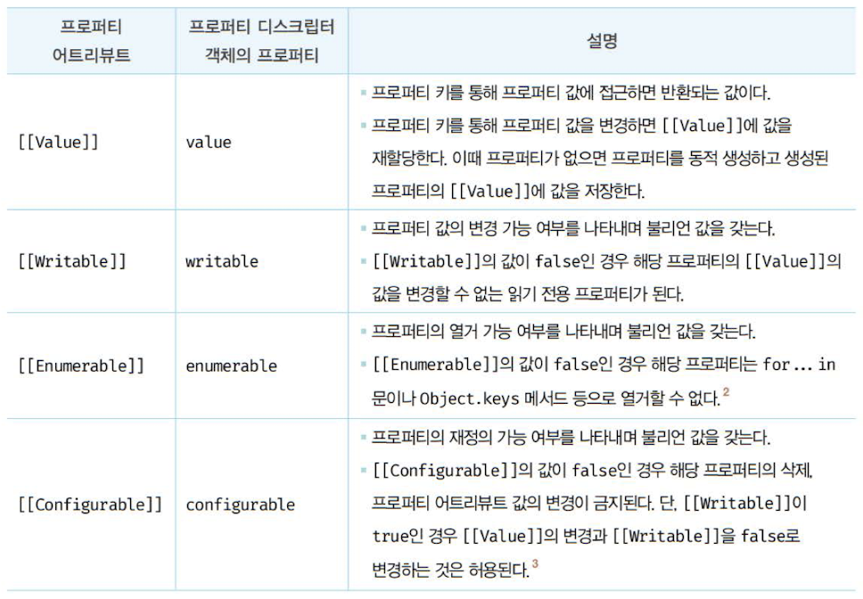
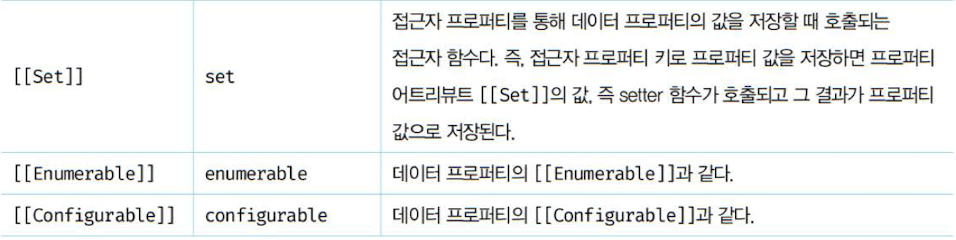
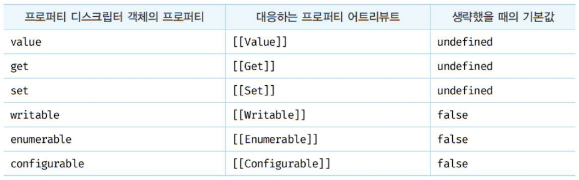

# 16장 프로퍼티 어트리뷰트

## 16.1 내부 슬롯과 내부 메서드

> **내부 슬롯(internal slot)과 내부 메서드(internal method)**는 자바스크립트 엔진의 구현 알고리즘을 설명하기 위해 ECMAScript 사양에서 사용하는 의사 프로퍼티(pseudo property)와 의사 메서드(pseudo method)다.

- 내부 슬롯과 내부 메서드는 **이중 대괄호**([[...]])로 감싼 이름들이다.
  e.g., [[GetPrototypeOf]], [[SetPrototypeOf]], [[IsExtensible]] ...

- 내부 슬롯과 내부 메서드는 자바스크립트 엔진 내부 로직으로, 원칙적으로는 개발자가 직접적으로 접근하거나 호출할 수 없다. 단, 일부 내부 슬롯과 메서드에 한해 **간접적으로 접근할 수 있는 수단**을 제공한다.

```js
// e.g., [[Prototype]] 내부 슬롯의 경우, __proto__를 통해 간접적으로 접근 가능

const o = {};

o.[[Prototype]] // -> Uncaught SyntaxError: Unexpected token '['

o.__proto__ // -> Object.prototype
```

---

## 16.2 프로퍼티 어트리뷰트와 프로퍼티 디스크립터 객체

> 자바스크립트 엔진은 프로퍼티를 생성할 때 `프로퍼티의 상태`를 나타내는 **프로퍼티 어트리뷰트**를 기본값으로 자동 정의한다.

- `프로퍼티의 상태`란 **프로퍼티의 값(value)**, **값의 갱신 가능 여부(writable)**, **열거 가능 여부(enumarable)**, **재정의 가능 여부(configrable)**를 말한다.

- **프로퍼티 어트리뷰트**는 자바스크립트 엔진이 관리하는 내부 상태 값인 **내부 슬롯**이다.
  : [[Value]], [[Writable]], [[Enumarable]], [[Configurable]]

- 내부 슬롯인 프로퍼티 어트리뷰트에 직접 접근할 수 없지만, ES8에서 도입된 `Object.getOwnPropertyDescriptor` 메서드를 사용하여 간접적으로 확인할 수는 있다.

```js
const person = {
  name: "Lee",
};

console.log(Object.getOwnPropertyDescriptor(person, "name"));
// {value: "Lee", writable: true, enumerable: true, configurable: true}
```

- Object.getOwnPropertyDescriptor 메서드를 호출할 때 **첫 번째 매개변수에는 객체의 참조**를, **두 번째 매개변수에는 프로퍼티 키를 문자열로** 전달한다.
- Object.getOwnPropertyDescriptor 메서드는 프로퍼티 어트리뷰트 정보를 제공하는 **프로퍼티 디스크립터(Property Descriptor) 객체를 반환**한다.

- Object.getOwnPropertyDescriptor**s** 메서드는 _모든_ 프로퍼티의 프로퍼티 어트리뷰트 정보를 제공하는 프로퍼티 디스크립터 객체들을 반환한다.

```js
const person = {
  name: "Lee",
};

person.age = 20;

console.log(Object.getOwnPropertyDescriptors(person));
/*
{
  name: {value: "Lee", writable: true, enumerable: true, configurable: true},
  age: {value: 20, writable: true, enumerable: true, configurable: true}
}
*/
```

---

## 16.3 데이터 프로퍼티와 접근자 프로퍼티

프로퍼티는 데이터 프로퍼티와 접근자 프로퍼티로 구분할 수 있다.

- **데이터 프로퍼티(data property)**: 키와 값으로 구성된 일반적인 프로퍼티. 지금까지 살펴본 모든 프로퍼티는 데이터 프로퍼티.
- **접근자 프로퍼티(accessor property)**: 자체적으로는 값을 갖지 않고 다른 데이터 프로퍼티의 값을 읽거나 저장할 때 호출되는 접근자 함수(accessor function)로 구성된 프로퍼티.

### 16.3.1 데이터 프로퍼티

- 데이터 프로퍼티는 네 가지 프로퍼티 어트리뷰트를 갖는다.
- 프로퍼티 어트리뷰트는 자바스크립트 엔진이 프로퍼티를 생성할 때 **기본값**으로 자동 정의된다.



```js
const person = {
  name: "Lee",
};

// 프로퍼티 어트리뷰트 정보를 제공하는 프로퍼티 디스크립터 객체를 반환함
console.log(Object.getOwnPropertyDescriptor(person, "name"));
// {value: "Lee", writable: true, enumerable: true, configurable: true}
```

**프로퍼티가 생성**될 때 **[[Value]]의 값**은 **프로퍼티 값**으로 초기화되고, **[[Writable]], [[Enumerable]], [[Configurable]]의 값**은 **true**로 초기화된다. 프로퍼티를 **동적 추가**해도 마찬가지다.

```js
const person = {
  name: "Lee",
};

// 프로퍼티 동적 생성
person.age = 20;

console.log(Object.getOwnPropertyDescriptors(person));
/*
{
  name: {value: "Lee", writable: true, enumerable: true, configurable: true},
  age: {value: 20, writable: true, enumerable: true, configurable: true}
}
*/
```

### 16.3.2 접근자 프로퍼티

- 접근자 프로퍼티는 **자체적으로는 값을 갖지 않고 다른 데이터 프로퍼티의 값을 읽거나 저장할 대 사용하는 접근자 함수로 구성**된 프로퍼티다.
- 접근자 프로퍼티도 네 가지 프로퍼티 어트리뷰트를 갖는다.




- **접근자 함수**는 **getter/setter 함수**라고도 부른다.
- 접근자 프로퍼티는 접근자 함수(getter/setter 함수)를 모두 정의할 수도 있고, 하나만 정의할 수도 있다.

```js
const person = {
  // 데이터 프로퍼티
  firstName: "서형",
  lastName: "권",

  // fullName은 접근자 함수로 구성된 접근자 프로퍼티
  // getter 함수
  get fullName() {
    return `${this.firstName} ${this.lastName}`;
  },
  // setter 함수
  set fullName(name) {
    // 배열 디스트럭처링 할당(구조 분해 할당)
    [this.firstName, this.lastName] = name.split(" ");
  },
};

// 데이터 프로퍼티를 통한 프로퍼티 값의 참조
console.log(person.firstName + " " + person.lastName); // 서형 권

// 접근자 프로퍼티를 통한 프로퍼티 값의 저장 (접근자 프로퍼티 fullName에 값을 저장하면 setter 함수가 호출됨)
person.fullName = "소현 김";
console.log(person); // {firstName: "소현", lastName: "김"}

// 접근자 프로퍼티를 통한 프로퍼티 값의 참조 (접근자 프로퍼티 fullName에 접근하면 getter 함수가 호출됨)
console.log(person.fullName); // 소현 김

// 데이터 프로퍼티인 firstName은 [[Value]], [[Writable]], [[Enumerable]], [[Configurable]] 프로퍼티 어트리뷰트를 가짐
let descriptor = Object.getOwnPropertyDescriptor(person, "firstName");
console.log(descriptor);
// {value: "소현", writable: true, enumerable: true, configurable: true}

// 접근자 프로퍼티인 fullName은 [[Get]], [[Set]], [[Enumerable]], [[Configurable]] 프로퍼티 어트리뷰트를 가짐
descriptor = Object.getOwnPropertyDescriptor(person, "fullName");
console.log(descriptor);
// {get: ƒ, set: ƒ, enumerable: true, configurable: true}
```

- 접근자 프로퍼티는 자체적으로 값(프로퍼티 어트리뷰트 [[Value]])을 가지지 않으며, 다만 데이터 프로퍼티의 값을 읽거나 저장할 때 관여할 뿐이다.

- 내부 슬롯, 내부 메서드 관점에서의 설명
  : 접근자 프로퍼티 fullName으로 프로퍼티 값에 접근하면 내부적으로 [[Get]] 내부 메서드가 호출되어 다음과 같이 동작한다.

  1. 프로퍼티 키가 문자열 또는 심벌인지 확인한다. ("fullName"은 문자열이므로 유효함)
  2. 프로토타입 체인에서 프로퍼티를 검색한다. (person 객체에 fullName 프로퍼티가 존재함)
  3. 검색된 fullName 프로퍼티가 데이터 프로퍼티인지 접근자 프로퍼티인지 확인한다. (fullName 프로퍼티는 접근자 프로퍼티)
  4. 접근자 프로퍼티 fullName의 프로퍼티 어트리뷰트 [[Get]]의 값, getter 함수를 호출하여 그 결과를 반환한다.

Object.getOwnPropertyDescriptor 메서드가 반환한 **프로퍼티 디스크립터 객체의 프로퍼티**를 살펴봄으로써 데이터 프로퍼티와 접근자 프로퍼티를 구별할 수 있다.

```js
// 함수 객체의 prototype은 데이터 프로퍼티
Object.getOwnPropertyDescriptor(function () {}, "prototype");
// {value: {...}, writable: true, enumerable: false, configurable: false}

// 일반 객체의 __proto__는 접근자 프로퍼티
Object.getOwnPropertyDescriptor(Object.prototype, "__proto__");
// {get: ƒ, set: ƒ, enumerable: false, configurable: true}
```

---

## 16.4 프로퍼티 정의

- 프로퍼티 정의란,

  1. 새로운 프로퍼티를 추가하면서 프로퍼티 어트리뷰트를 명시적으로 정의하거나,
  2. 기존 프로퍼티의 어트리뷰트를 재정의하는 것

- 프로퍼티 정의를 통해 객체의 **프로퍼티가 어떻게 동작해야 하는지 명확히 정의**할 수 있다.
  e.g., 프로퍼티 값을 갱신 가능하게 할 것인지, 프로퍼티를 열거 가능하도록 할 것인지, 프로퍼티를 재정의 가능하도록 할 것인지?

- `Object.defineProperty` 메서드를 사용하여 프로퍼티 어트리뷰트를 정의할 수 있다.
  인수로는 **객체의 참조**와 **데이터 프로퍼티의 키인 문자열**, **프로퍼티 디스크립터 객체**를 전달한다.

```js
const person = {};

// 데이터 프로퍼티 정의
Object.defineProperty(person, "firstName", {
  value: "서형",
  writable: true,
  enumerable: true,
  configurable: true,
});

Object.defineProperty(person, "lastName", {
  value: "권",
});

let descriptor = Object.getOwnPropertyDescriptor(person, "firstName");
console.log("firstName", descriptor);
// firstName {value: "서형", writable: true, enumerable: true, configurable: true}

// 디스크립터 객체의 프로퍼티를 누락시키면 undefined, false가 기본값
descriptor = Object.getOwnPropertyDescriptor(person, "lastName");
console.log("lastName", descriptor);
// lastName {value: "권", writable: false, enumerable: false, configurable: false}

// [[Enumerable]]의 값이 false인 경우, 해당 프로퍼티는 for...in 문이나 Object.keys 등으로 열거할 수 없음
// lastName 프로퍼티는 [[Enumerable]]의 값이 false이므로 열거되지 않음
console.log(Object.keys(person)); // ["firstName"]

// [[Writable]]의 값이 false인 경우, 해당 프로퍼티의 [[Value]]의 값을 변경할 수 없음
// lastName 프로퍼티는 [[Writable]]의 값이 false이므로 값을 변경할 수 없음
// 이때 값을 변경하면 에러 발생하지 않고 무시됨
person.lastName = "김";

// [[Configurable]]의 값이 false인 경우 해당 프로퍼티를 삭제할 수 없음
// lastName 프로퍼티는 [[Configurable]]의 값이 false이므로 삭제할 수 없음
// 이때 프로퍼티를 삭제하면 에러 발생하지 않고 무시됨
delete person.lastName;

// [[Configurable]]의 값이 false인 경우 해당 프로퍼티를 재정의할 수 없음
// Object.defineProperty(person, 'lastName', { enumerable: true });
// Uncaught TypeError: Cannot redefine property: lastName

descriptor = Object.getOwnPropertyDescriptor(person, "lastName");
console.log("lastName", descriptor);
// lastName {value: "권", writable: false, enumerable: false, configurable: false}

// 접근자 프로퍼티 정의
Object.defineProperty(person, "fullName", {
  // getter 함수
  get() {
    return `${this.firstName} ${this.lastName}`;
  },
  // setter 함수
  set(name) {
    [this.firstName, this.lastName] = name.split(" ");
  },
  enumerable: true,
  configurable: true,
});

descriptor = Object.getOwnPropertyDescriptor(person, "fullName");
console.log("fullName", descriptor);
// fullName {get: ƒ, set: ƒ, enumerable: true, configurable: true}

person.fullName = "소현 김";
console.log(person); // {firstName: "소현", lastName: "김"}
```

`Object.defineProperty` 메서드로 프로퍼티를 정의할 때 프로퍼티 디스크립터 객체의 프로퍼티를 **일부 생략**할 수 있다.
프로퍼티 디스크립터 객체에서 생략된 어트리뷰트는 다음과 같이 **기본값**이 적용된다.



Object.definePropertie**s** 메서드를 사용하면 한 번에 여러 개의 프로퍼티를 정의할 수 있다.

```js
const person = {};

Object.defineProperties(person, {
  // 데이터 프로퍼티 정의
  firstName: {
    value: "두인",
    writable: true,
    enumerable: true,
    configurable: true,
  },
  lastName: {
    value: "천",
    writable: true,
    enumerable: true,
    configurable: true,
  },
  // 접근자 프로퍼티 정의
  fullName: {
    // getter 함수
    get() {
      return `${this.firstName} ${this.lastName}`;
    },
    // setter 함수
    set(name) {
      [this.firstName, this.lastName] = name.split(" ");
    },
    enumerable: true,
    configurable: true,
  },
});

person.fullName = "현민 조";
console.log(person); // {firstName: "현민", lastName: "조"}
```

---

## 16.5 객체 변경 방지

- 객체는 변경 가능한 값이므로 재항당 없이 직접 변경할 수 있다.
  프로퍼티를 추가하거나 삭제할 수 있고, 프로퍼티 값을 갱신할 수 있으며, 프로퍼티 어트리뷰트를 재정의할 수도 있다.

- 자바스크립트는 객체의 변경을 방지하는 다양한 메서드를 제공한다.
  객체 변경 방지 메서드들은 객체의 변경을 금지하는 강도가 다르다.


### 16.5.1 객체 확장 금지

- `Object.preventExtensions` 메서드는 **객체의 확장을 금지**한다.
  - 확장이 금지된 객체는 **프로퍼티 추가가 금지**된다.
  - 프로퍼티 동적 추가와 Object.defineProperty 메서드로 프로퍼티 추가 방법 모두 금지된다.
  - 확장이 가능한 객체인지 여부는 `Object.isExtensible` 메서드로 확인할 수 있다.

```js
const person = { name: "Lee" };

// person 객체는 확장이 금지된 객체가 아님
console.log(Object.isExtensible(person)); // true

// person 객체의 확장을 금지하여 프로퍼티 추가를 금지함
Object.preventExtensions(person);

// person 객체는 확장이 금지된 객체
console.log(Object.isExtensible(person)); // false

// 프로퍼티 추가가 금지됨
person.age = 20; // 무시. strict mode에서는 에러
console.log(person); // {name: "Lee"}

// 프로퍼티 추가는 금지되지만 삭제는 가능
delete person.name;
console.log(person); // {}

// 프로퍼티 정의에 의한 프로퍼티 추가도 금지됨
Object.defineProperty(person, "age", { value: 20 });
// TypeError: Cannot define property age, object is not extensible
```

### 16.5.2 객체 밀봉

- `Object.seal` 메서드는 **객체를 밀봉**한다.
  - 객체 밀봉은 **프로퍼티 추가 및 삭제, 프로퍼티 어트리뷰트 재정의 금지**를 의미한다.
  - 밀봉된 객체는 **읽기와 쓰기만 가능**하다.
  - 밀봉된 객체인지 여부는 `Object.isSealed` 메서드로 확인할 수 있다.

```js
const person = { name: "Lee" };

// person 객체는 밀봉(seal)된 객체가 아님
console.log(Object.isSealed(person)); // false

// person 객체를 밀봉(seal)하여 프로퍼티 추가, 삭제, 재정의를 금지함
Object.seal(person);

// person 객체는 밀봉(seal)된 객체
console.log(Object.isSealed(person)); // true

// 밀봉(seal)된 객체는 configurable이 false
console.log(Object.getOwnPropertyDescriptors(person));
/*
{
  name: {value: "Lee", writable: true, enumerable: true, configurable: false},
}
*/

// 프로퍼티 추가가 금지됨
person.age = 20; // 무시. strict mode에서는 에러
console.log(person); // {name: "Lee"}

// 프로퍼티 삭제가 금지됨
delete person.name; // 무시. strict mode에서는 에러
console.log(person); // {name: "Lee"}

// 프로퍼티 값 갱신은 가능
person.name = "Kim";
console.log(person); // {name: "Kim"}

// 프로퍼티 어트리뷰트 재정의가 금지됨
Object.defineProperty(person, "name", { configurable: true });
// TypeError: Cannot redefine property: name
```

### 16.5.3 객체 동결

- `Object.freeze` 메서드는 **객체를 동결**한다.
  - 객체 동결이란 **프로퍼티 추가 및 삭제, 프로퍼티 어트리뷰트 재정의 금지, 프로퍼티 값 갱신 금지**를 의미한다.
  - 동결된 객체는 **읽기만 가능**하다.
  - 동결된 객체인지 여부는 `Object.isFrozen` 메서드로 확인할 수 있다.

```js
const person = { name: "Lee" };

// person 객체는 동결(freeze)된 객체가 아님
console.log(Object.isFrozen(person)); // false

// person 객체를 동결(freeze)하여 프로퍼티 추가, 삭제, 재정의, 쓰기를 금지함
Object.freeze(person);

// person 객체는 동결(freeze)된 객체
console.log(Object.isFrozen(person)); // true

// 동결(freeze)된 객체는 writable과 configurable이 false
console.log(Object.getOwnPropertyDescriptors(person));
/*
{
  name: {value: "Lee", writable: false, enumerable: true, configurable: false},
}
*/

// 프로퍼티 추가가 금지됨
person.age = 20; // 무시. strict mode에서는 에러
console.log(person); // {name: "Lee"}

// 프로퍼티 삭제가 금지됨
delete person.name; // 무시. strict mode에서는 에러
console.log(person); // {name: "Lee"}

// 프로퍼티 값 갱신이 금지됨
person.name = "Kim"; // 무시. strict mode에서는 에러
console.log(person); // {name: "Lee"}

// 프로퍼티 어트리뷰트 재정의가 금지됨
Object.defineProperty(person, "name", { configurable: true });
// TypeError: Cannot redefine property: name
```

### 16.5.4 불변 객체

위의 변경 방지 메서드들은 **얕은 변경 방지(shallow only)**로 직속 프로퍼티만 변경이 방지되고, **중첩 객체까지는 영향을 주지는 못한다**.

```js
const person = {
  name: "Lee",
  address: { city: "Seoul" },
};

// 얕은 객체 동결
Object.freeze(person);

// 직속 프로퍼티만 동결함
console.log(Object.isFrozen(person)); // true
// 중첩 객체까지 동결하지 못함
console.log(Object.isFrozen(person.address)); // false

person.address.city = "Busan";
console.log(person); // {name: "Lee", address: {city: "Busan"}}
```

객체의 중첩 객체까지 동결하여 변경이 불가능한 **읽기 전용의 불변 객체**를 구현하려면 객체를 값으로 갖는 모든 프로퍼티에 대해 **재귀적으로 Object.freeze 메서드를 호출**해야 한다.

```js
function deepFreeze(target) {
  // 객체가 아니거나 동결된 객체는 무시하고 객체이고 동결되지 않은 객체만 동결함
  if (target && typeof target === "object" && !Object.isFrozen(target)) {
    Object.freeze(target);
    /*
      모든 프로퍼티를 순회하며 재귀적으로 동결함
      - Object.keys 메서드: 객체 자신의 열거 가능한 프로퍼티 키를 배열로 반환함
      - forEach 메서드: 배열을 순회하며 배열의 각 요소에 대하여 콜백 함수를 실행함
    */
    Object.keys(target).forEach((key) => deepFreeze(target[key]));
  }
  return target;
}

const person = {
  name: "Lee",
  address: { city: "Seoul" },
};

// 깊은 객체 동결
deepFreeze(person);

console.log(Object.isFrozen(person)); // true
// 중첩 객체까지 동결
console.log(Object.isFrozen(person.address)); // true

person.address.city = "Busan";
console.log(person); // {name: "Lee", address: {city: "Seoul"}}
```
