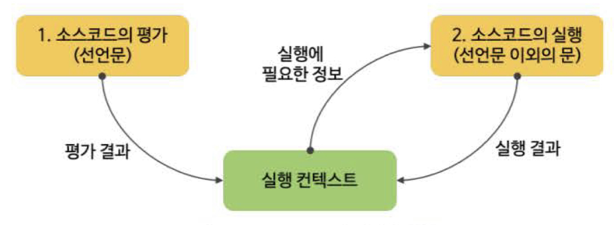
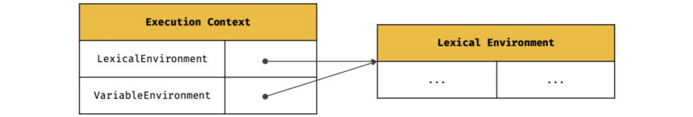
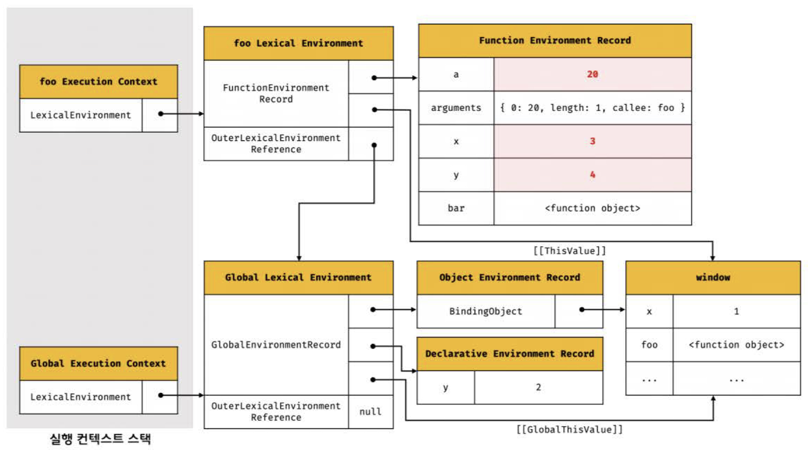

## 23장 실행 컨텍스트

> **실행 컨텍스트(execution context)**는 소스코드를 실행하기 위해 **필요한 환경을 제공**하고 **코드의 실행 결과를 실제로 관리**하는 영역

- 실행 컨텍스트를 이해하면 이해할 수 있는 것들
  - 스코프 기반으로 식별자와 식별자에 바인딩 된 값(식별자 바인딩)을 관리하는 방식
  - 호이스팅이 발생하는 이유
  - 클로저의 동작 방식
  - 태스크 큐와 함께 동작하는 이벤트 핸들러와 동기 처리의 동작 방식

### 23.1 소스코드의 타입

- **소스코드**를(실행 가능한 코드, executable code) 4가지 타입으로 구분하는 **이유**: 소스코드의 타입에 따라 **실행 컨텍스트를 생성하는 과정**과 **관리 내용**이 다르기 때문

- **1. 전역 코드**

  - 전역에 존재하는 소스코드. 전역에 정의된 함수, 클래스 등의 내부코드는 포함 안 됨
  - **전역 변수를 관리**하기 위해 최상위 스코프인 **전역 스코프 생성해야 함**
  - **전역 객체와 연결되어야 함** (var 키워드로 선언된 전역 변수와 함수 선언문으로 정의된 전역 함수를 전역 객체의 프로퍼티와 메서드로 바인딩하고 참조하기 위해)
  - 이를 위해 전역 코드가 평가되면 **전역 실행 컨텍스트**가 생성됨

- **2. 함수 코드**

  - 함수 내부에 존재하는 소스코드. 함수 내부에 중첩된 함수, 클래스 등의 내부 코드는 포함 안됨
  - **지역 스코프를 생성**하고, 지역변수, 매개변수, arguments 객체를 관리해야 함
  - 생성한 지역 스코프를 전역 스코프에서 시작하는 스코프 체인의 일원으로 연결해야 함
  - 이를 위해 함수 코드가 평가되면 **함수 실행 컨텍스트**가 생성됨

- **3. eval 코드**

  - 빌트인 전역함수인 eval 함수에 인수로 전달되어 실행되는 소스코드
  - strict mode에서 자신만의 독자적인 스코프를 생성함
  - => eval 코드가 실행되면 **eval 실행 컨텍스트**가 생성됨

- **4. 모듈 코드**
  - 모듈 내부에 존재하는 소스코드. 모듈 내부의 함수, 클래스 등의 내부 코드는 포함되지 않음
  - 모듈 별로 독립적인 모듈 스코프를 생성함
  - => 모듈 코드가 평가되면 **모듈 실행 컨텍스트**가 생성됨

---

### 23.2 소스코드의 평가와 실행

> 자바스크립트 엔진은 소스코드를 두개의 과정, `1)소스코드의 평가`와 `2)소스코드의 실행` 과정으로 나누어 처리한다.

- 1. 소스코드의 평가

  - **실행 컨텍스트 생성**
  - **변수, 함수 등의 선언문만 먼저 실행**하여 실행 컨텍스트가 관리하는 스코프(렉시컬 환경의 환경 레코드)에 생성된 변수나 함수 식별자를 키로 등록함

- 2. 소스코드의 실행
  - 평가 과정이 끝나면 **선언문을 제외한 소스코드가 순차적으로 실행됨** (= 런타임이 시작됨)
  - 소스코드 실행에 필요한 정보(변수나 함수의 참조)를 실행 컨텍스트가 관리하는 스코프에서 **검색**해서 취득함
  - 변수 값의 변경 등 소스코드의 실행 결과는 다시 실행 컨텍스트가 관리하는 스코프에 **등록**됨



```js
var x;
x = 1;
```

1. 소스코드의 평가

- 변수 선언문 `var x;` 먼저 실행
- 생성된 변수 식별자 x는 실행 컨텍스트가 관리하는 스코프에 키로 등록되고 undefined로 초기화됨
  

2. 소스코드의 실행

- 변수 할당문 `x = 1;`만 실행
  - x 변수가 선언된 변수인지 확인함(실행 컨텍스트가 관리하는 스코프에 x 변수가 등록되어 있는지 확인)
  - x 변수가 선언된 변수라면 값을 할당하고 실행 컨텍스트에 등록하여 관리함
    

---

### 23.3 실행 컨텍스트의 역할

```js
// 전역 변수 선언
const x = 1;
const y = 2;

// 함수 정의
function foo(a) {
  // 지역 변수 선언
  const x = 10;
  const y = 20;

  // 메서드 호출
  console.log(a + x + y); // 130
}

// 함수 호출
foo(100);

// 메서드 호출
console.log(x + y); // 3
```

> 전역 코드 평가 -> 전역 코드 실행 -> 함수 코드 평가 -> 함수 코드 실행

1. 전역 코드 평가

- 전역 코드의 변수 선언문과 함수 선언문 먼저 실행
  -> 그 결과 생성된 전역 변수와 전역 함수가 실행 컨텍스트가 관리하는 전역 스코프에 등록됨
  -> 전역 변수와 전역 함수는 전역 객체의 프로퍼티와 메서드가 됨

2. 전역 코드 실행

- 런타임 시작. 전역 코드 순차적으로 실행됨
  -> 전역 변수에 값이 할당되고 함수가 호출됨
  -> 함수가 호출되면 전역 코드의 실행을 일시 중단하고 코드 실행 순서를 변경하여 함수 내부로 진입함

3. 함수 코드 평가

- 매개 변수와 지역 변수 선언문이 먼저 실행됨
  -> 매개 변수와 지역 변수가 실행 컨텍스트가 관리하는 지역 스코프에 등록됨
  -> 함수 내에서 지역 변수처럼 사용할 수 있는 arguments 객체가 생성되어 지역 스코프에 등록되고 this 바인딩도 결정됨

4. 함수 코드 실행

- 런타임 시작. 함수 코드가 순차적으로 실행됨
  -> 매개 변수와 지역 변수 값이 할당되고, console.log 메서드가 호출됨
  - console 식별자는 스코프 체인에 등록되어 있지 않고 전역 객체에 프로퍼티로 존재하므로, 전역 스코프를 통해 검색 가능해야 함
  - log 프로퍼티를 console 객체의 프로토타입 체인을 통해 검색함
    -> console.log 메서드에 인수로 전달된 표현식 `a + x + y`가 평가됨
    -> console.log 메서드 실행이 종료됨
    -> 함수 코드 실행 과정이 종료됨
    -> 함수 호출 이전으로 되돌아가 전역 코드 실행을 계속함

<br>

> 코드가 실행되려면 스코프, 식별자, 코드 실행 순서 등의 관리가 필요하다

- 스코프를 구분하여 식별자와 바인딩된 값이 관리되어야 함
- 중첩 관계에 의해 스코프 체인을 형성하여 식별자를 검색할 수 있어야 함
- 전역 객체의 프로퍼티도 전역 변수처럼 검색할 수 있어야 함
- (함수 호출이 종료되면 함수 호출 이전으로 되돌아가기 위해) 현재 실행 중인 코드와 이전에 실행하던 코드를 구분하여 관리해야 함

=> 이 모든 것을 관리하는 것이 바로 **실행 컨텍스트**!!

> 실행 컨텍스트는 **소스코드를 실행하는 데 필요한 환경을 제공**하고 **코드의 실행 결과를 실제로 관리**하는 영역이다.

> 실행 컨텍스트는 식별자를 등록하고 관리하는 스코프와 코드 실행 순서 관리를 구현한 내부 메커니즘으로, **모든 코드는 실행 컨텍스트를 통해 실행되고 관리된다**.

> **식별자와 스코프**는 실행 컨텍스트의 **렉시컬 환경**으로 관리하고,
> **코드 실행 순서**는 **실행 컨텍스트 스택(콜 스택)**으로 관리한다.

---

### 23.4 실행 컨텍스트 스택

> JS 엔진은 전역 코드를 평가하여 전역 실행 컨텍스트를 생성한다.
> JS 엔진은 함수가 호출되면 함수 코드를 평가하여 함수 실행 컨텍스트를 생성한다.

> 이때 생성된 실행 컨텍스트는 스택 자료 구조로 관리된다.
> 이를 **실행 컨텍스트 스택**(a.k.a. **콜 스택**)이라 부른다.

> 코드가 실행되는 시간의 흐름에 따라 콜 스택에는 실행 컨텍스트가 추가(push)되고 제거(pop)된다.

```js
const x = 1;

function foo() {
  const y = 2;

  function bar() {
    const z = 3;
    console.log(x + y + z);
  }
  bar();
}

foo(); // 6
```


1. 전역 코드의 평가와 실행

- 전역 코드를 평가하여 전역 실행 컨택스트를 생성해서 콜 스택에 푸시
- 이때 전역 변수 x와 전역 함수 foo는 전역 실행 컨텍스트에 등록됨
- 전역 코드 실행되기 시작하여 전역 변수 x에 값이 할당되고, 전역 함수 foo가 호출됨

2. foo 함수 코드의 평가와 실행
   (전역 함수 foo가 호출되면 전역 코드의 실행은 일시 중단되고, 코드의 제어권이 foo 함수 내부로 이동함)

- foo 함수 내부의 함수 코드를 평가하여 foo 함수 실행 컨텍스트를 생성해서 콜 스택에 푸시
- foo 함수의 지역 변수 y와 중첩 함수 bar가 foo 함수 실행 컨텍스트에 등록됨
- foo 함수 코드가 실행되기 시작하여 지역 변수 y에 값이 할당되고 중첩 함수 bar가 호출됨

3. bar 함수 코드의 평가와 실행
   (중첩 함수 bar가 호출되면 foo 함수 코드의 실행은 일시 중단되고, 코드의 제어권이 bar 함수 내부로 이동함)

- bar 함수 내부의 함수 코드를 평가하여 bar 함수 실행 컨텍스트를 생성해서 콜 스택에 푸시
- bar 함수의 지역 변수 z가 bar 함수의 실행 컨텍스트에 등록됨
- bar 함수 코드가 실행되기 시작하여 지역 변수 z에 값이 할당되고 console.log 메서드를 호출한 이후, bar 함수 종료됨

4. foo 함수로의 복귀
   (bar 함수가 종료되면 코드의 제어권은 다시 foo 함수로 이동함)

- bar 함수 실행 컨텍스트를 콜 스택에서 팝하여 제거함
- foo 함수는 더 이상 실행할 코드가 없으므로 종료됨

5. 전역 코드로의 복귀
   (foo 함수가 종료되면 코드의 제어권은 다시 전역 코드로 이동함)

- foo 함수 실행 컨텍스트를 콜 스택에서 팝하여 제거함
- 전역 실행 컨텍스트도 더 이상 실행할 코드가 없으므로 콜 스택에서 팝되어 콜 스택이 비게 됨

> 실행 컨텍스트 스택(콜 스택)은 코드의 실행 순서를 관리한다.

- 소스코드가 평가되면 실행 컨텍스트가 생성되고 콜 스택의 맨 위에 쌓인다.
- 콜 스택 맨 위에 존재하는 실행 컨텍스트는 언제나 현재 실행 중인 코드의 실행 컨텍스트다.
- 콜 스택 맨 위에 존재하는 실행 컨텍스트를 **실행 중인 실행 컨텍스트(running execution context)**라 부른다.

---

### 23.5 렉시컬 환경

> **렉시컬 환경(Lexical Environment)**은 스코프와 식별자를 관리한다.

- 식별자와 식별자에 바인딩된 값, 그리고 상위 스코프에 대한 참조를 기록하는 자료구조
- 실행 컨텍스트를 구성하는 컴포넌트


- 렉시컬 환경은 키와 값을 갖는 객체 형태의 스코프(전역, 함수, 블록 스코프)를 생성하여 식별자를 키로 등록하고, 식별자에 바인딩된 값을 관리한다.
  => 렉시컬 환경은 (스코프를 구분하여 식별자를 등록하고 관리하는 저장소 역할을 하는) 렉시컬 스코프의 실체다.



- 실행 컨텍스트는 LexicalEnvironment 컴포넌트와 VariableEnvironment 컴포넌트로 구성된다.
  생성 초기에 두 컴포넌트는 하나의 동일한 렉시컬 환경을 참조하지만, 몇 가지 상황을 만나면 내용이 달라지는 경우가 있다. (이 책에선 둘을 구분하지 않고 렉시컬 환경으로 통일해 설명함)

- 렉시컬 환경은 두 개의 컴포넌트로 구성된다.
  

  1. 환경 레코드(Environment **Record**)

  - 스코프에 포함된 식별자를 등록하고 등록된 식별자에 바인딩된 값을 관리하는 저장소
  - 소스코드의 타입에 따라 관리하는 내용에 차이가 있음

  2. 외부 렉시컬 환경에 대한 참조(**Outer** Lexical Environment Reference)

  - 외부 렉시컬 환경에 대한 참조는 상위 스코프를 가리킴
    (이때 상위 스코프는 해당 실행 컨텍스트를 생성한 소스코드를 포함하는 상위코드의 렉시컬 환경을 말함)
  - 외부 렉시컬 환경에 대한 참조를 통해 단방향 링크드 리스트인 스코프 체인을 구현함

---

### 23.6 실행 컨텍스트의 생성과 식별자 검색 과정

```js
var x = 1;
const y = 2;

function foo(a) {
  var x = 3;
  const y = 4;

  function bar(b) {
    const z = 5;
    console.log(a + b + x + y + z);
  }
  bar(10);
}

foo(20); // 42
```

#### 23.6.1 전역 객체 생성

- 전역 객체는 전역 코드가 평가되기 이전에 생성된다.
- 전역 객체도 `Object.prototype`을 상속받는다. (전역 객체도 프로토타입 체인의 일원이다)

```js
// Object.prototype.toString
window.toString(); // -> "[object Window]"

window.__proto__.__proto__.__proto__.__proto__ === Object.prototype; // -> true
```

#### 23.6.2 전역 코드 평가

소스코드가 로드되면 JS 엔진은 다음과 같은 순서로 전역 코드를 평가한다.


위 과정을 거쳐 생성된 전역 실행 컨텍스트와 렉시컬 환경은 다음과 같다.


**1. 전역 실행 컨텍스트 생성**

- 비어 있는 전역 실행 컨텍스트를 생성하여 콜 스택에 푸시함
  (이때 전역 실행 컨텍스트는 콜스택의 최상위, 즉 실행 중인 실행 컨텍스트가 됨)

**2. 전역 렉시컬 환경 생성**

- 전역 렉시컬 환경을 생성하고 전역 실행 컨텍스트에 바인딩함
  (렉시컬 환경은 2개의 컴포넌트, 레코드와 아우터로 구성됨)

  **2.1. 전역 환경 레코드 생성**

  - 전역 환경 레코드는 전역 변수를 관리하는 전역 스코프, 전역 객체의 빌트인 전역 프로퍼티와 빌트인 전역 함수, 표준 빌트인 객체를 제공함
  - 전역 환경 레코드는 객체 환경 레코드(Object Environment Record)와 선언적 환경 레코드(Declarative Environment Record)로 구성되어 있음

    - 객체 환경 레코드: var 키워드로 선언한 전역 변수, 함수 선언문으로 정의한 전역 함수, 빌트인 전역 프로퍼티와 빌트인 전역 함수, 표준 빌트인 객체를 관리함
    - 선언적 환경 레코드: let, const 키워드로 선언한 전역 변수를 관리함

    **2.1.1. 객체 환경 레코드 생성**

    - 객체 환경 레코드는 **BindingObject**라고 부르는 객체('전역 객체 생성'에서 생성된 전역 객체)와 연결됨
    - var 키워드로 선언한 전역 변수와 함수 선언문으로 정의된 전역 함수는 BindingObject를 통해 전역 객체의 프로퍼티와 메서드가 됨
      (전역 객체를 가리키는 식별자 window 없이 전역 객체의 프로퍼티를 참조할 수 있는 매커니즘)

    ```js
    var x = 1;
    const y = 2;

    function foo(a) {
    ...
    ```

    - 전역 변수 x와 전역 함수 foo는 객체 환경 레코드를 통해 객체 환경 레코드의 BindingObject에 바인딩되어 있는 전역 객체의 프로퍼티와 메서드가 됨

    - **변수 호이스팅과 함수 호이스팅의 차이**: 전역 코드 평가 시점에 객체 환경 레코드에 바인딩된 BindingObject를 통해 전역 객체에 var 키워드로 선언한 변수 식별자를 키로 등록한 다음, 암묵적으로 undefined를 바인딩한다. 반면 함수 선언문으로 정의한 함수는 함수 이름과 동일한 이름의 식별자를 키로 등록하고 생성된 함수 객체를 즉시 할당한다. 따라서, 변수 선언문 이전에 참조한 변수의 값은 언제나 undefined이지만, 함수 선언문으로 정의한 함수는 함수 선언문 이전에 호출할 수 있다.

    **2.1.2. 선언적 환경 레코드 생성**

    - let, const 키워드로 선언한 전역 변수는 선언적 환경 레코드에 등록되고 관리됨
    - let, const 키워드로 선언한 변수는 전역 객체의 프로퍼티가 되지 않고 개념적인 블록 내에 존재하게 되는데, 그 개념적인 블록이 바로 전역 환경 레코드
    - const 키워드로 선언한 y 변수는 `window.y`처럼 전역 객체의 프로퍼티로서 참조할 수 없음
    - let, const 키워드로 선언한 변수는 선언 단계와 초기화 단계가 분리되어 진행되기 때문에 런타임에 실행 흐름이 변수 선언문에 도달하기 전까지 TDZ에 빠지게 됨
      (그림의 `<uninitialized>`는 초기화 단계가 진행되지 않아 변수에 접근할 수 없음을 의미함)
    - 호이스팅이 일어나지 않는 `것처럼` 보이지만 발생한다.

    ```js
    let foo = 1; // 전역 변수

    {
      // let, const 키워드로 선언한 변수가 호이스팅되지 않는다면 전역 변수를 참조해야 한다.
      // 하지만 let 키워드로 선언한 변수도 여전히 호이스팅이 발생하기 때문에 참조 에러(ReferenceError)가 발생한다.
      console.log(foo); // ReferenceError: Cannot access 'foo' before initialization
      let foo = 2; // 지역 변수
    }
    ```

  **2.2. this 바인딩**

  - 전역 환경 레코드의 [[GlobalThisValue]] 내부 슬롯에 this가 바인딩됨
  - 일반적으로 전역 코드에서 this는 전역 객체를 가리키므로 전역 객체가 바인딩됨
  - 전역 코드에서 this를 참조하면 바인딩된 객체가 반환됨

  - this 바인딩은 전역 환경 레코드와 함수 환경 레코드에만 존재하고, 객체 환경 레코드와 선언적 환경 레코드에는 없음

  **2.3. 외부 렉시컬 환경에 대한 참조 결정**

  - **외부 렉시컬 환경에 대한 참조**는 현재 평가 중인 소스코드를 포함하는 외부 소스코드의 렉시컬 환경, 즉 **상위 스코프**를 가리킨다.
  - 현재 평가 중이 소스코드는 전역코드이며, 전역 코드를 포함하는 소스코드는 없으므로 null이 할당됨 (전역 렉시컬 환경이 스코프 체인의 종점에 존재함을 의미)

  

#### 23.6.3 전역 코드 실행

- 전역 코드가 순차적으로 실행되기 시작

- 변수 할당문 또는 함수 호출문을 실행하기 위해 변수 또는 함수 이름이 선언된 식별자인지 확인

  - 스코프가 다르면 같은 이름을 가질 수 있기 때문에, 어느 스코프의 식별자를 참조하면 되는지 결정해야 함
    => **식별자 결정(identifier resolution)**

  - 식별자를 검색할 때는 실행 중인 실행 컨텍스트(콜 스택 최상단)에서 식별자를 검색하기 시작함
    (선언된 식별자는 실행 컨텍스트의 렉시컬 환경의 환경 **레코드**에 등록되어 있음)
  - 콜 스택 최상단에서 찾을 수 없으면 아우터(외부 렉시컬 환경에 대한 참조가 가리키는 환경, 즉 상위 스코프)로 이동하여 식별자 검색
    => **_스코프 체인의 동작 원리_**
  - 전역 렉시컬 환경(콜 스택의 최하단)은 스코프 체인의 종점이므로 전역 렉시컬 환경에서 검색할 수 없는 식별자는 참조 에러를 발생시킨다.

- 변수 할당문이 실행되어 변수 x, y에 값이 할당됨
- foo 함수가 호출됨


#### 23.6.4 foo 함수 코드 평가

- 전역 코드 평가를 통해 전역 실행 컨텍스트가 완료되었고, 전역 코드를 실행하고 있음
- 현재 진행 상황은 foo 함수를 호출하기 직전

```js
var x = 1;
const y = 2;

function foo(a) {
  var x = 3;
  const y = 4;

  function bar(b) {
    const z = 5;
    console.log(a + b + x + y + z);
  }
  bar(10);
}

foo(20); // ← 호출 직전
```

- foo 함수가 호출되면 전역 코드의 실행을 일시 중단하고 foo 함수 내부로 코드의 제어권이 이동함
- 다음과 같은 순서로 함수 코드 평가 실행


- 위 과정을 거쳐 생성된 foo 함수 실행 컨텍스트와 렉시컬 환경


**1. 함수 실행 컨텍스트 생성**

- foo 함수 실행 컨텍스트 생성
- 생성된 함수 실행 컨텍스트는 함수 렉시컬 환경이 완성된 다음 콜 스택 최상단에 푸시됨

**2. 함수 렉시컬 환경 생성**

- foo 함수 렉시컬 환경을 생성하고, foo 함수 실행 컨텍스트에 바인딩함
  

  **2.1. 함수 환경 레코드 생성**
  (렉시컬 환경은 환경 레코드와 외부 렉시컬 환경에 대한 참조(아우터)로 구성됨)

  - 함수 렉시컬 환경을 구성하는 컴포넌트 중 하나인 함수 환경 레코드는 매개변수, argument 객체, 함수 내부에서 선언한 지역 변수와 중첩함수를 등록하고 관리함
    

  **2.2. this 바인딩**

  - 함수 환경 레코드의 [[ThisValue]] 내부 슬롯에 전역 객체가 바인딩됨
    

  **2.3. 외부 렉시컬 환경에 대한 참조 결정**

  - foo 함수는 전역 코드에 정의된 전역 함수이기 때문에 전역 코드 평가 시점에 foo 함수 정의가 평가됨
  - 이 시점에 실행 중인 실행 컨텍스트(콜 스택 최상단)는 전역 실행 컨텍스트
    => 외부 렉시컬 환경에 대한 참조(아우터, 상위 스코프)에는 전역 렉시컬 환경에 대한 참조가 할당됨
    

  - 함수를 어디서 호출했는지가 아니라, 어디에 정의했는지에 따라 상위 스코프가 결정됨
  - 함수 객체는 자신이 정의된 스코프(상위 스코프)를 기억함
  - JS 엔진은 함수 정의를 평가하여 함수 객체를 생성할 때 상위 스코프를 함수 객체의 내부 슬롯 [[Environment]]에 저장함
  - 함수 렉시컬 환경의 아우터에 할당되는 것은 함수의 상위 스코프를 가리키는 함수 객체의 내부 슬롯 [[Environment]]에 저장된 렉시컬 환경의 참조다
    => 렉시컬 스코프를 구현하는 메커니즘 (클로저를 이해할 수 있는 단서)

#### 23.6.5 foo 함수 코드 실행

- 런타임 시작. foo 함수의 소스코드 순차적으로 실행됨
- 매개변수에 인수 할당되고, 변수 할당문이 실행되어 지역 변수 x, y에 값이 할당됨
- 함수 bar가 호출됨
- 식별자 결정을 이해 콜 스택 최상단의 실행 중인 실행 컨텍스트의 렉시컬 환경에서 식별자를 검색하기 시작
- 검색된 식별자에 값을 바인딩함



#### 23.6.6 bar 함수 코드 평가

- foo 함수 코드 평가를 통해 foo 함수 실행 컨텍스트가 생성되었고, foo 함수 코드를 실행하고 있음
- bar 함수 호출 직전 상황

```js
var x = 1;
const y = 2;

function foo(a) {
  var x = 3;
  const y = 4;

  function bar(b) {
    const z = 5;
    console.log(a + b + x + y + z);
  }
  bar(10); // ← 호출 직전
}

foo(20);
```

- bar 함수가 호출되면 bar 함수 내부로 코드의 제어권이 이동하고, bar 함수 코드를 평가하기 시작함
  (실행 컨텍스트와 렉시컬 환경의 생성 과정은 foo 함수와 동일)


#### 23.6.7 bar 함수 코드 실행

- 런타임 시작. bar 함수 소스코드 순차적으로 실행됨
- 매개변수에 인수가 할당되고, 변수 할당문이 실행되어 지역 변수 z에 값이 할당됨


- 그리고 `console.log(a + b + x + y + z);` 다음 순서로 실행됨

  **1. console 식별자 검색**

  - 실행 중인 실행 컨텍스트인 bar 함수 실행 컨텍스트의 렉시컬 환경에서 console 식별자를 검색하기 시작
  - 전역 렉시컬 환경까지 이동해서 console 식별자를 검색함 (객체 환경 레코드의 BindingObject를 통해 전역 객체에서 발견함)

  **2. log 메서드 검색**

  - console 식별자에 바인딩된 객체(console 객체)에서 console 객체의 프로토타입 체인을 통해 log 메서드를 검색함
  - log 메서드는 상속된 프로퍼티가 아니라 console 객체가 직접 소유하는 프로퍼티
    ```js
    console.hasOwnProperty("log"); // -> true
    ```

  **3. 표현식 a + b + x + y + z의 평가**

  - console.log 메서드에 전달할 인수(표현식 a + b + x + y + z)를 평가하기 위해 스코프 체인에서 a, b, x, y, z 식별자를 검색함
  - a 식별자는 foo 함수 렉시컬 환경, b 식별자는 bar 함수 렉시컬 환경, x와 y 식별자는 foo 함수 렉시컬 환경, z 식별자는 bar 함수 렉시컬 환경에서 검색됨
    

  **4. console.log 메서드 호출**

  - 표현식 a + b + x + y + z가 평가되어 생성된 값 42를 console.log 메서드에 전달하여 호출함

#### 23.6.8 bar 함수 코드 실행 종료

- console.log 메서드가 호출되고 종료하면 더 실행할 코드가 없으므로 bar 함수 코드 실행이 종료됨
- 콜 스택에서 bar 함수 실행 컨텍스트가 팝되어 제거되고, foo 실행 컨텍스트가 실행 중인 실행 컨텍스트가 됨


- bar 함수 실행 컨텍스트가 제거되었다고 해서 bar 함수 렉시컬 환경까지 즉시 소멸하는 것은 아님
  - 렉시컬 환경은 실행 컨텍스트에 의해 참조되긴 하지만 독립적인 객체
  - 객체를 포함한 모든 값은 아무에게도 참조되지 않을 때 비로소 가비지 컬렉터에 의해 메모리 공간 확보가 해제되어 소멸됨

#### 23.6.9 foo 함수 코드 실행 종료

- bar 함수 종료하면 더 이상 실행할 코드가 없으므로 foo 함수 코드 실행이 종료됨
- 콜 스택에서 foo 함수 실행 컨텍스트가 팝되어 제거되고, 전역 실행 컨텍스트가 실행 중인 실행 컨텍스트가 됨


#### 23.6.10 전역 코드 실행 종료

- foo 함수가 종료되면 더는 실행할 전역 코드가 없으므로 전역 코드의 실행이 종료되고, 전역 실행 컨텍스트도 콜 스택에서 팝되어 콜 스택이 비게 됨

---

### 23.7 실행 컨텍스트와 블록 레벨 스코프

- var 키워드로 선언한 변수는 함수의 코드 블록만 지역 스코프로 인정하는 함수 레벨 스코프를 따름
- **let, const 키워드로 선언한 변수는 모든 코드 블록을 지역 스코프로 인정하는 블록 레벨 스코프**를 따름

```js
let x = 1;

if (true) {
  let x = 10;
  console.log(x); // 10
}

console.log(x); // 1
```

- if문의 코드 블록 내에서 변수가 선언됨
- if문의 코드 블록이 실행되면 if문의 코드 블록을 위한 블록 레벨 스코프를 생성해야 함
- 이를 위해 선언적 환경 레코드를 갖는 렉시컬 환경을 새롭게 생성하여 기존의 전역 렉시컬 환경을 교체함
- 이때 새롭게 생성된 if문의 코드 블록을 위한 렉시컬 환경의 아우터(외부 렉시컬 환경에 대한 참조)는 if문이 실행되기 이전의 전역 렉시컬 환경을 가리킴

- if문 코드 블록의 실행이 종료되면 if문 코드 블록 실행 이전의 렉시컬 환경으로 되돌림
- 변수 선언문에 let 키워드를 사용한 for문은 코드 블록이 반복해서 실행될 때마다 코드 블록을 위한 새로운 렉시컬 환경을 생성함
