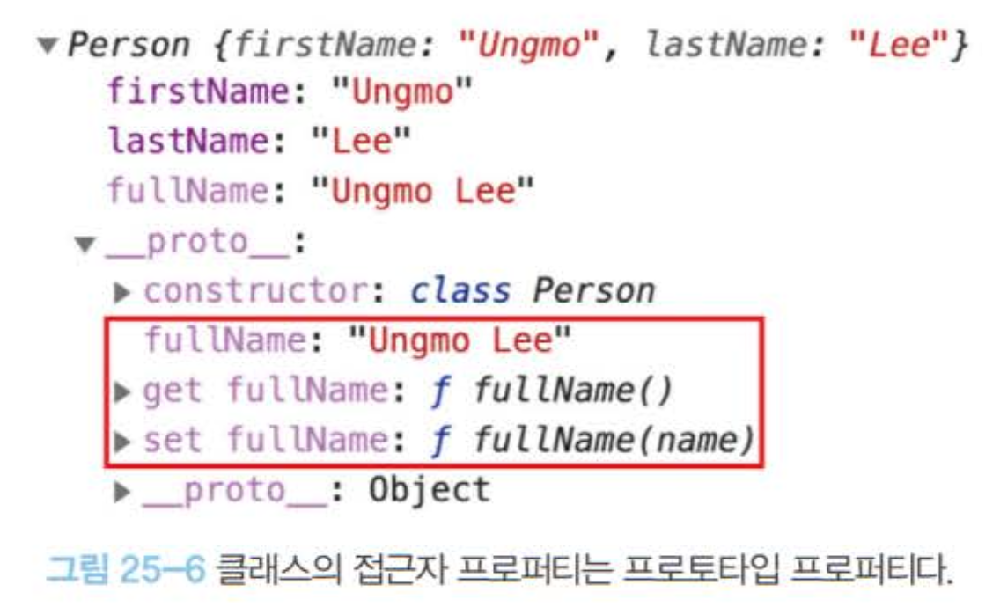
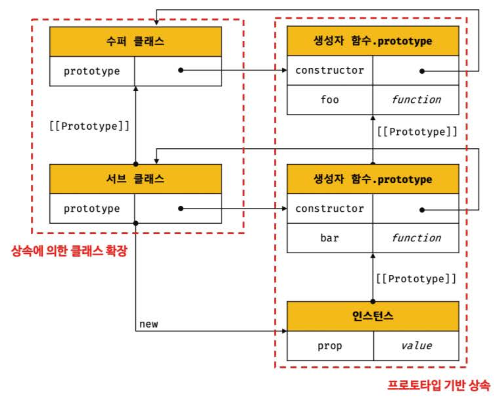
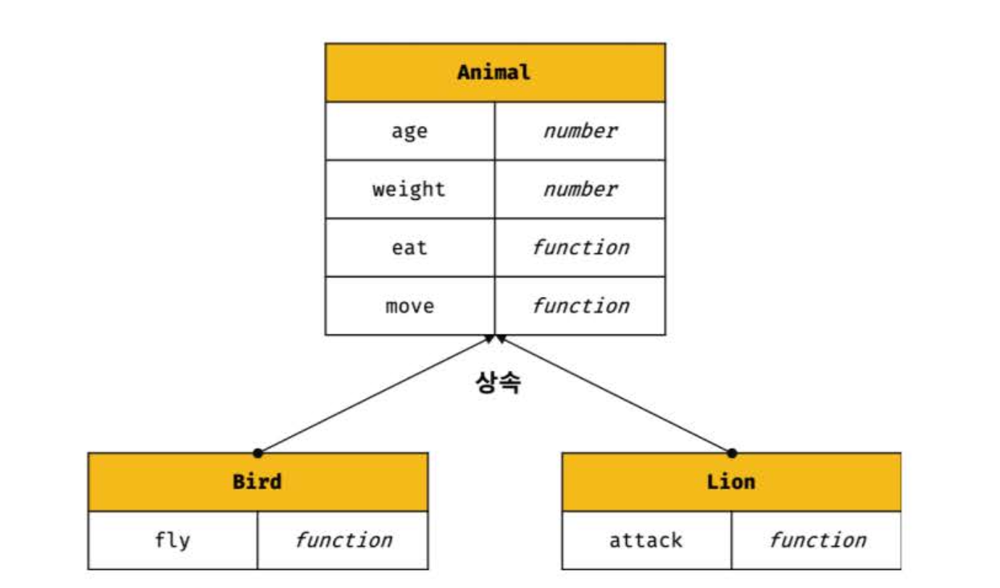
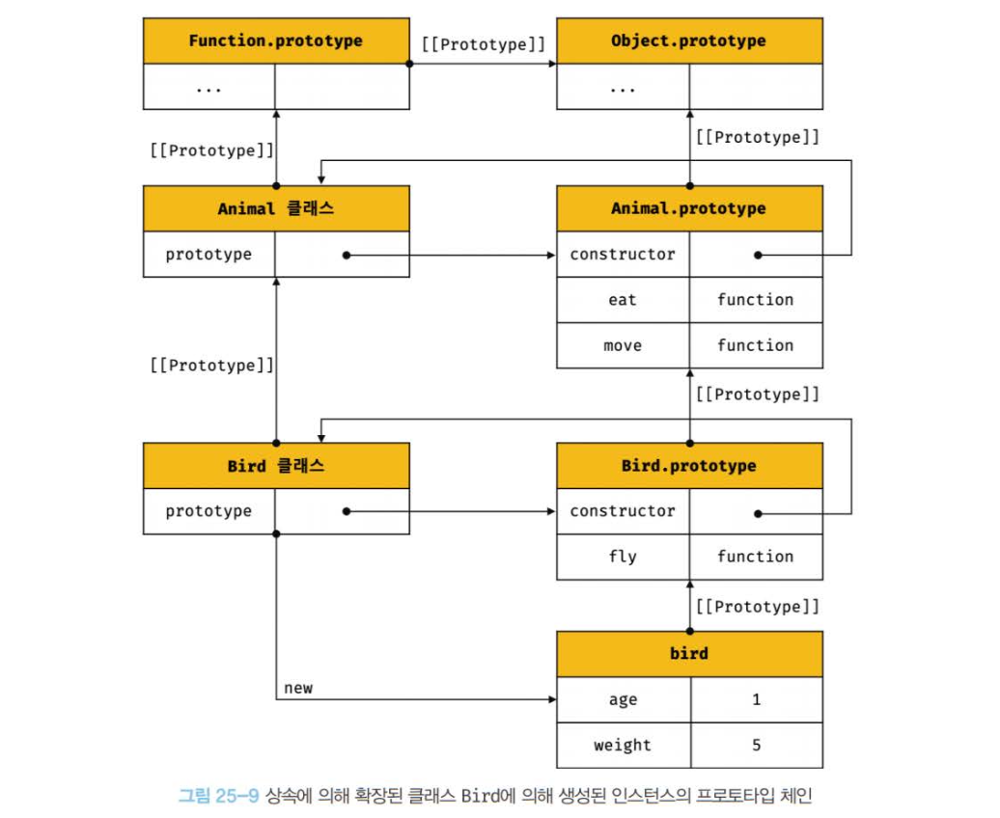
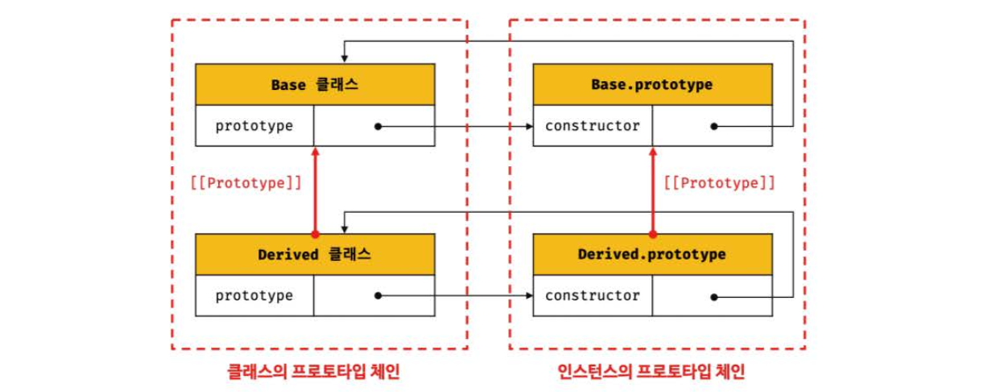

### 25.1 클래스는 프로토타입의 문법적 설탕인가?

> 프로토타입 기반 객체지향 언어인 자바스크립트는 클래스가 필요 없는(class free)객체지향 프로그래밍 언어다.

ES5에서는 클래스 없이도 생성자 함수와 프로토타입을 통해 객체지향 언어의 상속을 구현할 수 있다. `ES6` 에서 도입된 `클래스`는 기존의 프로토타입 기반 객체지향 모델을 폐지하고 새롭게 클래스 기반 객체지향 모델을 제공하는 것은 아니다.

- `클래스`는 `함수`이며 기존 프로토타입 기반 패턴을 클래스 기반 패턴처럼 사용할 수 있도록 하는 `문법적 설탕`이라고 볼 수도 있다.
  `문법적 설탕(Syntax Sugar)`: 사람이 이해 하고 표현하기 쉽게 디자인된 프로그래밍 언어 문법

- `클래스`와 `생성자 함수`는 모두 프로토타입 기반의 인스턴스를 생성하지만 정확히 동일하게 동작하지는 않는다.

<br>

**차이점은 아래와 같다.**

- 클래스를 `new`연산자 없이 호출하면 에러가 발생한다. 하지만 생성자 함수를 new연산자 없이 호출하면 `일반 함수`로 호출된다.

- 클래스는 상속을 지원하는 `extends`와 `super`키워드를 제공한다.

- 클래스는 `호이스팅`이 발생하지 않는 것처럼 동작한다.

- 클래스 내의 모든 코드에는 암묵적으로 `strict mode`가 지정되어 실행되며 해제할 수 없다

- 클래스의 `constructor`, `프로토타입 메서드`, `정적 메서드`는 열거되지 않는다. 모두 프로퍼티 어트리뷰트 `[[Enumerable]]`의 값이 `false`이기 때문이다.

> 따라서 클래스를 프로토타입 기반 객체 생성 패턴의 단순한 문법적 설탕이라고 보기보다는 새로운 객체 생성 매커니즘으로 보는 것이 좀 더 합당하다.

<br>

---

### 25.2 클래스 정의

> 클래스는 어떤 사물의 `공통 속성`을 모아 정의한 추상적인 개념이고, `인스턴스`는 클래스의 속성을 지닌 구체적인 사례이다. by, 코어자바스크립트

```js
[25 - 02];

// 클래스 선언문
class Person {}
```

- `class` 를 사용하여 정의한다.
- `class 이름`은 `파스칼 케이스`를 사용하는 것이 일반적이다.
  <br>

```js
[25 - 03];

// 익명 클래스 표현식
const Person = class {};

// 기명 클래스 표현식
const Person = class MyClass {};
```

- `표현식`으로 클래스를 정의할 수도 있다.
- 클래스는 함수와 마찬가지로 이름을 가질 수도 있고, 갖지 않을 수도 있다.

---

> 클래스를 `표현식`으로 정의할 수 있다는 것은 `값`으로 사용할 수 있는 `일급 객체`라는 것을 의미한다.

- `무명의 리터럴`로 생성할 수 있다, 즉 런타임에 생성이 가능하다.
- `변수`나 `자료구조`(객체, 배열 등)에 저장할 수 있다.
- 함수의 `매개변수`에 전달할 수 있다.
- 함수의 `반환값`으로 사용할 수 있다.

---

> 클래스 몸체에는 0개 이상의 메서드만 정의할 수 있다.

- constructor(생성자)
- 프로토타입 메서드
- 정적 메서드

```js
[25 - 04];

// 📌 클래스 선언문
class Person {
  // 📌 생성자
  constructor(name) {
    // 인스턴스 생성 및 초기화
    this.name = name; // name 프로퍼티는 public하다.
  }

  // 📌 프로토타입 메서드
  sayHi() {
    console.log(`Hi! My name is ${this.name}`);
  }

  // 📌 정적 메서드
  static sayHello() {
    console.log("Hello!");
  }
}

// 인스턴스 생성
const me = new Person("Lee");

// 인스턴스의 프로퍼티 참조
console.log(me.name); // Lee
// 프로토타입 메서드 호출
me.sayHi(); // Hi! My name is Lee
// 정적 메서드 호출
Person.sayHello(); // Hello!
```


<br>

---

### 25.3 클래스 호이스팅

> class 는 `함수`로 평가된다.

```js
[25 - 05];

// 클래스 선언문
class Person {}

console.log(typeof Person); // function
```

- 클래스 선언문으로 정의한 클래스는 함수 선언문과 같이 소스코드 평가 과정, 즉 런타임 이전에 먼저 평가되어 `함수 객체`를 생성한다.
- 이때 클래스가 평가되어 생성된 함수 객체는 `호출할 수 있는 생성자 함수(constructor)`다.
- 생성자 함수는 함수 정의가 평가되어 함수 객체를 생성하는 시점에 프로토타입도 더불어 생성된다.

> 프로토타입과 생성자 함수는 언제나 `쌍`으로 존재하기 때문이다.

---

클래스는 클래스 정의 이전에 `참조`할 수 없다.

- const, let 과 같은 오류가 나온다.

```js
[25 - 06];

console.log(Person);
// 📌 ReferenceError: Cannot access 'Person' before initialization

// 클래스 선언문
class Person {}
```

---

클래스 선언문은 `호이스팅`이 발생하지 않는 것처럼 보이나 그렇지 않다.

```js
[25 - 07];

const Person = "";

{
  // 호이스팅이 발생하지 않는다면 ''이 출력되어야 한다.
  console.log(Person);
  // ReferenceError: Cannot access 'Person' before initialization

  // 클래스 선언문
  class Person {}
}
```

- 클래스 선언문도 변수 선언, 함수 정의와 마찬가지로 `호이스팅`이 발생한다.
- 단, 클래스는 `let`, `const` 키워드로 선언한 변수처럼 `호이스팅`된다.

> 따라서 클래서 이전에 `일시적 사각지대(TDZ)`에 빠지기 때문에 호이스팅이 발생하지 않는 것처럼 동작한다.

<br>

---

### 25.4 인스턴스 생성

- `클래스`는 `생성자 함수`이며 `new 연산자`와 함께 호출되어 `인스턴스`를 생성한다.

- `함수`는 new 연산자를 사용여부에 따라 일반함수로 호출되거나, 인스턴스 생성을 위한 생성자 함수로 호출되지만, **`클래스`는 인스턴스를 생성하는 것이 유일한 존재이므로 반드시 new 연산자와 함께 호출해야한다.**

```js
[25-08], [25-09]

class Person {}

1. new 연산자와 함께 호출
// 인스턴스 생성
const me = new Person();
console.log(me); // Person {}


2. 클래스를 new 연산자 없이 호출하면 타입 에러가 발생한다.
const me = Person();
// TypeError: Class constructor Foo cannot be invoked without 'new'
```

<br>

---

### 25.5 메서드

> 클래스 몸체에는 0개 이상의 메서드만 정의할 수 있다.

- constructor(생성자)
- 프로토타입 메서드
- 정적 메서드
  <br>

#### 25.1 constructor

- `constructor`는 `인스턴스`를 `생성`하고 `초기화`하기 위한 `메서드`다.

- `constructor`는 이름을 변경할 수 없다.

```js
[25 - 11];

class Person {
  // 생성자
  constructor(name) {
    // 인스턴스(객체) 생성 및 초기화
    this.name = name;
  }
}

// 클래스는 함수다.
console.log(typeof Person); // function
```

---

**1️⃣ `클래스` 내부를 들여다보자**


- 클래스도 함수 객체 `고유의 프로퍼티`를 모두 가지고 있다.

- 함수와 동일하게 프로토타입과 연결되어 있으며 `자신의 스코프 체인`을 구성한다.

- prototype 프로퍼티가 가리키는 프로토타입 객체의 constructor 프로퍼티는 `클래스 자신`을 가리키고 있다.

- 이는 클래스가 인스턴스를 생성하는 `생성자 함수`라는 것을 의미한다.

<br>

**2️⃣ 클래스가 생성한 `인스턴스`의 내부를 들여다보자.**


- 생성장 함수와 마찬가지로 constructor 내부에서 this에 추가한 name 프로퍼티가 클래스가 생성한 인스턴스 프로퍼티가 된다.

---

**클래스의 cunstructor 메서드 🆚 프로토타입의 cunstructor 프로퍼티**

- 이 둘은 이름이 같지만 직접적인 관련이 없다.

- 프로토타입의 cuntructor 프로퍼티는 모든 프로토타입이 가지고 있는 프로퍼티이며 생성자 함수를 가리킨다.

---

**constructor는 생성자 함수와 유사하지만 몇가지 차이가 있다.**

- constructor 는 클래스 내에 `한 개`만 존재할 수 있다.

```js
[25-15]

class Person {
  constructor() {}
  constructor() {}
}
// SyntaxError: A class may only have one constructor
```

<br>

- constructor 는 `생략`할 수 있다.
- constructor 는 생략하면 클래스에 빈 constructor가 `암묵적으로 정의`된다.
- constructor를 생략한 클래스는 빈 constructor 에 의해 `빈 객체`를 생성한다.

```js
[25 - 16];

class Person {}

[25 - 17];

class Person {
  // constructor를 생략하면 다음과 같이 빈 constructor가 암묵적으로 정의된다.
  constructor() {}
}

// 빈 객체가 생성된다.
const me = new Person();
console.log(me); // Person {}
```

<br>

- 프로퍼티가 추가되어 초기화된 인스턴스를 생성하려면 constructor 내부에서 `this`에 인스턴스 프로퍼티를 추가한다.

```js
[25 - 18];

class Person {
  constructor() {
    // 고정값으로 인스턴스 초기화
    this.name = "Kim";
    this.address = "Seoul";
  }
}

// 인스턴스 프로퍼티가 추가된다.
const me = new Person();
console.log(me); // Person {name: "Kim", address: "Seoul"}
```

<br>

- 클래스 `외부`에서 인스턴스 프로퍼티의 초기값을 전달하려면 constructor에 `매개변수`를 선언하고 인스턴스를 생성할 때 초기값을 전달한다.

- 이때 초기값은 constructor의 `매개변수`에 전달된다.

- constructor 내에서는 인스턴스의 생성과 동시에 인스턴스 프로퍼티 추가를 통해 인스턴스 초기화를 실행하기 때문에 constructor 를 생략하면 안된다.

```js
[25 - 19];

class Person {
  constructor(name, address) {
    // 인수로 인스턴스 초기화
    this.name = name;
    this.address = address;
  }
}

// 인수로 초기값을 전달한다. 초기값은 constructor에 전달된다.
const me = new Person("Kim", "Seoul");
console.log(me); // Person {name: "Kim", address: "Seoul"}
```

<br>

---

**constructor는 별도의 `반환문`을 갖지 않는다. return 문 반드시 생략! **

**new 연산자와 함께 클래스가 호출되면 암묵적으로 `this` 즉 `인스턴스를 반환`하기 때문이다. **

<br>

- this가 아닌 다른 객체를 명시적으로 반환하면 인스턴스가 반환되지 못하고 return 문에 명시한 객체가 반환된다.

```js
[25 - 20];

class Person {
  constructor(name) {
    this.name = name;

    // 명시적으로 객체를 반환하면 암묵적인 this 반환이 무시된다.
    return {};
  }
}

// constructor에서 명시적으로 반환한 빈 객체가 반환된다.
const me = new Person("Kim");
console.log(me); // {}
```

<br>

- 명시적으로 원시값을 반환하면 원시값은 무시되고 암묵적으로 `this`가 반환된다.

```js
[25 - 21];

class Person {
  constructor(name) {
    this.name = name;

    // 명시적으로 원시값을 반환하면 원시값 반환은 무시되고 암묵적으로 this가 반환된다.
    return 100;
  }
}

const me = new Person("Kim");
console.log(me); // Person { name: "Kim" }
```

<br>

---

#### 25.2 프로토타입 메서드

> 클래스 prototype 내부에 정의된 메서드를 프로토타입 메서드라고 하며, 이들은 인스턴스가 마치 자신의 것처럼 호출할 수 있다. by. 코어자바스크립트

- 클래스는 생성자 함수에 의한 객체 생성 방식과는 다르게 클래스의 prototype 프로퍼티 메서드를 추가하지 않아도 기본적으로 프로토타입 메서드가 된다.

```js
[25 - 23];

class Person {
  // 생성자
  constructor(name) {
    // 인스턴스 생성 및 초기화
    this.name = name;
  }

  // 📌 프로토타입 메서드
  sayHi() {
    console.log(`Hi! My name is ${this.name}`);
  }
}

// Person.prototype.sayHi ~~~~

const me = new Person("Lee");
me.sayHi(); // Hi! My name is Lee
```

<br>

- 생성자 함수와 마찬가지로 클래스가 생성한 인스턴스틑 프로토타입 체인의 일원이 된다.

```js
[25 - 24];

// me 객체의 프로토타입은 Person.prototype이다.
Object.getPrototypeOf(me) === Person.prototype; // -> true
me instanceof Person; // -> true

// Person.prototype의 프로토타입은 Object.prototype이다.
Object.getPrototypeOf(Person.prototype) === Object.prototype; // -> true
me instanceof Object; // -> true

// me 객체의 constructor는 Person 클래스다.
me.constructor === Person; // -> true
```

---

#### 25.3 정적 메서드

> 클래스(생성자함수)에 직접 정의한 메서드를 `static 메서드`라고 하며, 이들은 인스턴스가 직접 호출할 수 없고, 클래스(생성자함수)에 의해서만 호출할 수 있다. by. 코어자바스크립트

- 정적 메서드는 인스턴스를 생성하지 않아도 호출할 수 있는 메서드다.

- 클래스에서는 메서드에 `static` 키워드를 붙이면 정적 메서드(클래스 메서드)가 된다.

```js
[25 - 26];

class Person {
  // 생성자
  constructor(name) {
    // 인스턴스 생성 및 초기화
    this.name = name;
  }

  // 📌 정적 메서드
  static sayHi() {
    console.log("Hi!");
  }
}
```

<br>

- 정적 메서드는 프로토타입 메서드처럼 인스턴스로 호출하지 않고 클래스로 호출한다.

```js
[25 - 27];
// 정적 메서드는 클래스로 호출하며 인스턴스 없이도 호출할 수 있다.
Person.sayHi(); // Hi!

[25 - 28];
// 인스턴스 생성
// 정적 메서드는 인스턴스로 호출할 수 없다.
const me = new Person("Lee");
me.sayHi(); // TypeError: me.sayHi is not a function
```

---

#### 25.4 '정적 메서드'와 '프로토타입 메서드'의 차이

- 정적 메서드와 프로토타입 메서드는 자신이 속해있는 프로토타입 체인이 다르다.

- 정적 메서드는 클래스로 호출, 프로토타입 메서드는 인스턴스로 호출한다.

- 정적 메서드는 인스턴스 프로퍼티를 참조할 수 없지만, 프로토타입 메서드는 인스턴스 프로퍼티를 참조할 수 있다.

---

#### 25.5 클래스에서 정의한 메서드의 특징

- function 키워드를 생략한 메서드 축약 표현을 사용한다.

- 객체 리터럴과는 다르게 클래스에 메서드를 정의할 땐 `콤마`가 필요없다.
- 암묵적으로 `strict mode`로 실행된다.

- `for...in`문이나 `Object.key` 메서드 등으로 열거할 수 없다. 즉, 프로퍼티의 열거 가능 여부를 나타내며, 불리언 값을 갖는 프로퍼티 어트리뷰트 `[[Enumerable ]]`의 값이 `false`다.

- 내부 메서드 `[[Construct]]`를 갖지 않는 `non-constructor`다. 따라서 `new 연산자`와 함께 호출할 수 없다.

---

### 25.6 클래스의 인스턴스 생성과정

#### 1️⃣ 인스턴스 생성과 this 바인딩

- `new`연산자와 함께 클래스를 호출하면 암묵적으로 빈 객체(인스턴스)가 생성된다.

- 암묵적으로 생성된 빈 객체, 즉 인스턴스는 `this`에 `바인딩`된다.

#### 2️⃣ 인스턴스 초기화

- `constructor` 내부의 코드가 실행되며 `this`에 바인딩되어 있는 인스턴스를 초기화한다.

#### 3️⃣ 인스턴스 반환

- 클래스의 모든 처리가 끝나면 완성된 인스턴스가 바인딩된 `this`가 암묵적으로 `반환`된다.

```js
[25 - 32];

class Person {
  // 생성자
  constructor(name) {
    // 1. 암묵적으로 인스턴스가 생성되고 this에 바인딩된다.
    console.log(this); // Person {}
    console.log(Object.getPrototypeOf(this) === Person.prototype); // true

    // 2. this에 바인딩되어 있는 인스턴스를 초기화한다.
    this.name = name;

    // 3. 완성된 인스턴스가 바인딩된 this가 암묵적으로 반환된다.
  }
}
```

---

### 25.7 프로퍼티

#### 25.7.1 인스턴스 프로퍼티

인스턴스 프로퍼티는 constructor 내부에서 정의해야 한다.

```js
class Person {
  constructor(name) {
    // 인스턴스 프로퍼티
    this.name = name;
  }
}

const me = new Person("Lee");
console.log(me); // Person {name: "Lee"}
```

constructor 내부 코드가 실행되기 이전에 constructor 내부의 this에는 이미 클래스가 암묵적으로 생성한 인스턴스인 빈 객체가 바인딩 되어 있다.

그 빈 객체(인스턴스)에 프로퍼티가 추가되어 인스턴스가 초기화된다.

```js
class Person {
  constructor(name) {
    // 인스턴스 프로퍼티
    this.name = name;
  }
}

const me = new Person("Lee");

console.log(me.name); // Lee
```

constructor 내부에서 this에 추가한 프로퍼티는 언제나 클래스가 생성한 인스턴스의 프로퍼티가 된다.

#### 25.7.2 접근자 프로퍼티

'접근자 프로퍼티'는 자체적으로는 값([[Value]])을 갖지 않고, 다른 데이터 프로퍼티의 값을 읽거나 저장할 때 사용하는 접근자 함수(getter 함수와 setter 함수)로 구성된 프로퍼티다. 접근자 프로퍼티는 클래스에서도 사용할 수 있다.

```js
class Person {
  constructor(firstName, lastName) {
    this.firstName = firstName;
    this.lastName = lastName;
  }

  // fullName은 접근자 함수로 구성된 접근자 프로퍼티다.
  // getter 함수
  get fullName() {
    return `${this.firstName} ${this.lastName}`;
  }

  // setter 함수
  set fullName(name) {
    [this.firstName, this.lastName] = name.split(" ");
  }
}

const me = new Person("Ungmo", "Lee");

// 데이터 프로퍼티를 통한 프로퍼티 값의 참조.
console.log(`${me.firstName} ${me.lastName}`); // Ungmo Lee

// 접근자 프로퍼티를 통한 프로퍼티 값의 저장
// 접근자 프로퍼티 fullName에 값을 저장하면 setter 함수가 호출된다.
me.fullName = "Heegun Lee";
console.log(me); // {firstName: "Heegun", lastName: "Lee"}

// 접근자 프로퍼티를 통한 프로퍼티 값의 참조
// 접근자 프로퍼티 fullName에 접근하면 getter 함수가 호출된다.
console.log(me.fullName); // Heegun Lee

// fullName은 접근자 프로퍼티다.
// 접근자 프로퍼티는 get, set, enumerable, configurable 프로퍼티 어트리뷰트를 갖는다.
console.log(Object.getOwnPropertyDescriptor(Person.prototype, "fullName"));
// {get: ƒ, set: ƒ, enumerable: false, configurable: true}
```

- getter 함수:

  - 메서드 이름 앞에 get 키워드를 사용해 정의함
  - 무언가를 취득할 때 사용하므로 return 필요

- setter 함수:
  - 메서드 앞에 set 키워드를 사용해 정의함
  - 무언가를 프로퍼티에 할당해야 할 때 사용하므로 반드시 매개변수 필요

```js
// Object.getOwnPropertyNames는 비열거형(non-enumerable)을 포함한 모든 프로퍼티의 이름을 반환한다.(상속 제외)
Object.getOwnPropertyNames(me); // -> ["firstName", "lastName"]
Object.getOwnPropertyNames(Object.getPrototypeOf(me)); // -> ["constructor", "fullName"]
```

클래스의 메서드는 기본적으로 프로토타입 메서드가 된다. 따라서 클래스의 접근자 프로퍼티 또한 인스턴스 프로퍼티가 아닌 프로토타입의 프로퍼티가 된다.



#### 25.7.3 클래스 필드 정의 제안

> **클래스 필드(class field)**란, 클래스 기반 객체지향 언어에서 클래스가 생성할 인스턴스의 프로퍼티를 가리키는 용어다.

- 자바스크립트의 클래스에서는 인스턴스 프로퍼티를 선언하고 초기화하려면 반드시 constructor 내부에서 this에 프로퍼티를 추가해야 한다.
- 또한, 자바스크립트의 클래스에서 인스턴스 프로퍼티를 참조하려면 반드시 this를 사용하여 참조해야 한다.
- 자바스크립트의 클래스 몸체에는 메서드만 선언할 수 있다. 따라서, 클래스 몸체에 클래스 필드를 선언하면 문법 에러가 발생한다.

```js
class Person {
  // 클래스 필드 정의
  name = "Lee";
}

const me = new Person("Lee");
```

하지만 최신 브라우저(크롬 72 이상) 또는 최신 Node.js(ver.12 이상)에서 실행하면 정상 동작한다. 클래스 몸체에서 클래스 필드를 정의할 수 있는 **클래스 필드 정의(Class Field Definition) 제안**은 아직 ECMAScript 정식 표준 사양으로 승급되지 않았으나, 최신 브라우저와 최신 Node.js는 미리 구현해 놓았다.

```js
class Person {
  // 클래스 필드 정의
  name = "Lee";
}

const me = new Person();
console.log(me); // Person {name: "Lee"}
```

- 클래스 몸체에서 클래스 필드를 정의하는 경우 this에 클래스 필드를 바인딩해서는 안 된다. **this는 클래스의 constructor와 메서드 내에서만 유효**하다.

```js
class Person {
  // this에 클래스 필드를 바인딩해서는 안된다.
  this.name = ''; // SyntaxError: Unexpected token '.'
}
```

- 클래스 필드를 참조하는 경우, 자바스크립트에서는 this를 반드시 사용해야 한다.

```js
class Person {
  // 클래스 필드
  name = "Lee";

  constructor() {
    console.log(name); // ReferenceError: name is not defined
  }
}

new Person();
```

- 클래스 필드에 초기값을 할당하지 않으면 undefined를 갖는다.

```js
class Person {
  // 클래스 필드를 초기화하지 않으면 undefined를 갖는다.
  name;
}

const me = new Person();
console.log(me); // Person {name: undefined}
```

- 인스턴스를 생성할 때 외부의 초기값으로 클래스 필드를 초기화해야 할 필요가 있다면 constructor에서 클래스 필드를 초기화해야 한다.

```js
class Person {
  name;

  constructor(name) {
    // 클래스 필드 초기화.
    this.name = name;
  }
}

const me = new Person("Lee");
console.log(me); // Person {name: "Lee"}
```

- 함수는 일급객체이므로 클래스 필드에 할당할 수 있다.

```js
class Person {
  // 클래스 필드에 문자열을 할당
  name = "Lee";

  // 클래스 필드에 함수를 할당
  getName = function () {
    return this.name;
  };
  // 화살표 함수로 정의할 수도 있다.
  // getName = () => this.name;
}

const me = new Person();
console.log(me); // Person {name: "Lee", getName: ƒ}
console.log(me.getName()); // Lee
```

- 이처럼 클래스 필드에 함수를 할당하는 경우, 이 함수는 프로토타입 메서드가 아닌 인스턴스 메서드가 된다. 모든 클래스 필드는 인스턴스 프로퍼티가 되기 때문이다. 따라서 _클래스 필드에 함수를 할당하는 것은 권장되지 않는다_.

#### 25.7.4 private 필드 정의 제안

- ES6의 클래스는 생성자 함수와 마찬가지로 다른 클래스 기반 객체지향 언어에서 지원하는 private, public, protectec 키워드와 같은 접근 제한자를 지원하지 않는다. 따라서 **인스턴스 프로퍼티는 인스턴스를 통해 클래스 외부에서 언제나 참조할 수 있다(= 언제나 public이다)**.

```js
class Person {
  constructor(name) {
    this.name = name; // 인스턴스 프로퍼티는 기본적으로 public하다.
  }
}

// 인스턴스 생성
const me = new Person("Lee");
console.log(me.name); // Lee
```

- 클래스 필드 정의 제안을 사용하더라도 클래스 필드는 기본적으로 public하기 때문에 외부에 그대로 노출된다.

```js
class Person {
  name = "Lee"; // 클래스 필드도 기본적으로 public하다.
}

// 인스턴스 생성
const me = new Person();
console.log(me.name); // Lee
```

- 2021년 1월 기준, private 필드를 정의할 수 있는 표준 사양 제안이 최신 브라우저와 최신 Node.js에 이미 구현되어 있다.

- private 필드의 선두에는 #을 붙여준다. private 필드를 참조할 때도 #을 붙여주어야 한다.

```js
class Person {
  // private 필드 정의
  #name = "";

  constructor(name) {
    // private 필드 참조
    this.#name = name;
  }
}

const me = new Person("Lee");

// private 필드 #name은 클래스 외부에서 참조할 수 없다.
console.log(me.#name);
// SyntaxError: Private field '#name' must be declared in an enclosing class
```

\***타입스크립트**는 클래스 기반 객체지향 언어가 지원하는 접근 제한자인 public, private, protected를 모두 지원하며, 의미 또한 기본적으로 동일하다.

- public 필드는 어디서든 참조할 수 있지만 private 필드는 클래스 내부에서만 참조할 수 있다.

| **접근 가능성** | **public** | **private** |
| 클래스 내부 | O | **O** |
| 자식 클래스 내부 | O | X |
| 클래스 인스턴스를 통한 접근 | O | X |

- 클래스 외부에서 private 필드에 직접 접근할 수 있는 방법은 없다. 다만 **접근자 프로퍼티**를 통해 간접적으로 접근하는 방법은 유효하다.

```js
class Person {
  // private 필드 정의
  #name = "";

  constructor(name) {
    this.#name = name;
  }

  // name은 접근자 프로퍼티다.
  get name() {
    // private 필드를 참조하여 trim한 다음 반환한다.
    return this.#name.trim();
  }
}

const me = new Person(" Lee ");
console.log(me.name); // Lee
```

- private 필드는 반드시 **클래스 몸체에 정의해야 하고, constructor에 정의하면 에러**가 발생한다.

```js
class Person {
  constructor(name) {
    // private 필드는 클래스 몸체에서 정의해야 한다.
    this.#name = name;
    // SyntaxError: Private field '#name' must be declared in an enclosing class
  }
}
```

#### 25.7.5 static 필드 정의 제안

- 클래스에는 static 키워드를 사용하여 정적 메서드를 정의할 수 있지만 정적 필드를 정의할 수는 없었다. 하지만 2021년 1월 기준, 최신 브라우저와 최신 Node.js에 "Static class features" 중 static public/private 필드가 구현되어 있다.

```js
class MyMath {
  // static public 필드 정의
  static PI = 22 / 7;

  // static private 필드 정의
  static #num = 10;

  // static 메서드
  static increment() {
    return ++MyMath.#num;
  }
}

console.log(MyMath.PI); // 3.142857142857143
console.log(MyMath.increment()); // 11
```

---

### 25.8 상속에 의한 클래스 확장

#### 25.8.1 클래스 상속과 생성자 함수 상속

상속에 의한 클래스 확장은 프로토타입 기반 상속과는 다른 개념이다.
프로토타입 기반 상속은 프로토타입 체인을 통해 다른 객체의 자산을 상속받는 개념이지만,
**상속에 의한 클래스 확장은 기존 클래스를 상속받아 새로운 클래스를 확장하여 정의하는 것**이다.



- 클래스와 생성자 함수는 인스턴스를 생성할 수 있는 함수라는 점에서는 유사하다. 하지만 **클래스는 상속을 통해 기존 클래스를 확장할 수 있는 문법이 제공**되지만 생성자 함수는 그렇지 않다는 차이가 있다.



- 예를 들어 Bird 클래스와 Lion 클래스는 상속을 통해 Animal 클래스의 속성을 그대로 사용하고, 자신만의 고유한 속성을 추가하여 확장했다. 이처럼 상속에 의한 클래스 확장은 **코드 재사용** 관점에서 유용하다.

```js
class Animal {
  constructor(age, weight) {
    this.age = age;
    this.weight = weight;
  }

  eat() {
    return "eat";
  }

  move() {
    return "move";
  }
}

// 상속을 통해 Animal 클래스를 확장한 Bird 클래스
class Bird extends Animal {
  fly() {
    return "fly";
  }
}

const bird = new Bird(1, 5);

console.log(bird); // Bird {age: 1, weight: 5}
console.log(bird instanceof Bird); // true
console.log(bird instanceof Animal); // true

console.log(bird.eat()); // eat
console.log(bird.move()); // move
console.log(bird.fly()); // fly
```



#### 25.8.2 extends 키워드

상속을 통해 클래스를 확장하려면 extends 키워드를 사용하여 상속 받을 클래스를 정의한다.

> 서브클래스(파생 클래스, 자식 클래스): 상속을 통해 확장된 클래스
> 수퍼클래스(베이스 클래스, 부모 클래스): 서브클래스에게 상속된 클래스

- **extends** 키워드의 역할은 **부모 클래스와 자식 클래스 간의 상속관계를 설정**하는 것이다.

- 클래스도 프로토타입을 통해 상속 관계를 구현한다.



- 부모 클래스와 자식 클래스는 인스턴스의 프로토타입 체인, 클래스 간의 프로토타입 체인도 생성한다. 이를 통해 **프로토타입 메서드, 정적 메서드 모두 상속 가능**하다.

#### 25.8.3 동적 상속

- extends 키워드는 클래스뿐만 아니라 **생성자 함수를 상속받아 클래스를 확장할 수도** 있다. 단, **extends 키워드 앞에는 반드시 클래스가** 와야 한다.

```js
// 생성자 함수
function Base(a) {
  this.a = a;
}

// 생성자 함수를 상속받는 서브클래스
class Derived extends Base {}

const derived = new Derived(1);
console.log(derived); // Derived {a: 1}
```

- extends 키워드 다음에는 클래스뿐만 아니라 [[Construct]] 내부 메서드를 갖는 함수 객체로 평가될 수 있는 모든 표현식을 사용할 수 있다. 이를 통해 동적으로 상속받을 대상을 결정할 수 있다.

```js
function Base1() {}

class Base2 {}

let condition = true;

// 조건에 따라 동적으로 상속 대상을 결정하는 서브클래스
class Derived extends (condition ? Base1 : Base2) {}

const derived = new Derived();
console.log(derived); // Derived {}

console.log(derived instanceof Base1); // true
console.log(derived instanceof Base2); // false
```

#### 25.8.4 서브클래스의 constructor

- 클래스에서 constructor를 생략하면 다음과 같이 클래스에 비어 있는 constructor가 암묵적으로 정의된다.

```js
constructor() {}
```

- 자식 클래스에서 constructor를 생략하면 클래스에 다음과 같은 constructor가 암묵적으로 정의된다. args는 new 연산자와 함께 클래스를 호출할 때 전달한 인수의 리스트다.

```js
constructor(...args) { super(...args); }
```

> super()는 부모 클래스의 constructor(super-constructor)를 호출하여 인스턴스를 생성한다.

다음 예제에서는 부모 클래스와 자식 클래스 모두 constructor를 생략했다.

```js
// 수퍼클래스
class Base {}

// 서브클래스
class Derived extends Base {}
```

다음과 같이 암묵적으로 constructor가 정의된다.

```js
// 수퍼클래스
class Base {
  constructor() {}
}

// 서브클래스
class Derived extends Base {
  constructor() {
    super();
  }
}

const derived = new Derived();
console.log(derived); // Derived {}
```

#### 25.8.5 super 키워드

super 키워드는 다음과 같이 동작한다.

> 1. super를 호출하면 부모 클래스의 constructor(super-constructor)를 호출한다.
> 2. super를 참조하면 부모 클래스의 메서드를 호출할 수 있다.

- **super 호출**

"super를 호출하면 부모 클래스의 constructor(super-constructor)를 호출한다."

```js
// 수퍼클래스
class Base {
  constructor(a, b) {
    // ④
    this.a = a;
    this.b = b;
  }
}

// 서브클래스
class Derived extends Base {
  constructor(a, b, c) {
    // ②
    super(a, b); // ③
    this.c = c;
  }
}

const derived = new Derived(1, 2, 3); // ①
console.log(derived); // Derived {a: 1, b: 2, c: 3}
```

- new 연산자와 함께 Derived 클래스를 호출(①)하면서 전달한 인수 1, 2, 3은 Derived 클래스의 constructor(②)에 전달되고, super 호출을 통해(③) Base 클래스의 constructor(④)에 일부가 전달된다.

- 전달된 인수는 부모 클래스와 자식 클래스에 배분되고, 상속 관계의 두 클래스는 서로 협력하여 인스턴스를 생성한다.

**super를 호출할 때 주의사항**

1. 자식 클래스에서 constructor를 생략하지 않는 경우, **constructor에는 반드시 super를 호출**해야 한다.

```js
class Base {}

class Derived extends Base {
  constructor() {
    // ReferenceError: Must call super constructor in derived class before accessing 'this' or returning from derived constructor
    console.log("constructor call");
  }
}

const derived = new Derived();
```

2. 자식 클래스의 constructor에서 **super를 호출하기 전에는 this를 참조할 수 없다**.

```js
class Base {}

class Derived extends Base {
  constructor() {
    // ReferenceError: Must call super constructor in derived class before accessing 'this' or returning from derived constructor
    this.a = 1;
    super();
  }
}

const derived = new Derived(1);
```

3. super는 반드시 **자식 클래스의 constructor애서만 호출**한다.

```js
class Base {
  constructor() {
    super(); // SyntaxError: 'super' keyword unexpected here
  }
}

function Foo() {
  super(); // SyntaxError: 'super' keyword unexpected here
}
```

- **super 참조**

"super를 참조하면 부모 클래스의 메서드를 호출할 수 있다."

1. 자식 클래스의 프로토타입 메서드 내에서 super.sayHi는 부모 클래스의 프로토타입 메서드 sayHi를 가리킨다.

```js
// 수퍼클래스
class Base {
  constructor(name) {
    this.name = name;
  }

  sayHi() {
    return `Hi! ${this.name}`;
  }
}

// 서브클래스
class Derived extends Base {
  sayHi() {
    // super.sayHi는 수퍼클래스의 프로토타입 메서드를 가리킨다.
    return `${super.sayHi()}. how are you doing?`;
  }
}

const derived = new Derived("Lee");
console.log(derived.sayHi()); // Hi! Lee. how are you doing?
```

super는 자신을 참조하고 있는 메서드(Derived의 sayHi)가 바인딩되어 있는 객체(Derived.prototype)의 프로토타입(Base.prototype)을 가리킨다.

따라서 super.sayHi는 Base.prototype.sayHi를 가리킨다.

2. 자식 클래스의 정적 메서드 내에서 super.sayHi는 부모 클래스의 정적 메서드 sayHi를 가리킨다.

```js
// 수퍼클래스
class Base {
  static sayHi() {
    return "Hi!";
  }
}

// 서브클래스
class Derived extends Base {
  static sayHi() {
    // super.sayHi는 수퍼클래스의 정적 메서드를 가리킨다.
    return `${super.sayHi()} how are you doing?`;
  }
}

console.log(Derived.sayHi()); // Hi! how are you doing?
```

#### 25.8.6 상속 클래스의 인스턴스 생성 과정

```js
// 수퍼클래스
class Rectangle {
  constructor(width, height) {
    this.width = width;
    this.height = height;
  }

  getArea() {
    return this.width * this.height;
  }

  toString() {
    return `width = ${this.width}, height = ${this.height}`;
  }
}

// 서브클래스
class ColorRectangle extends Rectangle {
  constructor(width, height, color) {
    super(width, height);
    this.color = color;
  }

  // 메서드 오버라이딩
  toString() {
    return super.toString() + `, color = ${this.color}`;
  }
}

const colorRectangle = new ColorRectangle(2, 4, "red");
console.log(colorRectangle); // ColorRectangle {width: 2, height: 4, color: "red"}

// 상속을 통해 getArea 메서드를 호출
console.log(colorRectangle.getArea()); // 8
// 오버라이딩된 toString 메서드를 호출
console.log(colorRectangle.toString()); // width = 2, height = 4, color = red
```

1. 자식 클래스의 super 호출

자식 클래스가 new 연산자와 함께 호출됨 -> constructor 내부의 super 키워드가 함수처럼 호출됨 -> 부모 클래스의 constructor가 호출됨

자식 클래스는 직접 인스턴스를 생성하지 않고, 부모 클래스에게 인스턴스 생성을 위임한다.
(자식 클래스의 constructor에서 반드시 super를 호출해야 하는 이유)

2. 부모 클래스의 인스턴스 생성과 this 바인딩

부모 클래스의 constructor 내부 코드가 실행되기 이전에 암묵적으로 빈 객체를 생성한다. 이 객체가 바로 인스턴스다. 인스턴스는 this에 바인딩된다. 즉, 부모 클래스의 constructor 내부의 this는 생성된 인스턴스를 가리킨다.

인스턴스는 부모 클래스가 생성한 것이지만, new 연산자와 함게 호출된 클래스가 자식 클래스라는 사실이 중요하다.
new 연산자와 함께 호출된 함수를 가리키는 new.target은 자식 클래스를 가리킨다.
따라서 인스턴스는 new.target이 가리키는 자식 클래스가 생성한 것으로 처리된다.

3. 부모 클래스의 인스턴스 초기화

부모 클래스의 constructor가 실행되어 this에 바인딩 되어 있는 인스턴스에 프로퍼티를 추가하고, constructor가 인수로 전달받은 초기값으로 인스턴스의 프로퍼티를 초기화한다.

4. 자식 클래스 constructor로의 복귀와 this 바인딩

super의 호출이 종료되고, 제어 흐름이 자식 클래스 constructor로 돌아온다.
이때 super가 반환한 인스턴스가 this에 바인딩된다. 자식 클래스는 별도의 인스턴스를 생성하지 않고, super가 반환한 인스턴스를 this에 바인딩하여 그대로 사용한다.

이처럼 super가 호출되지 않으면 인스턴스 생성도, this 바인딩도 불가능하다. 따라서, **자식 클래스 constructor 내부의 인스턴스 초기화는 반드시 super 호출 이후에 처리되어야 한다**.

5. 자식 클래스의 인스턴스 초기화

super 호출 이후, this에 바인딩되어 있는 인스턴스에 프로퍼티를 추가하고 constructor가 인수로 전달받은 초기값으로 인스턴스의 프로퍼티를 초기화한다.

6. 인스턴스 반환

클래스의 모든 처리가 끝나면 완성된 인스턴스가 바인딩된 this가 암묵적으로 반환된다.

#### 25.8.7 표준 빌트인 생성자 함수 확장

extends 키워드 다음에는 클래스뿐만 아니라 [[Construct]] 내부 메서드를 갖는 함수 객체로 평가될 수 있는 모든 표현식을 사용할 수 있다.

String, Number, Array 같은 표준 빌트인 객체도 포함된다.

```js
// Array 생성자 함수를 상속받아 확장한 MyArray
class MyArray extends Array {
  // 중복된 배열 요소를 제거하고 반환한다: [1, 1, 2, 3] => [1, 2, 3]
  uniq() {
    return this.filter((v, i, self) => self.indexOf(v) === i);
  }

  // 모든 배열 요소의 평균을 구한다: [1, 2, 3] => 2
  average() {
    return this.reduce((pre, cur) => pre + cur, 0) / this.length;
  }
}

const myArray = new MyArray(1, 1, 2, 3);
console.log(myArray); // MyArray(4) [1, 1, 2, 3]

// MyArray.prototype.uniq 호출
console.log(myArray.uniq()); // MyArray(3) [1, 2, 3]
// MyArray.prototype.average 호출
console.log(myArray.average()); // 1.75
```

- Array 생성자 함수를 상속받아 확장한 MyArray 클래스가 생성한 인스턴스는 Array.prototype과 MyArray.prototype의 모든 메서드를 사용할 수 있다.

- Array.prototype의 메서드 중에서 map, filter와 같이 새로운 배열을 반환하는 메서드가 MyArray 클래스의 인스턴스를 반환한다.

```js
console.log(myArray.filter((v) => v % 2) instanceof MyArray); // true
```

- 만약 새로운 배열을 반환하는 메서드가 MyArray 클래스의 인스턴스를 반환하지 않고 Array의 인스턴스를 반환하면, MyArray 클래스의 메서드와 메서드 체이닝이 불가능하다.

```js
// 메서드 체이닝
// [1, 1, 2, 3] => [ 1, 1, 3 ] => [ 1, 3 ] => 2
console.log(
  myArray
    .filter((v) => v % 2)
    .uniq()
    .average()
); // 2
```
