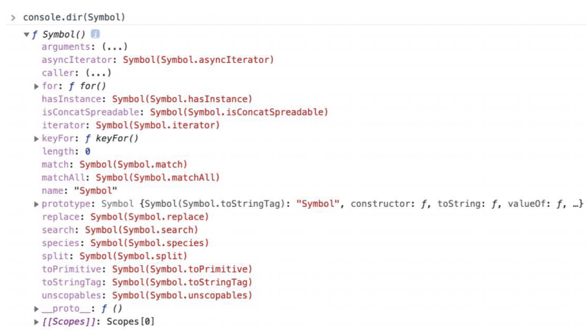

# 33장 7번째 데이터 타입 Symbol

## 33.1 심벌이란?

> 심벌이란 ES6에서 도입된 7번째 데이터 타입으로, 변경 불가능한 원시 타입의 값이다.

- 심벌 값은 다른 값과 중복되지 않는 유일무이한 값이다.

=> 주로 이름의 충돌 위험이 없는 유일한 프로퍼티 키를 만들기 위해 사용한다.
(프로퍼티 키로 사용할 수 있는 값은 빈 문자열을 포함하는 모든 문자열 또는 심벌 값이다.)

---

## 33.2 심벌 값의 생성

### 33.2.1 Symbol 함수

> 심벌 값은 Symbol 함수를 호출하여 생성한다.

- 다른 원시 값(문자열, 숫자, 불리언, undefined, null 타입의 값)은 리터럴 표기법을 통해 생성할 수 있지만 심벌 값은 **Symbol 함수를 호출**하여 생성해야 한다.

- 생성된 심벌 값은 **외부로 노출되지 않아 확인할 수 없고**, 다른 값과 **절대 중복되지 않는 유일무이**한 값이다.

```js
// Symbol 함수를 호출하여 유일무이한 심벌 값을 생성한다.
const mySymbol = Symbol();
console.log(typeof mySymbol); // symbol

// 심벌 값은 외부로 노출되지 않아 확인할 수 없다.
console.log(mySymbol); // Symbol()
```

- 생성자 함수로 객체를 생성하는 것처럼 보이지만, Symbol 함수는 String, Number, Boolean 생성자 함수와는 달리 **new 연산자와 함께 호출하지 않는다**.
- new 연산자와 함께 생성자 함수 또는 클래스를 호출하면 객체(인스턴스)가 생성되지만, **심벌 값은 변경 불가능한 원시 값**이다.

```js
new Symbol(); // TypeError: Symbol is not a constructor
```

- 심벌 값도 숫자, 불리언과 같이 객체처럼 접근하면 암묵적으로 래퍼 객체를 생성한다.

(다음 예제의 description 프로퍼티와 toString 메서드는 Symbol.prototype의 프로퍼티다.)

```js
const mySymbol = Symbol("mySymbol");

// 심벌도 레퍼 객체를 생성한다
console.log(mySymbol.description); // mySymbol
console.log(mySymbol.toString()); // Symbol(mySymbol)
```

- 심벌 값은 암묵적으로 문자열이나 숫자 타입으로 변환되지 않는다.

```js
const mySymbol = Symbol();

// 심벌 값은 암묵적으로 문자열이나 숫자 타입으로 변환되지 않는다.
console.log(mySymbol + ""); // TypeError: Cannot convert a Symbol value to a string
console.log(+mySymbol); // TypeError: Cannot convert a Symbol value to a number
```

- 단, 불리언 타입으로는 암묵적으로 타입 변환된다. 이를 통해 if문 등에서 존재를 확인할 수 있다.

```js
const mySymbol = Symbol();

// 불리언 타입으로는 암묵적으로 타입 변환된다.
console.log(!!mySymbol); // true

// if 문 등에서 존재 확인을 위해 사용할 수 있다.
if (mySymbol) console.log("mySymbol is not empty.");
const mySymbol = Symbol();

// 불리언 타입으로는 암묵적으로 타입 변환된다.
console.log(!!mySymbol); // true

// if 문 등에서 존재 확인을 위해 사용할 수 있다.
if (mySymbol) console.log("mySymbol is not empty.");
```

### 33.2.2 Symbol.for / Symbol.keyFor 메서드

> Symbol.for 메서드는 인수로 전달 받은 문자열을 키로 사용하여 키와 심벌 값의 쌍들이 저장되어 있는 전역 심벌 레지스트리(global symbol registry)에서 해당 키와 일치하는 심벌 값을 검색한다.

- 검색에 성공하면 새로운 심벌 값을 생성하지 않고 검색된 심벌 값을 반환한다.

- 검색에 실패하면 새로운 심벌 값을 생성하여 Symbol.for 메서드의 인수로 전달된 키로 전역 심벌 레지스트리에 저장한 수, 생성된 심벌 값을 반환한다.

```js
// 전역 심벌 레지스트리에 mySymbol이라는 키로 저장된 심벌 값이 없으면 새로운 심벌 값을 생성
const s1 = Symbol.for("mySymbol");
// 전역 심벌 레지스트리에 mySymbol이라는 키로 저장된 심벌 값이 있으면 해당 심벌 값을 반환
const s2 = Symbol.for("mySymbol");

console.log(s1 === s2); // true
```

- Symbol 함수는 호출될 때마다 유일무이한 심벌 값을 생성하는데, 이때 전역 심벌 레지스트리에서 심벌 값을 검색할 수 있는 키를 지정할 수 없으므로 전역 심벌 레지스트리에 등록되어 관리되지 않는다.

- Symbol.for 메서드를 사용하면 애플리케이션 전역에서 중복되지 않는 유일무이한 상수인 심벌값을 단 하나만 생성하여 전역 심벌 레지스트리를 통해 공유할 수 있다.

- Symbol.keyFor 메서드를 사용하면 전역 심벌 레지스트리에 저장된 심벌 값의 키를 추출할 수 있다.

```js
// 전역 심벌 레지스트리에 mySymbol이라는 키로 저장된 심벌 값이 없으면 새로운 심벌 값을 생성
const s1 = Symbol.for("mySymbol");
// 전역 심벌 레지스트리에 저장된 심벌 값의 키를 추출
Symbol.keyFor(s1); // -> mySymbol

// Symbol 함수를 호출하여 생성한 심벌 값은 전역 심벌 레지스트리에 등록되어 관리되지 않는다.
const s2 = Symbol("foo");
// 전역 심벌 레지스트리에 저장된 심벌 값의 키를 추출
Symbol.keyFor(s2); // -> undefined
```

---

## 33.3 심벌과 상수

- 위, 아래, 왼쪽, 오른쪽을 나타내는 상수를 정의한다고 할 때,

```js
// 위, 아래, 왼쪽, 오른쪽을 나타내는 상수를 정의한다.
// 이때 값 1, 2, 3, 4에는 특별한 의미가 없고 상수 이름에 의미가 있다.
const Direction = {
  UP: 1,
  DOWN: 2,
  LEFT: 3,
  RIGHT: 4,
};

// 변수에 상수를 할당
const myDirection = Direction.UP;

if (myDirection === Direction.UP) {
  console.log("You are going UP.");
}
```

위와 같이 값에는 특별한 의미가 없고, 상수 이름 자체에 의미가 있는 경우가 있다.

이때 상수 값 1, 2, 3, 4가 변경되거나, 다른 변수 값과 중복될 가능성이 있다.

이런 경우 변경/중복 가능성이 있는 무의미한 상수 대신, 중복될 가능서잉 없는 유일무이한 심벌 값ㅇ르 사용할 수 있다.

```js
// 위, 아래, 왼쪽, 오른쪽을 나타내는 상수를 정의한다.
// 중복될 가능성이 없는 심벌 값으로 상수 값을 생성한다.
const Direction = {
  UP: Symbol("up"),
  DOWN: Symbol("down"),
  LEFT: Symbol("left"),
  RIGHT: Symbol("right"),
};

const myDirection = Direction.UP;

if (myDirection === Direction.UP) {
  console.log("You are going UP.");
}
```

---

## 33.4 심벌과 프로퍼티 키

- 객체의 프로퍼티 키는 빈 문자열을 포함한 모든 문자열 또는 심벌 값으로 만들 수 있으며, 동적으로 생성할 수도 있다.

- 심벌 값을 프로퍼티 키로 사용하려면 프로퍼티 키로 사용할 심벌 값에 대괄호를 사용해야 한다.

- 프로퍼티에 접근할 때도 대괄호를 사용해야 한다.

```js
const obj = {
  // 심벌 값으로 프로퍼티 키를 생성
  [Symbol.for("mySymbol")]: 1,
};

obj[Symbol.for("mySymbol")]; // -> 1
```

- **심벌 값은 유일무이한 값이므로 심벌 값으로 프로퍼티 키를 만들면 다른 프로퍼티 키와 절대 충돌하지 않는다.**

- 기존 프로퍼티 키와 충돌하지도 않고, 미래에 추가될 프로퍼티 키와도 충돌할 위험이 없다.

---

## 33.5 심벌과 프로퍼티 은닉

- 심벌 값을 프로퍼티 키로 사용하여 생성한 프로퍼티는 `for ... in 문`이나 `Object.keys`, `Object.getOwnPropertyNames` 메서드로 찾을 수 없다.

- 심벌 값을 프로퍼티 키로 사용하여 프로퍼티를 생성하면 외부에 노출할 필요가 없는 프로퍼티를 은닉할 수 있다.

```js
// 표준 빌트인 객체를 확장하는 것은 권장하지 않는다.
Array.prototype.sum = function () {
  return this.reduce((acc, cur) => acc + cur, 0);
};

[1, 2].sum(); // -> 3
```

- 그러나 프로퍼티를 완전히 숨길 수 있는 건 아니고, ES6에서 도입된 `Object.getOwnPropertySymbols` 메서드를 사용하면 심벌 값을 프로퍼티 키로 사용하여 생성한 프로퍼티를 찾을 수 있다.

```js
const obj = {
  // 심벌 값으로 프로퍼티 키를 생성
  [Symbol("mySymbol")]: 1,
};

// getOwnPropertySymbols 메서드는 인수로 전달한 객체의 심벌 프로퍼티 키를 배열로 반환한다.
console.log(Object.getOwnPropertySymbols(obj)); // [Symbol(mySymbol)]

// getOwnPropertySymbols 메서드로 심벌 값도 찾을 수 있다.
const symbolKey1 = Object.getOwnPropertySymbols(obj)[0];
console.log(obj[symbolKey1]); // 1
```

---

## 33.6 심벌과 표준 빌트인 객체 확장

- 표준 빌트인 객체에 사용자 정의 메서드를 직접 추가하여 확장하는 것은 권장하지 않는다.

- 개발자가 직접 추가한 메서드와 미래에 표준 사양으로 추가될 메서드의 이름이 중복될 수 있기 때문에, 표준 빌트인 객체는 읽기 전용으로 사용하는 것이 좋다.

```js
// 표준 빌트인 객체를 확장하는 것은 권장하지 않는다.
Array.prototype.sum = function () {
  return this.reduce((acc, cur) => acc + cur, 0);
};

[1, 2].sum(); // -> 3
```

- 하지만 중복될 가능성이 없는 심벌 값으로 프로퍼티 키를 생성하여 표준 빌트인 객체를 확장하면 기존 프로퍼티 키와 표준 사양의 버전이 올라갔을 때 추가될 수 있는 어떤 프로퍼티 키와도 충돌할 위험이 없다.

```js
// 심벌 값으로 프로퍼티 키를 동적 생성하면 다른 프로퍼티 키와 절대 충돌하지 않아 안전하다.
Array.prototype[Symbol.for("sum")] = function () {
  return this.reduce((acc, cur) => acc + cur, 0);
};

[1, 2][Symbol.for("sum")](); // -> 3
```

---

## 33.7 Well-known Symbol

- 자바스크립트가 기본 제공하는 빌트인 심벌 값이 있다.

- 빌트인 심벌 값은 Symbol 함수의 프로퍼티에 할당되어 있다.



- 빌트인 심벌 값을 ECMAScript 사양에서는 **Well-known Symbol**이라 부른다.

- Well-known Symbol은 자바스크립트 엔진의 내부 알고리즘에 사용된다.

- 예를 들면, Array, String, Map, Set, TypedArray, arguments, NodeList, HTMLCollection과 같이 for ... of 문으로 순회 가능한 빌트인 이터러블은 Well-known Symbol인 Symbol.iterator 메서드를 호출하면 이터레이터를 반환하도록 규정되어 있다.

- 빌트인 이터러블이 아닌 일반 객체를 이터러블처럼 동작하도록 구현하고 싶다면, Well-known Symbol인 Symbol.iterator를 키로 갖는 메서드를 객체에 추가하고, 이터레이터를 반환하도록 구현하면 그 객체는 이터러블이 된다.

```js
// 1 ~ 5 범위의 정수로 이루어진 이터러블
const iterable = {
  // Symbol.iterator 메서드를 구현하여 이터러블 프로토콜을 준수
  [Symbol.iterator]() {
    let cur = 1;
    const max = 5;
    // Symbol.iterator 메서드는 next 메서드를 소유한 이터레이터를 반환
    return {
      next() {
        return { value: cur++, done: cur > max + 1 };
      },
    };
  },
};

for (const num of iterable) {
  console.log(num); // 1 2 3 4 5
}
```

- 이때 일반 객체에 추가해야 하는 메서드의 키 Symbol.iterator는 기존 프로퍼티 키 또는 미래에 추가될 프로퍼티 키와 절대 중복되지 않는다.

> 심벌은 1) 중복되지 않는 상수 값을 생성하는 것은 물론, 2) 작성된 코드에 영향을 주지 않고 새로운 프로퍼티를 추가하기 위해 (하위 호환성을 보장하기 위해) 도입되었다.
