# 39장 DOM

<br>

브라우저 렌더링 엔진은 HTML 문서를 파싱하여 브라우저가 이해할 수 있는 자료구조인 DOM을 생성한다.

> DOM(Document Object Model)은 HTML 문서의 계층적 구조와 정보를 표현하며 이를 제어할 수 있는 API,
> 즉 프로퍼티와 메서드를 제공하는 트리 자료구조다.

## 39.1 노드

<br>

### 39.1.1 HTML 요소와 노드 객체

- HTML 요소(HTML element)는 HTML 문서를 구성하는 개별적인 요소를 의미함


<br>

- HTML 요소는 렌더링 엔진에 의해 파싱되어 DOM을 구성하는 요소 노드 객체로 변환됨
  - 어트리뷰트 => 어트리뷰트 노드
  - 텍스트 콘텐츠 => 텍스트 노드


<br>

HTML 요소는 중첩관계(부자관계)를 갖는다. 즉, HTML 요소의 콘텐츠 영역(<>와 </>의 사이)에는 텍스트뿐 아니라 다른 요소도 포함할 수 있다.

HTML 요소 간 부자관계를 반영하여 모든 노드 객체들은 트리 자료 구조로 구성된다.
<br>

**트리 자료구조(tree data structure)**

> "부모 노드와 자식 노드로 구성되어 노드 간의 계층적 구조를 표현하는 비선형 자료구조"

- 하나의 최상위 노드에서 시작함
- 최상위 노드는 부모 노드가 없고, 루트 노드(root node)라 함
- 루트 노드는 0개 이상의 자식 노드를 가짐
- 자식 노드가 없는 노드를 리프 노드(leaf node)라 함

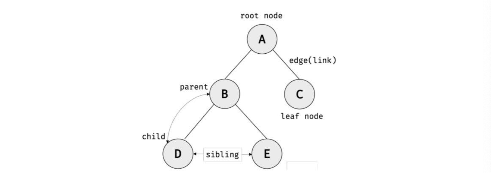
<br>

> 노드 객체들로 구성된 트리 자료구조를 DOM(Document Object Model) 또는 DOM 트리라 한다.
> <br>

### 39.1.2 노드 객체의 타입

예를 들어 다음과 같은 HTML 문서를 렌더링 엔진이 파싱할 때,

```html
<!DOCTYPE html>
<html>
  <head>
    <meta charset="UTF-8" />
    <link rel="stylesheet" href="style.css" />
  </head>
  <body>
    <ul>
      <li id="apple">Apple</li>
      <li id="banana">Banana</li>
      <li id="orange">Orange</li>
    </ul>
    <script src="app.js"></script>
  </body>
</html>
```

렌더링 엔진은 다음과 같이 DOM을 생성한다.

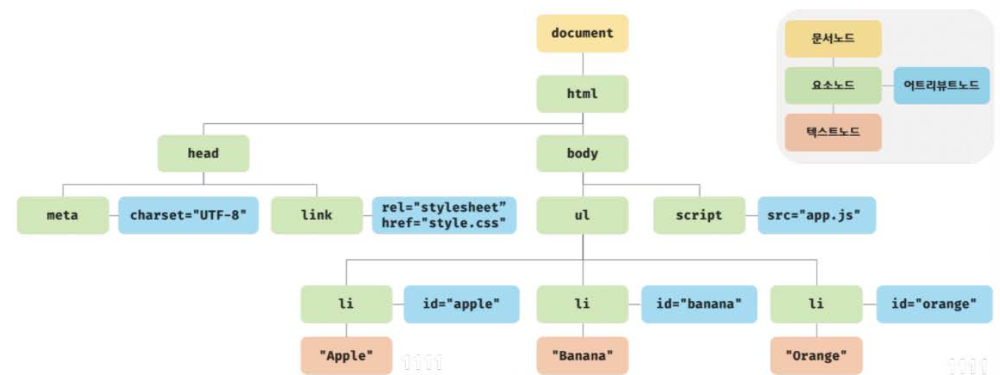
<br>

DOM은 노드 객체의 개충적일 구조로 구성되는데, 노드 객체는 12개의 종류가 있고 상속구조를 갖는다.

- 중요한 노드 타입 네 가지

  1️⃣ **문서 노드(document node)**

  - 유일한 최상위 루트 노드로서, document 객체를 가리킴
  - document 객체는 브라우저가 렌더링한 HTML 문서 전체를 가리키는 객체
  - `window.document` 또는 `document`로 참조할 수 있음
  - 문서 노드(=document 객체)는 DOM 트리의 노드들에 접근하기 위한 진입점 역할을 담당하므로, 요소, 어트리뷰트 텍스트 노드에 접근하려면 문서 노드를 통해야 함
    <br>

  2️⃣ **요소 노드(element node)**

  - HTML 요소를 가리키는 객체
  - HTML 요소 간 중첩에 의해 부자관계를 가짐
  - 문서의 구조를 표현함
    <br>

  3️⃣ **어트리뷰트 노드(attribute node)**

  - HTML 요소의 어트리뷰트를 가리키는 객체
  - 부모 노드가 없고 어트리뷰트가 지정된 요소 노드와 연결되어 있음
  - 부모 노드가 없으므로 요소노드의 형제는 아님
  - 어트리뷰트 노드에 접근하려면 요소 노드에 먼저 접근해야 함
    <br>

  4️⃣ **텍스트 노드(text node)**

  - HTML 요소의 텍스트를 가리키는 갱체
  - 요소 노드는 문서의 구조를 표현하는 반면, 텍스트 노드는 문서의 정보를 표현
  - 요소 노드의 자식 노드이며, 자식 노드를 가질 수 없는 리프 노드
  - DOM 트리의 최종단이므로, 텍스트 요소에 접근하려면 요소 노드에 먼저 접근해야 함
    <br>

### 39.1.3 노드 객체의 상속 구조

- DOM을 구성하는 노드 객체는 ECMAScript 사양에 정의된 표준 빌트인 객체가 아니라 브라우저 환경에서 추가적으로 제공하는 호스트객체다.

- 하지만 노드 객체도 자바스크립트 객체이므로 프로토타입에 의한 상속 구조를 갖는다.

- 노드 객체의 상속 구조:

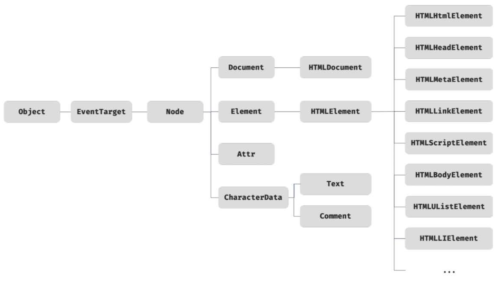

- 모든 객체는 Object, EventTarget, Node 인터페이스를 상속받는다.

- 문서 노드는 Document, HTMLDocument, 어트리뷰트 노드는 Attr, 텍스트 노드는 CharacterData 인터페이스를 각각 상속받는다.

- 요소 노드는 Element 인터페이스와 HTMLHtmlElement, HTMLHeadElement, HTMLUListElement 등의 인터페이스를 추가적으로 상속받는다.

- 노드 객체에는 노드 타입에 상관 없이 모든 노드 객체가 공통으로 갖는 기능도 있고, 노드 타입에 따라 고유한 기능도 있다.

  - 모든 노드 객체는 이벤트를 발생시킬 수 있다. EventTarget 인터페이스는 이벤트 관련 기능(EventTarget.addEventListener, EventTarget.removeListener 등)을 제공한다.

  - 모든 노드 객체는 트리 자료 구조의 노드로서 트리 탐색 기능(Node.parentNode, Node.childNodes, Node.previousSibling, Node.nextSibling 등)과 정보 제공 기능(Node.nodeType, Node.nodeName 등)을 필요로 한다. 노드 관련 기능은 Node 인터페이스가 제공한다.

  - input 요소 노드 객체는 value 프로퍼티가 필요하지만 div 요소 노드 객체는 value 프로퍼티가 필요하지 않다. 필요한 기능을 제공하는 인터페이스(HTMLInputElement, HTMLDivElement)가 HTML 요소의 종류에 따라 각각 다르다.

<br>

> DOM은 HTML 문서의 계층적 구조와 정보를 표현하고, 노드 타입에 따라 필요한 기능을 프로퍼티와 메서드 집합인 DOM API(Application Programming Interface)로 제공한다.
> 이 DOM API를 통해 HTML의 구조나 내용, 스타일 등을 동적으로 조작할 수 있다.

<br>

---

<br>

### 39.2 요소 노드 취득

HTML 구조/내용/스타일을 동적으로 조작하려면 요소 노드를 취득해야 한다.

예를 들어, HTML 문서 내의 h1 요소의 텍스트를 변경하고 싶은 경우, DOM 트리 내에 존재하는 h1 요소 노드를 취득하고, 그것의 자식 노드인 텍스트 노드를 변경한다.

DOM은 요소 노드를 취득할 수 있는 다양한 메서드를 제공한다.

<br>

### 39.2.1 id를 이용한 요소 노드 취득

> `Document.prototype.getElementById` 메서드는 인수로 전달한 id 어트리뷰트 값을 갖는 하나의 요소 노드를 탐색하여 반환한다.

- getElementById 메서드는 Document.prototype의 프로퍼티이므로 **반드시 document를 통해 호출**해야 한다.

```html
<!DOCTYPE html>
<html>
  <body>
    <ul>
      <li id="apple">Apple</li>
      <li id="banana">Banana</li>
      <li id="orange">Orange</li>
    </ul>
    <script>
      // id 값이 'banana'인 요소 노드를 탐색하여 반환한다.
      // 두 번째 li 요소가 파싱되어 생성된 요소 노드가 반환된다.
      const $elem = document.getElementById("banana");

      // 취득한 요소 노드의 style.color 프로퍼티 값을 변경한다.
      $elem.style.color = "red";
    </script>
  </body>
</html>
```

<br>

- HTML 문서 내에서 중복된 id 값을 갖는 요소가 여러 개 존재하더라도, 인수로 전달된 id 값을 갖는 단 하나의 첫 번째 요소 노드만 반환한다.

```html
<!DOCTYPE html>
<html>
  <body>
    <ul>
      <li id="banana">Apple</li>
      <li id="banana">Banana</li>
      <li id="banana">Orange</li>
    </ul>
    <script>
      // getElementById 메서드는 언제나 단 하나의 요소 노드를 반환한다.
      // 첫 번째 li 요소가 파싱되어 생성된 요소 노드가 반환된다.
      const $elem = document.getElementById("banana");

      // 취득한 요소 노드의 style.color 프로퍼티 값을 변경한다.
      $elem.style.color = "red";
    </script>
  </body>
</html>
```

<br>

- 인수로 전달된 id 값을 갖는 HTML 요소가 존재하지 않는 경우 getElementById 메서드는 null을 반환한다.

```html
<!DOCTYPE html>
<html>
  <body>
    <ul>
      <li id="apple">Apple</li>
      <li id="banana">Banana</li>
      <li id="orange">Orange</li>
    </ul>
    <script>
      // id 값이 'grape'인 요소 노드를 탐색하여 반환한다. null이 반환된다.
      const $elem = document.getElementById("grape");

      // 취득한 요소 노드의 style.color 프로퍼티 값을 변경한다.
      $elem.style.color = "red";
      // -> TypeError: Cannot read property 'style' of null
    </script>
  </body>
</html>
```

<br>

- HTML 요소에 id 어트리뷰트를 부여하면 id 값과 동일한 이름의 전역변수가 암묵적으로 선언되고 해당 노드 객체가 할당되는 부수효과가 있다.

```html
<!DOCTYPE html>
<html>
  <body>
    <div id="foo"></div>
    <script>
      // id 값과 동일한 이름의 전역 변수가 암묵적으로 선언되고 해당 노드 객체가 할당된다.
      console.log(foo === document.getElementById("foo")); // true

      // 암묵적 전역으로 생성된 전역 프로퍼티는 삭제되지만 전역 변수는 삭제되지 않는다.
      delete foo;
      console.log(foo); // <div id="foo"></div>
    </script>
  </body>
</html>
```

<br>

- 단, id 값과 동일한 이름의 전역 변수가 이미 선언되어 있으면 이 전역 변수에 노드 객체가 재할당되지는 않는다.

```html
<!DOCTYPE html>
<html>
  <body>
    <div id="foo"></div>
    <script>
      let foo = 1;

      // id 값과 동일한 이름의 전역 변수가 이미 선언되어 있으면 노드 객체가 재할당되지 않는다.
      console.log(foo); // 1
    </script>
  </body>
</html>
```

<br>

### 39.2.2 태그 이름을 이용한 요소 노드 취득

- `Document.prototype/Element.prototype.getElementsByTagName` 메서드는 인수로 전달한 태그 이름을 갖는 모든 요소 노드들을 탐색하여 반환한다.

- 여러 개의 요소 노드 객체를 갖는 DOM 컬렉션 객체인 HTMLCollection 객체를 반환한다.

```html
<!DOCTYPE html>
<html>
  <body>
    <ul>
      <li id="apple">Apple</li>
      <li id="banana">Banana</li>
      <li id="orange">Orange</li>
    </ul>
    <script>
      // 태그 이름이 li인 요소 노드를 모두 탐색하여 반환한다.
      // 탐색된 요소 노드들은 HTMLCollection 객체에 담겨 반환된다.
      // HTMLCollection 객체는 유사 배열 객체이면서 이터러블이다.
      const $elems = document.getElementsByTagName("li");

      // 취득한 모든 요소 노드의 style.color 프로퍼티 값을 변경한다.
      // HTMLCollection 객체를 배열로 변환하여 순회하며 color 프로퍼티 값을 변경한다.
      [...$elems].forEach((elem) => {
        elem.style.color = "red";
      });
    </script>
  </body>
</html>
```

- HTMLCollection 객체는 유사배열객체이면서 이터러블이다.

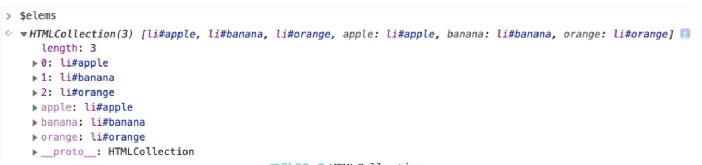
<br>

- HTML 문서의 모든 요소 노드를 취득하려면 getElementsByTagName 메서드의 인수로 '\*'을 전달한다.

```js
// 모든 요소 노드를 탐색하여 반환한다.
const $all = document.getElementsByTagName("*");
// -> HTMLCollection(8) [html, head, body, ul, li#apple, li#banana, li#orange, script, apple: li#apple, banana: li#banana, orange: li#orange]
```

<br>

- `Document.prototype.getElementsByTagName` 메서드는 DOM의 루트 노드인 document를 통해 호출하며, DOM 전체에서 요소 노드를 탐색하여 반환한다.

- 반면 `Element.prototype.getElementsByTagName` 메서드는 특정 요소 노드를 통해 호출하며, 특정 요소 노드의 자손 노드 중에서 요소 노드를 탐색하여 반환한다.

- 만약 인수로 전달된 태그 이름을 갖는 요소가 존재하지 않는 경우 빈 HTMLCollection 객체가 반환된다.

```html
<!DOCTYPE html>
<html>
  <body>
    <ul id="fruits">
      <li>Apple</li>
      <li>Banana</li>
      <li>Orange</li>
    </ul>
    <ul>
      <li>HTML</li>
    </ul>
    <script>
      // DOM 전체에서 태그 이름이 li인 요소 노드를 모두 탐색하여 반환한다.
      const $lisFromDocument = document.getElementsByTagName("li");
      console.log($lisFromDocument); // HTMLCollection(4) [li, li, li, li]

      // #fruits 요소의 자손 노드 중에서 태그 이름이 li인 요소 노드를 모두
      // 탐색하여 반환한다.
      const $fruits = document.getElementById("fruits");
      const $lisFromFruits = $fruits.getElementsByTagName("li");
      console.log($lisFromFruits); // HTMLCollection(3) [li, li, li]
    </script>
  </body>
</html>
```

<br>

### 39.2.3 class를 이용한 요소 노드 취득

- `Document.prototype/Element.prototype.getElementsByClassName` 메서드는 인수로 전달한 class 어트리뷰트 값을 갖는 모드 ㄴ요소 노드들을 탐색하여 반환한다.

- 인수로 전달할 class 값은 공백으로 구분하여 여러 개를 지정할 수 있다.

- 여러 개의 요소 노드 객체를 갖는 DOM 컬렉션 객체인 HTMLCollection 객체를 반환한다.

```html
<!DOCTYPE html>
<html>
  <body>
    <ul>
      <li class="fruit apple">Apple</li>
      <li class="fruit banana">Banana</li>
      <li class="fruit orange">Orange</li>
    </ul>
    <script>
      // class 값이 'fruit'인 요소 노드를 모두 탐색하여 HTMLCollection 객체에 담아 반환한다.
      const $elems = document.getElementsByClassName("fruit");

      // 취득한 모든 요소의 CSS color 프로퍼티 값을 변경한다.
      [...$elems].forEach((elem) => {
        elem.style.color = "red";
      });

      // class 값이 'fruit apple'인 요소 노드를 모두 탐색하여 HTMLCollection 객체에 담아 반환한다.
      const $apples = document.getElementsByClassName("fruit apple");

      // 취득한 모든 요소 노드의 style.color 프로퍼티 값을 변경한다.
      [...$apples].forEach((elem) => {
        elem.style.color = "blue";
      });
    </script>
  </body>
</html>
```

<br>

- Document.prototype.getElementsByClassName 메서드는 DOM의 루트 노드인 문서 노드, document를 통해 호출하며 DOM 전체에서 요소 노드를 탐색하여 반환한다.

- Element.prototype.getElementsByClassName 메서드는 특정 요소 노드를 통해 호출하며 특정 요소 노드의 자손 노드 중에서 요소 노드를 탐색하여 반환한다.

- 만약 인수로 전달된 class 값을 갖는 요소가 존재하지 않는 경우 getElementsByClassName 메서드는 빈 HTMLCollection 객체를 반환한다.

```html
<!DOCTYPE html>
<html>
  <body>
    <ul id="fruits">
      <li class="apple">Apple</li>
      <li class="banana">Banana</li>
      <li class="orange">Orange</li>
    </ul>
    <div class="banana">Banana</div>
    <script>
      // DOM 전체에서 class 값이 'banana'인 요소 노드를 모두 탐색하여 반환한다.
      const $bananasFromDocument = document.getElementsByClassName("banana");
      console.log($bananasFromDocument); // HTMLCollection(2) [li.banana, div.banana]

      // #fruits 요소의 자손 노드 중에서 class 값이 'banana'인 요소 노드를 모두 탐색하여 반환한다.
      const $fruits = document.getElementById("fruits");
      const $bananasFromFruits = $fruits.getElementsByClassName("banana");

      console.log($bananasFromFruits); // HTMLCollection [li.banana]
    </script>
  </body>
</html>
```

<br>

### 39.2.4 CSS 선택자를 이용한 요소 노드 취득

CSS 선택자는 스타일을 적용하고자 하는 HTML 요소를 특정할 때 사용하는 문법이다.

```js
/* 전체 선택자: 모든 요소를 선택 */
* { ... }

/* 태그 선택자: 모든 p 태그 요소를 모두 선택 */
p { ... }

/* id 선택자: id 값이 'foo'인 요소를 모두 선택 */
#foo { ... }

/* class 선택자: class 값이 'foo'인 요소를 모두 선택 */
.foo { ... }

/* 어트리뷰트 선택자: input 요소 중에 type 어트리뷰트 값이 'text'인 요소를 모두 선택 */
input[type=text] { ... }

/* 후손 선택자: div 요소의 후손 요소 중 p 요소를 모두 선택 */
div p { ... }

/* 자식 선택자: div 요소의 자식 요소 중 p 요소를 모두 선택 */
div > p { ... }

/* 인접 형제 선택자: p 요소의 형제 요소 중에 p 요소 바로 뒤에 위치하는 ul 요소를 선택 */
p + ul { ... }

/* 일반 형제 선택자: p 요소의 형제 요소 중에 p 요소 뒤에 위치하는 ul 요소를 모두 선택 */
p ~ ul { ... }

/* 가상 클래스 선택자: hover 상태인 a 요소를 모두 선택 */
a:hover { ... }
-
/* 가상 요소 선택자: p 요소의 콘텐츠의 앞에 위치하는 공간을 선택
   일반적으로 content 프로퍼티와 함께 사용된다. */
p::before { ... }
```

<br>

- Document.prototype/Element.prototype.querySelector 메서드는 인수로 전달한 CSS 선택자를 만족시키는 단 하나의 요소 노드를 탐색하여 반환한다.

- 인수로 전달한 CSS 선택자를 만족시키는 요소 노드가 여러 개인 경우 첫 번째 요소 노드만 반환한다.

- 인수로 전달한 CSS 선택자를 만족시키는 요소 노드가 없는 경우 null을 반환한다.

- 인수로 전달한 CSS 선택자가 문법에 맞지 않는 경우 DOMException 에러가 발생한다.

```html
<!DOCTYPE html>
<html>
  <body>
    <ul>
      <li class="apple">Apple</li>
      <li class="banana">Banana</li>
      <li class="orange">Orange</li>
    </ul>
    <script>
      // class 어트리뷰트 값이 'banana'인 첫 번째 요소 노드를 탐색하여 반환한다.
      const $elem = document.querySelector(".banana");

      // 취득한 요소 노드의 style.color 프로퍼티 값을 변경한다.
      $elem.style.color = "red";
    </script>
  </body>
</html>
```

<br>

- Document.prototype/Element.prototype.querySelectorAll 메서드는 인수로 전달한 CSS 선택자를 만족시키는 모든 요소 노드를 탐색하여 반환한다.

- querySelectorAll 메서드는 여러 개의 요소 노드 객체를 갖는 DOM 컬렉션 객체인 NodeList 객체를 반환한다.

- NodeList 객체는 유사 배열 객체이면서 이터러블이다.

- 인수로 전달된 CSS 선택자를 만족시키는 요소가 존재하지 않는 경우, 빈 NodeList 객체를 반환한다.

- 인수로 전달된 CSS 선택자가 문법에 맞지 않는 경우 DOMException 에러가 발생한다.

```html
<!DOCTYPE html>
<html>
  <body>
    <ul>
      <li class="apple">Apple</li>
      <li class="banana">Banana</li>
      <li class="orange">Orange</li>
    </ul>
    <script>
      // ul 요소의 자식 요소인 li 요소를 모두 탐색하여 반환한다.
      const $elems = document.querySelectorAll("ul > li");
      // 취득한 요소 노드들은 NodeList 객체에 담겨 반환된다.
      console.log($elems); // NodeList(3) [li.apple, li.banana, li.orange]

      // 취득한 모든 요소 노드의 style.color 프로퍼티 값을 변경한다.
      // NodeList는 forEach 메서드를 제공한다.
      $elems.forEach((elem) => {
        elem.style.color = "red";
      });
    </script>
  </body>
</html>
```

<br>

- HTML 문서의 모든 요소 노드를 취득하려면 querySelectorAll 메서드의 인수로 전체 선택자 '\*'를 전달한다.

```js
// 모든 요소 노드를 탐색하여 반환한다.
const $all = document.querySelectorAll("*");
// -> NodeList(8) [html, head, body, ul, li#apple, li#banana, li#orange, script]
```

<br>

- Document.prototype.querySelector과 Document.prototype.querySelectorAll 메서드는 DOM의 루트 노드인 문서 노드, document를 통해 호출하며, DOM 전체에서 요소 노드를 탐색하여 반환한다.

<br>

> id 어트리뷰트가 있는 요소 노드를 취득하는 경우에는 getElementById 메서드를 사용하고, 그 외의 경우 querySelctor, querySelectorAll 메서드 사용을 권장한다.

: querySelector, querySelectorAll 메서드는 getElementById, getElementBy\*\*\* 메서드보다 다소 느리기 때문.

<br>

### 39.2.5 특정 요소 노드를 취득할 수 있는지 확인

- Element.prototype.matches 메서드는 인수로 전달한 CSS 선택자를 통해 특정 요소 노드를 취득할 수 있는지 확인한다.

- Element.prototype.matches 메서드는 이벤트 위임을 사용할 때 유용하다.

```html
<!DOCTYPE html>
<html>
  <body>
    <ul id="fruits">
      <li class="apple">Apple</li>
      <li class="banana">Banana</li>
      <li class="orange">Orange</li>
    </ul>
  </body>
  <script>
    const $apple = document.querySelector(".apple");

    // $apple 노드는 '#fruits > li.apple'로 취득할 수 있다.
    console.log($apple.matches("#fruits > li.apple")); // true

    // $apple 노드는 '#fruits > li.banana'로 취득할 수 없다.
    console.log($apple.matches("#fruits > li.banana")); // false
  </script>
</html>
```

<br>

### 39.2.6 HTMLCollection과 NodeList

- DOM API가 여러 개의 결과값을 반환하기 위한 DOM 컬렉션 객체
- 유사 배열 객체이면서 이터러블 (for...of문으로 순회 가능, 스프레드 문법으로 배열 변환 가능)
- 노드 객체의 상태 변화를 실시간으로 반영하는 **"살아 있는 객체"**

<br>

**HTMLCollection**

- getElementsByTagName, getElementsByClassName 메서드가 반환하는 HTMLCollection 객체는 노드 객체의 상태 변화를 실시간으로 반영하는 살아 있는 DOM 컬렉션 객체다.

- HTMLCollection 객체는 실시간으로 노드 객체의 상태 변경을 반영하여 요소를 제거할 수 있기 때문에 HTMLCollection 객체를 for문으로 순회하면서 노드 객체의 상태를 변경해야 할 때 주의해야 한다.

```html
<!DOCTYPE html>
<head>
  <style>
    .red {
      color: red;
    }
    .blue {
      color: blue;
    }
  </style>
</head>
<html>
  <body>
    <ul id="fruits">
      <li class="red">Apple</li>
      <li class="red">Banana</li>
      <li class="red">Orange</li>
    </ul>
    <script>
      // class 값이 'red'인 요소 노드를 모두 탐색하여 HTMLCollection 객체에 담아 반환한다.
      const $elems = document.getElementsByClassName("red");
      // 이 시점에 HTMLCollection 객체에는 3개의 요소 노드가 담겨 있다.
      console.log($elems); // HTMLCollection(3) [li.red, li.red, li.red]

      // HTMLCollection 객체의 모든 요소의 class 값을 'blue'로 변경한다.
      for (let i = 0; i < $elems.length; i++) {
        $elems[i].className = "blue";
      }

      // HTMLCollection 객체의 요소가 3개에서 1개로 변경되었다.
      console.log($elems); // HTMLCollection(1) [li.red]
    </script>
  </body>
</html>
```

<br>

- for문을 역방향으로 순회하거나 while문을 사용하는 방법으로 위의 문제를 회피할 수 있다.

```js
// for 문을 역방향으로 순회
for (let i = $elems.length - 1; i >= 0; i--) {
  $elems[i].className = "blue";
}
```

```js
// while 문으로 HTMLCollection에 요소가 남아 있지 않을 때까지 무한 반복
let i = 0;
while ($elems.length > i) {
  $elems[i].className = "blue";
}
```

<br>

- 유사 배열 객체이면서 이터러블인 HTMLCollection 객체를 배열로 변환하면 부작용을 일으킬 HTMLCollection 객체를 사용할 필요가 없고, forEach, map, filter, reduce 등을 사용할 수 있어 유용하다.

```js
// 유사 배열 객체이면서 이터러블인 HTMLCollection을 배열로 변환하여 순회
[...$elems].forEach((elem) => (elem.className = "blue"));
```

<br>

**NodeList**

- HTMLCollection 객체의 부작용을 해결하기 위해 getElementsBy\*\*\* 메서드 대신 querySelectorAll 메서드를 사용하는 방법도 있다.

- querySelectorAll 메서드는 DOM 컬렉션 객체인 NodeList 객체를 반환한다.

- NodeList 객체는 실시간으로 노드 객체의 상태 변경을 반영하지 않는 객체다.

```js
// querySelectorAll은 DOM 컬렉션 객체인 NodeList를 반환한다.
const $elems = document.querySelectorAll(".red");

// NodeList 객체는 NodeList.prototype.forEach 메서드를 상속받아 사용할 수 있다.
$elems.forEach((elem) => (elem.className = "blue"));
```

- NodeList 객체는 (Array.prototype.forEach 메서드와 사용방법이 동일한) NodeList.prototype.forEach 메서드를 상속받아 사용할 수 있다.

- childNodes 프로퍼티가 반환하는 NodeList 객체는 HTMLCollection 객체와 같이 실시간으로 노드 객체의 상태 변경을 반영하는 live 객체로 동작하므로 주의가 필요하다.

```html
<!DOCTYPE html>
<html>
  <body>
    <ul id="fruits">
      <li>Apple</li>
      <li>Banana</li>
    </ul>
  </body>
  <script>
    const $fruits = document.getElementById("fruits");

    // childNodes 프로퍼티는 NodeList 객체(live)를 반환한다.
    const { childNodes } = $fruits;
    console.log(childNodes instanceof NodeList); // true

    // $fruits 요소의 자식 노드는 공백 텍스트 노드(39.3.1절 "공백 텍스트 노드" 참고)를 포함해 모두 5개다.
    console.log(childNodes); // NodeList(5) [text, li, text, li, text]

    for (let i = 0; i < childNodes.length; i++) {
      // removeChild 메서드는 $fruits 요소의 자식 노드를 DOM에서 삭제한다.
      // (39.6.9절 "노드 삭제" 참고)
      // removeChild 메서드가 호출될 때마다 NodeList 객체인 childNodes가 실시간으로 변경된다.
      // 따라서 첫 번째, 세 번째 다섯 번째 요소만 삭제된다.
      $fruits.removeChild(childNodes[i]);
    }

    // 예상과 다르게 $fruits 요소의 모든 자식 노드가 삭제되지 않는다.
    console.log(childNodes); // NodeList(2) [li, li]
  </script>
</html>
```

> 노드 객체의 상태 변경과 상관없이 안전하게 DOM 컬렉션을 사용하려면 HTMLCollection과 NodeList 객체를 배열로 변환하여 사용하는 것을 권장한다.

```html
<!DOCTYPE html>
<html>
  <body>
    <ul id="fruits">
      <li>Apple</li>
      <li>Banana</li>
    </ul>
  </body>
  <script>
    const $fruits = document.getElementById("fruits");

    // childNodes 프로퍼티는 NodeList 객체(live)를 반환한다.
    const { childNodes } = $fruits;

    // 스프레드 문법을 사용하여 NodeList 객체를 배열로 변환한다.
    [...childNodes].forEach((childNode) => {
      $fruits.removeChild(childNode);
    });

    // $fruits 요소의 모든 자식 노드가 모두 삭제되었다.
    console.log(childNodes); // NodeList []
  </script>
</html>
```

<br>

---

<br>

## 39.3 노드 탐색

요소 노드를 취득한 다음, 취득한 요소 노드를 기점으로 DOM 트리의 노드를 옮겨 다니며 부모, 형제, 자식 노드 등을 탐색(traversing, node walking)해야 할 때가 있다.

```html
<ul id="fruits">
  <li class="apple">Apple</li>
  <li class="banana">Banana</li>
  <li class="orange">Orange</li>
</ul>
```

- ul#fruits 요소 노드를 취득한 다음, 자식 노드를 모두 탐색하거나 자식 노드 중 하나만 탐색할 수 있다.
- li.banana 요소 노드를 취득한 다음, 형제 노드를 탐색하거나 부모 노드를 탐색할 수 있다.

> 이처럼 DOM 트리 상의 노드를 탐색할 수 있도록 Node, Element 인터페이스는 **트리 탐색 프로퍼티**를 제공한다.

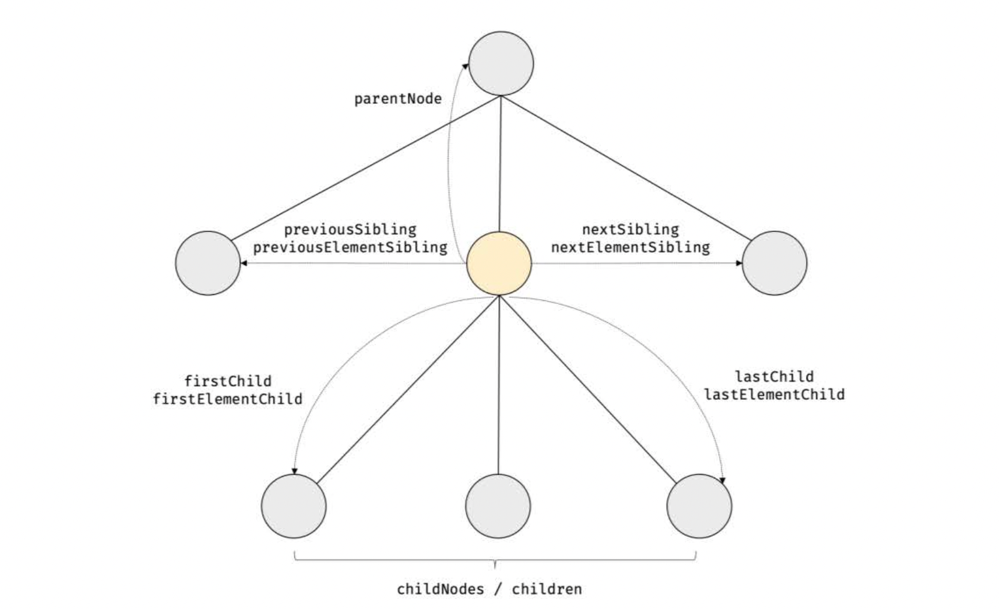

- parentNode, previousSibling, firstChild, childNodes 프로퍼티는 Node.prototype이 제공

- previousElementSibling, nextElementSibling, children 프로퍼티는 Element.prototype이 제공

- 노드 탐색 프로퍼티는 모두 접근자 프로퍼티

- 단, setter 없이 getter만 존재하여 참조만 가능한 읽기 전용 접근자 프로퍼티

<br>

### 39.3.1 공백 텍스트 노드

- HTML 요소 사이의 스페이스, 탭, 줄바꿈 등의 공백 문제는 텍스트 노드를 생성한다. 이를 **공백 텍스트 노드**라 한다.

```html
<!DOCTYPE html>
<html>
  <body>
    <ul id="fruits">
      <li class="apple">Apple</li>
      <li class="banana">Banana</li>
      <li class="orange">Orange</li>
    </ul>
  </body>
</html>
```

위 HTML 문서는 파싱되어 다음과 같은 DOM을 생성한다.

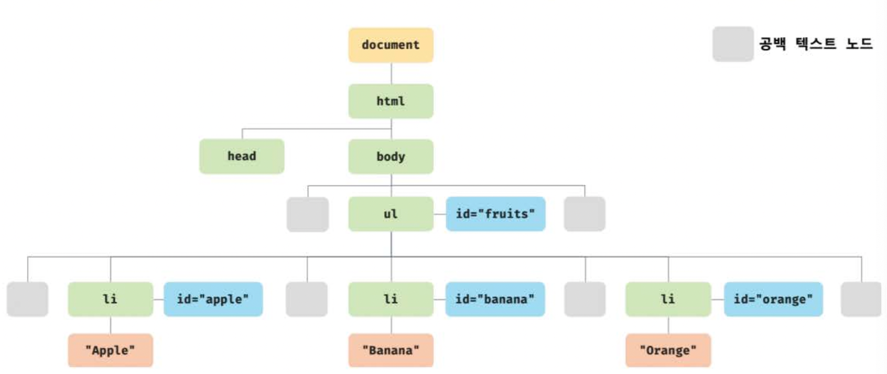

> HTML 문서의 공백 문자는 공백 텍스트 노드를 생성하므로, 노드를 탐색할 때 공백 문자가 생성한 공백 텍스트 노드에 주의해야 한다.

인위적으로 HTML 문서의 공백문자를 제거하면 공백 텍스트 노드를 생성하지 않지만, 가독성이 좋지 않으므로 권장하지 않는다.

<br>

### 39.3.2 자식 노드 탐색

자식 노드를 탐색하기 위해 다음과 같은 노드 탐색 프로퍼티를 사용한다.

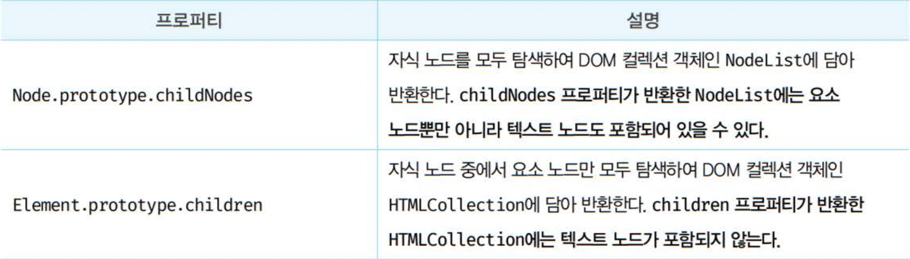
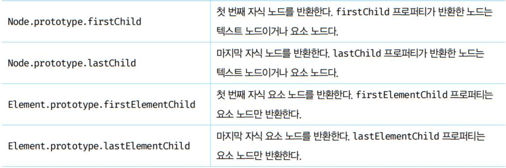

```html
<!DOCTYPE html>
<html>
  <body>
    <ul id="fruits">
      <li class="apple">Apple</li>
      <li class="banana">Banana</li>
      <li class="orange">Orange</li>
    </ul>
  </body>
  <script>
    // 노드 탐색의 기점이 되는 #fruits 요소 노드를 취득한다.
    const $fruits = document.getElementById("fruits");

    // #fruits 요소의 모든 자식 노드를 탐색한다.
    // childNodes 프로퍼티가 반환한 NodeList에는 요소 노드뿐만 아니라 텍스트 노드도 포함되어 있다.
    console.log($fruits.childNodes);
    // NodeList(7) [text, li.apple, text, li.banana, text, li.orange, text]

    // #fruits 요소의 모든 자식 노드를 탐색한다.
    // children 프로퍼티가 반환한 HTMLCollection에는 요소 노드만 포함되어 있다.
    console.log($fruits.children);
    // HTMLCollection(3) [li.apple, li.banana, li.orange]

    // #fruits 요소의 첫 번째 자식 노드를 탐색한다.
    // firstChild 프로퍼티는 텍스트 노드를 반환할 수도 있다.
    console.log($fruits.firstChild); // #text

    // #fruits 요소의 마지막 자식 노드를 탐색한다.
    // lastChild 프로퍼티는 텍스트 노드를 반환할 수도 있다.
    console.log($fruits.lastChild); // #text

    // #fruits 요소의 첫 번째 자식 노드를 탐색한다.
    // firstElementChild 프로퍼티는 요소 노드만 반환한다.
    console.log($fruits.firstElementChild); // li.apple

    // #fruits 요소의 마지막 자식 노드를 탐색한다.
    // lastElementChild 프로퍼티는 요소 노드만 반환한다.
    console.log($fruits.lastElementChild); // li.orange
  </script>
</html>
```

<br>

### 39.3.3 자식 노드 존재 확인

- 자식 노드가 존재하는지 확인하려면 Node.prototype.hasChildNodes 메서드를 사용한다.
- 자식 노드 존재 여부는 boolean 값으로 반환된다.
- hasChildNodes 메서드는 텍스트 노드를 포함하여 자식 노드의 존재를 확인한다.

```html
<!DOCTYPE html>
<html>
  <body>
    <ul id="fruits"></ul>
  </body>
  <script>
    // 노드 탐색의 기점이 되는 #fruits 요소 노드를 취득한다.
    const $fruits = document.getElementById("fruits");

    // #fruits 요소에 자식 노드가 존재하는지 확인한다.
    // hasChildNodes 메서드는 텍스트 노드를 포함하여 자식 노드의 존재를 확인한다.
    console.log($fruits.hasChildNodes()); // true
  </script>
</html>
```

<br>

- 자식 노드 중에 텍스트 노드가 아닌 요소 노드가 존재하는지 확인하려면 hasChildNodes 대신 children.length 또는 childElementCount 프로퍼티를 사용한다.

```html
<!DOCTYPE html>
<html>
  <body>
    <ul id="fruits"></ul>
  </body>
  <script>
    // 노드 탐색의 기점이 되는 #fruits 요소 노드를 취득한다.
    const $fruits = document.getElementById("fruits");

    // hasChildNodes 메서드는 텍스트 노드를 포함하여 자식 노드의 존재를 확인한다.
    console.log($fruits.hasChildNodes()); // true

    // 자식 노드 중에 텍스트 노드가 아닌 요소 노드가 존재하는지는 확인한다.
    console.log(!!$fruits.children.length); // 0 -> false
    // 자식 노드 중에 텍스트 노드가 아닌 요소 노드가 존재하는지는 확인한다.
    console.log(!!$fruits.childElementCount); // 0 -> false
  </script>
</html>
```

<br>

### 39.3.4 요소 노드의 텍스트 노드 탐색

- 요소 노드의 텍스트 노드는 요소 노드의 자식 노드이기 때문에 firstChild 프로퍼티로 접근할 수 있다.
- firstChild 프로퍼티는 첫 번째 자식 노드를 반환한다.
- firstChild 프로퍼티가 반환한 노드는 텍스트 노드이거나 요소 노드다.

```html
<!DOCTYPE html>
<html>
  <body>
    <div id="foo">Hello</div>
    <script>
      // 요소 노드의 텍스트 노드는 firstChild 프로퍼티로 접근할 수 있다.
      console.log(document.getElementById("foo").firstChild); // #text
    </script>
  </body>
</html>
```

<br>

### 39.3.5 부모 노드 탐색

- 부모 노드를 탐색하려면 Node.prototype.parentNode 프로퍼티를 사용한다.
- 텍스트 노드는 DOM 트리의 최종단 노드인 리프 노드이므로 부모 노드가 텍스트 노드인 경우는 없다.

```html
<!DOCTYPE html>
<html>
  <body>
    <ul id="fruits">
      <li class="apple">Apple</li>
      <li class="banana">Banana</li>
      <li class="orange">Orange</li>
    </ul>
  </body>
  <script>
    // 노드 탐색의 기점이 되는 .banana 요소 노드를 취득한다.
    const $banana = document.querySelector(".banana");

    // .banana 요소 노드의 부모 노드를 탐색한다.
    console.log($banana.parentNode); // ul#fruits
  </script>
</html>
```

<br>

### 39.3.6 형제 노드 탐색

- 부모 노드가 같은 형제 노드를 탐색하려면 다음과 같은 노드 탐색 프로퍼티를 사용한다.
- 단, 어트리뷰트 노드는 요소 노드와 연결되어 있지만 부모 노드가 없기 때문에 반환되지 않는다.
- 즉, 텍스트 노드 또는 요소 노드만 반환된다.

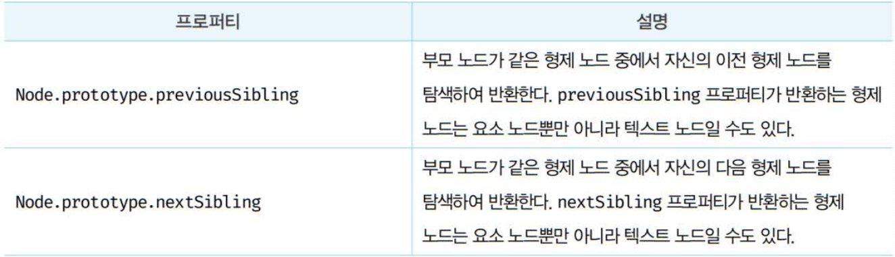
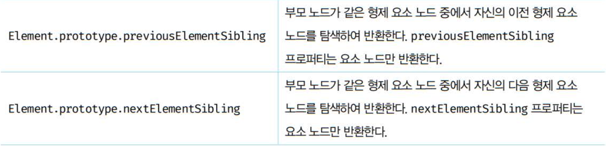

```html
<!DOCTYPE html>
<html>
  <body>
    <ul id="fruits">
      <li class="apple">Apple</li>
      <li class="banana">Banana</li>
      <li class="orange">Orange</li>
    </ul>
  </body>
  <script>
    // 노드 탐색의 기점이 되는 #fruits 요소 노드를 취득한다.
    const $fruits = document.getElementById("fruits");

    // #fruits 요소의 첫 번째 자식 노드를 탐색한다.
    // firstChild 프로퍼티는 요소 노드뿐만 아니라 텍스트 노드를 반환할 수도 있다.
    const { firstChild } = $fruits;
    console.log(firstChild); // #text

    // #fruits 요소의 첫 번째 자식 노드(텍스트 노드)의 다음 형제 노드를 탐색한다.
    // nextSibling 프로퍼티는 요소 노드뿐만 아니라 텍스트 노드를 반환할 수도 있다.
    const { nextSibling } = firstChild;
    console.log(nextSibling); // li.apple

    // li.apple 요소의 이전 형제 노드를 탐색한다.
    // previousSibling 프로퍼티는 요소 노드뿐만 아니라 텍스트 노드를 반환할 수도 있다.
    const { previousSibling } = nextSibling;
    console.log(previousSibling); // #text

    // #fruits 요소의 첫 번째 자식 요소 노드를 탐색한다.
    // firstElementChild 프로퍼티는 요소 노드만 반환한다.
    const { firstElementChild } = $fruits;
    console.log(firstElementChild); // li.apple

    // #fruits 요소의 첫 번째 자식 요소 노드(li.apple)의 다음 형제 노드를 탐색한다.
    // nextElementSibling 프로퍼티는 요소 노드만 반환한다.
    const { nextElementSibling } = firstElementChild;
    console.log(nextElementSibling); // li.banana

    // li.banana 요소의 이전 형제 요소 노드를 탐색한다.
    // previousElementSibling 프로퍼티는 요소 노드만 반환한다.
    const { previousElementSibling } = nextElementSibling;
    console.log(previousElementSibling); // li.apple
  </script>
</html>
```

<br>

---

<br>

## 39.4 노드 정보 취득

- 노드 객체에 대한 정보를 취득하려면 노드 정보 프로퍼티를 사용한다.

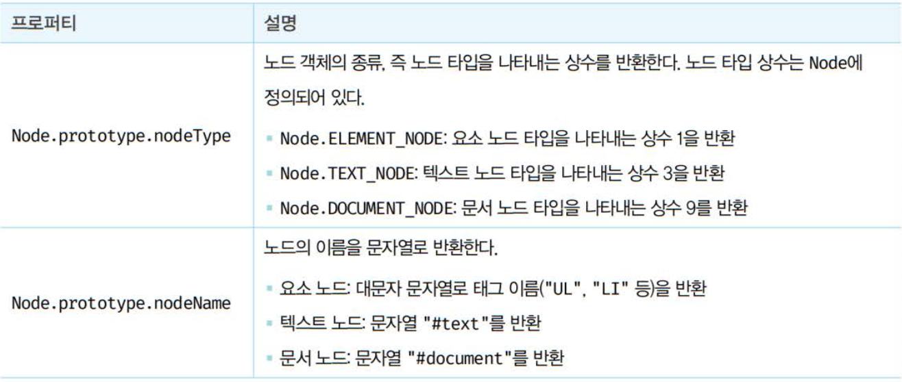

```html
<!DOCTYPE html>
<html>
  <body>
    <div id="foo">Hello</div>
  </body>
  <script>
    // 문서 노드의 노드 정보를 취득한다.
    console.log(document.nodeType); // 9
    console.log(document.nodeName); // #document

    // 요소 노드의 노드 정보를 취득한다.
    const $foo = document.getElementById("foo");
    console.log($foo.nodeType); // 1
    console.log($foo.nodeName); // DIV

    // 텍스트 노드의 노드 정보를 취득한다.
    const $textNode = $foo.firstChild;
    console.log($textNode.nodeType); // 3
    console.log($textNode.nodeName); // #text
  </script>
</html>
```

<br>

---

<br>

## 39.5 요소 노드의 텍스트 조작

<br>

### 39.5.1 nodeValue

- 앞서 살펴본 노드 탐색 및 정보 프로퍼티는 getter만 존재하는 읽기 전용 접근자 프로퍼티

- Node.prototype.nodeValue 프로퍼티는 setter와 getter 모두 존재하는 접근자 프로퍼티이므로 참조와 할당 모두 가능하다.

```html
<!DOCTYPE html>
<html>
  <body>
    <div id="foo">Hello</div>
  </body>
  <script>
    // 문서 노드의 nodeValue 프로퍼티를 참조한다.
    console.log(document.nodeValue); // null

    // 요소 노드의 nodeValue 프로퍼티를 참조한다.
    const $foo = document.getElementById("foo");
    console.log($foo.nodeValue); // null

    // 텍스트 노드의 nodeValue 프로퍼티를 참조한다.
    const $textNode = $foo.firstChild;
    console.log($textNode.nodeValue); // Hello
  </script>
</html>
```

<br>

- 텍스트 노드의 nodeValue 프로퍼티를 참조할 때만 텍스트를 반환한다.

- 텍스트 노드의 nodeValue 프로퍼티에 값을 할당하면 텍스트를 변경할 수 있다.

```html
<!DOCTYPE html>
<html>
  <body>
    <div id="foo">Hello</div>
  </body>
  <script>
    // 1. #foo 요소 노드의 자식 노드인 텍스트 노드를 취득한다.
    const $textNode = document.getElementById("foo").firstChild;

    // 2. nodeValue 프로퍼티를 사용하여 텍스트 노드의 값을 변경한다.
    $textNode.nodeValue = "World";

    console.log($textNode.nodeValue); // World
  </script>
</html>
```

<br>

### 39.5.2 textContent

- Node.prototype.textContent 프로퍼티는 요소 노드의 텍스트와 모든 자손 노드의 텍스트를 모두 취득하거나 변경한다.

- 요소 노드의 textContent 프로퍼티를 참조하면 요소 노드의 콘텐츠 영역(<>와 </>사이) 내 텍스트를 모두 반환한다. 이때 HTML 마크업은 무시된다.

```html
<!DOCTYPE html>
<html>
  <body>
    <div id="foo">Hello <span>world!</span></div>
  </body>
  <script>
    // #foo 요소 노드의 텍스트를 모두 취득한다. 이때 HTML 마크업은 무시된다.
    console.log(document.getElementById("foo").textContent); // Hello world!
  </script>
</html>
```

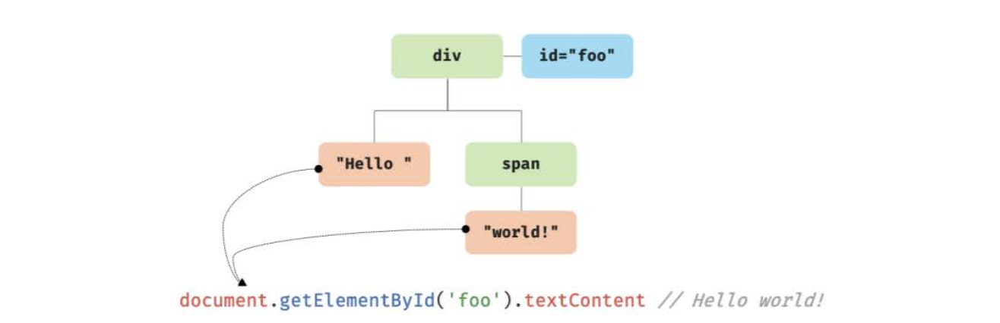

<br>

- 텍스트 노드의 nodeValue 프로퍼티를 참조하여도 텍스트를 취득할 수 있었다. 다만 textContent를 사용할 때와 비교해서 코드가 좀 더 복잡하다.

```html
<!DOCTYPE html>
<html>
  <body>
    <div id="foo">Hello <span>world!</span></div>
  </body>
  <script>
    // #foo 요소 노드는 텍스트 노드가 아니다.
    console.log(document.getElementById("foo").nodeValue); // null
    // #foo 요소 노드의 자식 노드인 텍스트 노드의 값을 취득한다.
    console.log(document.getElementById("foo").firstChild.nodeValue); // Hello
    // span 요소 노드의 자식 노드인 텍스트 노드의 값을 취득한다.
    console.log(document.getElementById("foo").lastChild.firstChild.nodeValue); // world!
  </script>
</html>
```

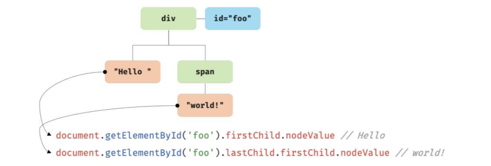

<br>

- 요소 노드의 콘텐츠 영역에 텍스트만 존재한다면 firstChild.nodeValue와 textContent 프로퍼티는 같은 결과를 반환한다. 후자를 사용하는 편이 코드가 간결하다.

```html
<!DOCTYPE html>
<html>
  <body>
    <!-- 요소 노드의 콘텐츠 영역에 다른 요소 노드가 없고 텍스트만 존재 -->
    <div id="foo">Hello</div>
  </body>
  <script>
    const $foo = document.getElementById("foo");

    // 요소 노드의 콘텐츠 영역에 자식 요소 노드가 없고 텍스트만 존재한다면
    // firstChild.nodeValue와 textContent는 같은 결과를 반환한다.
    console.log($foo.textContent === $foo.firstChild.nodeValue); // true
  </script>
</html>
```

<br>

- 요소 노드의 textContent 프로퍼티에 문자열을 할당하면 요소 노드의 모든 자식 노드가 제거되고 할당한 문자열이 텍스트로 추가된다.

- 할당한 문자열에 HTML 마크업이 포함되어 있어도 텍스트로 취급된다. 즉, HTML 마크업이 파싱되지 않는다.

```html
<!DOCTYPE html>
<html>
  <body>
    <div id="foo">Hello <span>world!</span></div>
  </body>
  <script>
    // #foo 요소 노드의 모든 자식 노드가 제거되고 할당한 문자열이 텍스트로 추가된다.
    // 이때 HTML 마크업이 파싱되지 않는다.
    document.getElementById("foo").textContent = "Hi <span>there!</span>";
  </script>
</html>
```

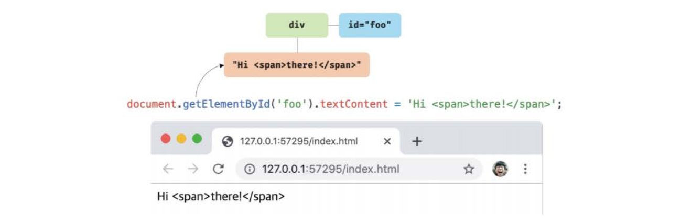

<br>

- textContent와 유사하게 동작하는 innerText 프로퍼티가 있지만, 1) CSS에 의해 visibility가 hidden이면 요소 노드의 텍스트를 반환하지 않고, 2) CSS를 고려하기 때문에 느리기 때문에 사용하지 않는 것이 좋다.

<br>

---

<br>

## 39.6 DOM 조작

- Dom 조작은 새로운 노드를 생성해서 DOM에 추가하거나 기존 노드를 삭제 또는 교체하는 것을 의미한다.
- DOM 조작에 의해 DOM에 새로운 노드가 추가되거나 삭제되면 리플로우와 리페인트가 발생하는 원인이 되므로 성능에 영향을 준다. 따라서 주의해서 다루어야 한다.

### 39.6.1 innerHTML

- `Element.prototype.innerHTML 프로퍼티`는 setter와 getter 모두 존재하는 접근자 프로퍼티이다.
- `innerHTML 프로퍼티`는 요소 노드의 HTML 마크업을 취득하거나 변경하는데, 요소 노드의 innerHTML 프로퍼티를 참조하면 콘텐츠 영역 내에 포함된 모든 HTML 마크업을 문자열로 반환한다. 아래의 코드로 확인 할 수 있다.

```js
<!DOCTYPE html>
<html>
  <body>
    <div id="foo">Hello <span>world!</span></div>
  </body>
  <script>
    // #foo 요소의 콘텐츠 영역 내의 HTML 마크업을 문자열로 취득한다.
    console.log(document.getElementById('foo').innerHTML);
    // "Hello <span>world!</span>"
  </script>
</html>
```

- `innerHTML 프로퍼티` 를 사용하면 아래처럼 HTML 마크업 문자열로 간단히 DOM 조작이 가능하다.

```js
<!DOCTYPE html>
<html>
  <body>
    <ul id="fruits">
      <li class="apple">Apple</li>
    </ul>
  </body>
  <script>
    const $fruits = document.getElementById('fruits');

    // 노드 추가
    $fruits.innerHTML += '<li class="banana">Banana</li>';

    // 노드 교체
    $fruits.innerHTML = '<li class="orange">Orange</li>';

    // 노드 삭제
    $fruits.innerHTML = '';
  </script>
</html>
```

- 하지만 **크로스 사이트 스크립팅 공격**에 취약하기때문에 사용에 주의하여야 한다!

- 크로스 사이트 스크립팅 공격에 예방하기위해 HTML 새니티제이션(HTML sanitization)인 `DOMPurify 라이브러리`의 사용을 권장한다.

> XSS(Cross-Site-Scripting)이란?
> 사이트 간 스크립팅(또는 크로스 사이트 스크립팅, 영문 명칭 cross-site scripting, 영문 약어 XSS)은 웹 애플리케이션에서 많이 나타나는 취약점의 하나로 웹사이트 관리자가 아닌 이가 웹 페이지에 악성 스크립트를 삽입할 수 있는 취약점이다.

### 39.6.2 insertAdjacentHTML 메서드

- `Element.prototype.insertAdjacentHTML(position, DOMString) 메서드`는 기존 요소를 제거하지 않고 위치를 지정해 새로운 요소를 삽입한다.
- `insertAdjacentHTML 메서드`의 첫 번째 인수로는 전달할 위치를 받는다. 이때 첫 번째 인수로 'beforebegin', 'afterbegin', 'beforeend', 'afterend' 이렇게 4가지를 받을 수 있다. 두 번째 인수로는 HTML 마크업 문자열을 파싱한다.

> beforebegin : 형제요소로 앞에
> afterbegin : 자식요소로 맨앞에
> beforeend : 자식요소로 맨뒤에
> afterend : 형제요소로 뒤에

```js
<!DOCTYPE html>
<html>
  <body>
    <!-- beforebegin -->
    <div id="foo">
      <!-- afterbegin -->
      text
      <!-- beforeend -->
    </div>
    <!-- afterend -->
  </body>
  <script>
    const $foo = document.getElementById('foo');

    $foo.insertAdjacentHTML('beforebegin', '<p>beforebegin</p>');
    $foo.insertAdjacentHTML('afterbegin', '<p>afterbegin</p>');
    $foo.insertAdjacentHTML('beforeend', '<p>beforeend</p>');
    $foo.insertAdjacentHTML('afterend', '<p>afterend</p>');
  </script>
</html>
```

### 39.6.3 노드 생성과 추가

- DOM은 노드를 직접 생성/삽입/삭제/치환하는 메서드도 제공한다.

- 아래의 예제 코드로 과정을 확인해보자.

```js
<!DOCTYPE html>
<html>
  <body>
    <ul id="fruits">
      <li>Apple</li>
    </ul>
  </body>
  <script>
    const $fruits = document.getElementById('fruits');

    // 1. 요소 노드 생성
    const $li = document.createElement('li');

    // 2. 텍스트 노드 생성
    const textNode = document.createTextNode('Banana');

    // 3. 텍스트 노드를 $li 요소 노드의 자식 노드로 추가
    $li.appendChild(textNode);

    // 4. $li 요소 노드를 #fruits 요소 노드의 마지막 자식 노드로 추가
    $fruits.appendChild($li);
  </script>
</html>
```

#### 1. 요소 노드 생성

- `createElement 메서드`로 요소 노드를 생성하고 반환한다.


- `createElement 메서드`로 생성한 요소 노드는 위 그림과 같이 기존 DOM에 추가되지 않고 따로 존재하는 상태이다.
- 따라서 생성된 요소 노드를 DOM에 추가하는 과정이 필요하다.

---

#### 2. 텍스트 노드 생성

- `createTextNode 메서드`를 사용하여 텍스트 노드를 생성하고 반환한다.


- 텍스트 노드는 요소 노드의 자식 노드이다. 하지만 아직 자식 노드로 추가되지 않을 것을 확인할 수 있다.
- 따라서 이후에 텍스트 노드를 요소 노드의 자식으로 추가하는 과정이 필요하다.

---

#### 3. 텍스트 노드를 요소 노드의 자식 노드로 추가

- `appendChild 메서드`는 매개변수 childNode에게 인수로 전달한 노드를 appendChild 메서드를 호출한 노드의 마지막 자식 노드로 추가한다.


- `appendChild 메서드`를 통해 요소 노드와 텍스트 노드를 부자 관계로 연결해주었다.

---

#### 4. 요소 노드를 DOM에 추가

- `appendChild 메서드`로 요소 노드를 기존 DOM에 연결시켜준다.


---

#### 39.6.4 복수의 노드 생성과 추가

- DOM을 여러번 변경하게 되면 그 때마다 리플로우와 리페인트가 실행된다. 이는 비효율적이기때문에 컨테이너 요소를 사용해서 문제를 해결할 수 있다.

```js
<!DOCTYPE html>
<html>
  <body>
    <ul id="fruits"></ul>
  </body>
  <script>
    const $fruits = document.getElementById('fruits');

    // 컨테이너 요소 노드 생성
    const $container = document.createElement('div');

    ['Apple', 'Banana', 'Orange'].forEach(text => {
      // 1. 요소 노드 생성
      const $li = document.createElement('li');

      // 2. 텍스트 노드 생성
      const textNode = document.createTextNode(text);

      // 3. 텍스트 노드를 $li 요소 노드의 자식 노드로 추가
      $li.appendChild(textNode);

      // 4. $li 요소 노드를 컨테이너 요소의 마지막 자식 노드로 추가
      $container.appendChild($li);
    });

    // 5. 컨테이너 요소 노드를 #fruits 요소 노드의 마지막 자식 노드로 추가
    $fruits.appendChild($container);
  </script>
</html>
```

- `createElement`로 전체의 큰 틀을 만들어서 그 안에 다 넣어서(1,2,3,4 과정) 한번만 추가(5번 과정)하면 리플로우를 한번만 실행하게되서 더욱 효율적이다!
  - 하지만 불필요한 컨테이너 요소도 추가되는 부작용이 있다.
- 이 문제점은 DocumentFragment 노드를 통해 해결할 수 있다.

- `DocumentFragment 노드`는 노드 객체의 일종으로, 부모 노드가 없어서 기존 DOM과는 별도로 존재한다는 특징이 있다.
- `DocumentFragment 노드`를 DOM에 추가하면 자신은 제거되고 자신의 자식 노드만 DOM에 추가된다.
  

#### 39.6.5 노드 삽입

**마지막 노드로 추가**

- `Node.prototype.appendChild 메서드`는 인수로 전달받은 노드를 자신을 호출한 노드의 마지막 자식 노드로 DOM에 추가한다. 단, 노드를 추가할 위치를 지정할 수 없고 언제나 마지막 자식 노드로 추가한다.

```js
<!DOCTYPE html>
<html>
  <body>
    <ul id="fruits">
      <li>Apple</li>
      <li>Banana</li>
    </ul>
  </body>
  <script>
    // 요소 노드 생성
    const $li = document.createElement('li');

    // 텍스트 노드를 $li 요소 노드의 마지막 자식 노드로 추가
    $li.appendChild(document.createTextNode('Orange'));

    // $li 요소 노드를 #fruits 요소 노드의 마지막 자식 노드로 추가
    document.getElementById('fruits').appendChild($li);
  </script>
</html>
```


---

**지정한 위치에 노드 삽입**

- `Node.prototype.insertBefore(newNode, childNode) 메서드`는 첫 번째 인수로 전달받은 노드를 두 번째 인수로 전달받은 노드 앞에 삽입한다.
- 두 번쨰 인수로 전달받은 노드는 반드시 insertBefore 메서드를 호출한 노드의 자식 노드여야한다.

```js
<!DOCTYPE html>
<html>
  <body>
    <ul id="fruits">
      <li>Apple</li>
      <li>Banana</li>
    </ul>
  </body>
  <script>
    const $fruits = document.getElementById('fruits');

    // 요소 노드 생성
    const $li = document.createElement('li');

    // 텍스트 노드를 $li 요소 노드의 마지막 자식 노드로 추가
    $li.appendChild(document.createTextNode('Orange'));

    // $li 요소 노드를 #fruits 요소 노드의 마지막 자식 요소 앞에 삽입
    $fruits.insertBefore($li, $fruits.lastElementChild);
    // Apple - Orange - Banana
  </script>
</html>
```


#### 39.6.6 노드 이동

- DOM에 이미 존재하는 노드를 appendChild 또는 insertBefore 메서드를 사용하여 DOM에 다시 추가하면 현재 위치에서 노드를 제거하고 새로운 위치에 노드를 추가한다. 즉, 노드가 이동한다.

```js
<!DOCTYPE html>
<html>
  <body>
    <ul id="fruits">
      <li>Apple</li>
      <li>Banana</li>
      <li>Orange</li>
    </ul>
  </body>
  <script>
    const $fruits = document.getElementById('fruits');

    // 이미 존재하는 요소 노드를 취득
    const [$apple, $banana, ] = $fruits.children;

    // 이미 존재하는 $apple 요소 노드를 #fruits 요소 노드의 마지막 노드로 이동
    $fruits.appendChild($apple); // Banana - Orange - Apple

    // 이미 존재하는 $banana 요소 노드를 #fruits 요소의 마지막 자식 노드 앞으로 이동
    $fruits.insertBefore($banana, $fruits.lastElementChild);
    // Orange - Banana - Apple
  </script>
</html>
```


#### 39.6.7 노드 복사

- `Node.prototype.cloneNode([deep: true | false]) 메서드`는 노드의 사본을 생성하여 반환한다.
- deep에 true를 인수로 전달하면 노드를 깊은 복사하여 모든 자손 노드가 포함된 사본을 생성하고, false를 전달하거나 생략하면 얕은 복사를 해서 노드 자신만의 사본을 생성한다.

```js
<html>
  <body>
    <ul id="fruits">
      <li>Apple</li>
    </ul>
  </body>
  <script>
    const $fruits = document.getElementById('fruits'); const $apple =
    $fruits.firstElementChild; // $apple 요소를 얕은 복사하여 사본을 생성.
    텍스트 노드가 없는 사본이 생성된다. const $shallowClone =
    $apple.cloneNode(); // 사본 요소 노드에 텍스트 추가
    $shallowClone.textContent = 'Banana'; // 사본 요소 노드를 #fruits 요소
    노드의 마지막 노드로 추가 $fruits.appendChild($shallowClone); // #fruits
    요소를 깊은 복사하여 모든 자손 노드가 포함된 사본을 생성 const $deepClone =
    $fruits.cloneNode(true); // 사본 요소 노드를 #fruits 요소 노드의 마지막
    노드로 추가 $fruits.appendChild($deepClone);
  </script>
</html>
```


#### 39.6.8 노드 교체

- `Node.prototype.replaceChild(newChild, oldChild) 메서드`는 자신을 호출한 노드의 자식 노드를 다른 노드로 교체한다.
  - 첫 번째 매개변수 newChild : 교체할 새로운 노드
  - 두 번째 매개변수 oldChild : 이미 존재하는 교체될 노드
- replaceChild 메서드는 자신을 호출한 노드의 자식인 oldChild 노드를 newChild 노드로 교체한다. oldChild 노드는 DOM에서 제거된다.

```js
<!DOCTYPE html>
<html>
  <body>
    <ul id="fruits">
      <li>Apple</li>
    </ul>
  </body>
  <script>
    const $fruits = document.getElementById('fruits');

    // 기존 노드와 교체할 요소 노드를 생성
    const $newChild = document.createElement('li');
    $newChild.textContent = 'Banana';

    // #fruits 요소 노드의 첫 번째 자식 요소 노드를 $newChild 요소 노드로 교체
    $fruits.replaceChild($newChild, $fruits.firstElementChild);
  </script>
</html>
```


#### 39.6.9 노드 삭제

- `Node.prototype.removeChild(child) 메서드`는 child 매개변수에 인수로 전달한 노드를 DOM에서 삭제한다.

---

### 39.7 어트리뷰트

#### 39.7.1 어트리뷰트 노드와 attributes 프로퍼티

- HTML 문서의 구성 요소인 HTML 요소는 여러 개의 어트리뷰트를 가질 수 있다.
- HTML 요소의 동작을 제어하기 위한 추가적인 정보를 제공한다.
- 대부분의 어트리뷰트는 모든 HTML 요소에서 사용될 수 있지만, type, value, checked 어트리뷰트는 input 요소에만 사용할 수 있는 경우도 있다.
- HTML 문서가 파싱될 때 HTML 요소의 어트리뷰트는 어트리뷰트 노드로 변환되어 요소 노드와 연결된다.

#### 39.7.2 HTML 어트리뷰트 조작

- HTML 어트리뷰트 값을 참조하려면 `Element.prototype.getAttribute(attributeName) 메서드`를 사용하고, HTML 어트리뷰트 값을 변경하려면 `Element.prototype.setAttribute(attributeName, attributeValue) 메서드`를 사용한다.

#### 39.7.3 HTML 어트리뷰트 vs DOM 프로퍼티

- **HTML 어트리뷰트와 DOM 프로퍼티는 대부분 1:1 대응한다.**

**HTML 어트리뷰트**

- HTML 어트리뷰트의 역할은 HTML 요소의 초기 상태를 지정하는 것이다.
  -> 즉, HTML 어트리뷰트 값은 HTML 요소의 초기 상태를 의미하며 이는 변하지 않는다.

**DOM 프로퍼티**

- 사용자가 입력한 최신 상태는 HTML 어트리뷰트에 대응하는 요소 노드의 DOM 프로퍼티가 관리한다.
- DOM 프로퍼티는 사용자의 입력에 의한 상태 변화에 반응하여 언제나 최신 상태를 유지한다.
- DOM 프로퍼티에 값을 할당하는 것은 사용자가 상태를 변경하는 행위와 같다.

#### 39.7.4 data 어트리뷰트와 dataset 프로퍼티

- data 어트리뷰트와 dataset 프로퍼티를 사용하면 HTML 요소에 정의한 사용자 정의 어트리뷰트와 자바스크립트 간에 데이터를 교환할 수 있다.

- data 어트리뷰트는 data-user-id. data-role과 같이 data- 접두사 다음에 이름을 붙여서 사용한다.

```js
<!DOCTYPE html>
<html>
<body>
  <ul class="users">
    <li id="1" data-user-id="7621" data-role="admin">Lee</li>
    <li id="2" data-user-id="9524" data-role="subscriber">Kim</li>
  </ul>
</body>
</html>
```

- dataset 프로퍼티는 HTML 요소의 모든 data 어트리뷰트의 정보를 제공하는 DOMStringMap 객체를 반환한다.
- DOMStringMap 객체는 data 어트리뷰트의 data- 접두사 뒤에 이름을 카멜 케이스로 변환한 프로퍼티를 가지고 있다.

```js
<!DOCTYPE html>
<html>
<body>
  <ul class="users">
    <li id="1" data-user-id="7621" data-role="admin">Lee</li>
    <li id="2" data-user-id="9524" data-role="subscriber">Kim</li>
  </ul>
  <script>
    const users = [...document.querySelector('.users').children];

    // user-id가 '7621'인 요소 노드를 취득한다.
    const user = users.find(user => user.dataset.userId === '7621');
    // user-id가 '7621'인 요소 노드에서 data-role의 값을 취득한다.
    console.log(user.dataset.role); // "admin"

    // user-id가 '7621'인 요소 노드의 data-role 값을 변경한다.
    user.dataset.role = 'subscriber';
    // dataset 프로퍼티는 DOMStringMap 객체를 반환한다.
    console.log(user.dataset); // DOMStringMap {userId: "7621", role: "subscriber"}
  </script>
</body>
</html>
```

- 만약 존재하지 않는 이름을 키로 사용하여 dataset 프로퍼티에 값을 할당하면 HTML 요소에 data 어트리뷰트가 추가된다.

```js
<!DOCTYPE html>
<html>
<body>
  <ul class="users">
    <li id="1" data-user-id="7621">Lee</li>
    <li id="2" data-user-id="9524">Kim</li>
  </ul>
  <script>
    const users = [...document.querySelector('.users').children];

    // user-id가 '7621'인 요소 노드를 취득한다.
    const user = users.find(user => user.dataset.userId === '7621');

    // user-id가 '7621'인 요소 노드에 새로운 data 어트리뷰트를 추가한다.
    user.dataset.role = 'admin';
    console.log(user.dataset);
    /*
    DOMStringMap {userId: "7621", role: "admin"}
    -> <li id="1" data-user-id="7621" data-role="admin">Lee</li>
    */
  </script>
</body>
</html>
```

### 39.8 스타일

#### 39.8.1 인라인 스타일 조작

- `HTMLElement.prototype.style 프로퍼티`는 setter와 getter 모두 존재하는 접근자 프로퍼티이며 요소 노드의 인라인 스타일을 취득하거나 추가 또는 변경한다.

```js
<!DOCTYPE html>
<html>
<body>
  <div style="color: red">Hello World</div>
  <script>
    const $div = document.querySelector('div');

    // 인라인 스타일 취득
    console.log($div.style); // CSSStyleDeclaration { 0: "color", ... }

    // 인라인 스타일 변경
    $div.style.color = 'blue';

    // 인라인 스타일 추가
    $div.style.width = '100px';
    $div.style.height = '100px';
    $div.style.backgroundColor = 'yellow';
  </script>
</body>
</html>
```

#### 39.8.2 클래스 조작

**className**

- `Element.prototype.className 프로퍼티`는 setter와 getter 모두 존재하는 접근자 프로퍼티이며 요소 노드의 인라인 스타일을 취득하거나 추가 또는 변경한다.
- className 프로퍼티는 문자열을 반환하기때문에 공백으로 구분된 여러 개의 클래스를 반환하는 경우 다루기가 불편하다.

**classList**

- `Element.prototype.classList 프로퍼티`는 class 어트리뷰트의 정보를 담은 DOMTokenList 객체를 반환한다.

```js
<!DOCTYPE html>
<html>
<head>
  <style>
    .box {
      width: 100px; height: 100px;
      background-color: antiquewhite;
    }
    .red { color: red; }
    .blue { color: blue; }
  </style>
</head>
<body>
  <div class="box red">Hello World</div>
  <script>
    const $box = document.querySelector('.box');

    // .box 요소의 class 어트리뷰트 정보를 담은 DOMTokenList 객체를 취득
    // classList가 반환하는 DOMTokenList 객체는 HTMLCollection과 NodeList와 같이
    // 노드 객체의 상태 변화를 실시간으로 반영하는 살아 있는(live) 객체다.
    console.log($box.classList);
    // DOMTokenList(2) [length: 2, value: "box blue", 0: "box", 1: "blue"]

    // .box 요소의 class 어트리뷰트 값 중에서 'red'만 'blue'로 변경
    $box.classList.replace('red', 'blue');
  </script>
</body>
</html>
```

- DOMTokenList 객체가 제공하는 메서드
  
  

#### 39.8.3 요소에 적용되어 있는 CSS 스타일 참조

- style 프로퍼티는 인라인 스타일만 반환하기 때문에 클래스를 적용한 스타일이나 상속을 통해 적용된 스타일은 style 프로퍼티로 참조할 수 없다.

### 39.9 DOM 표준


