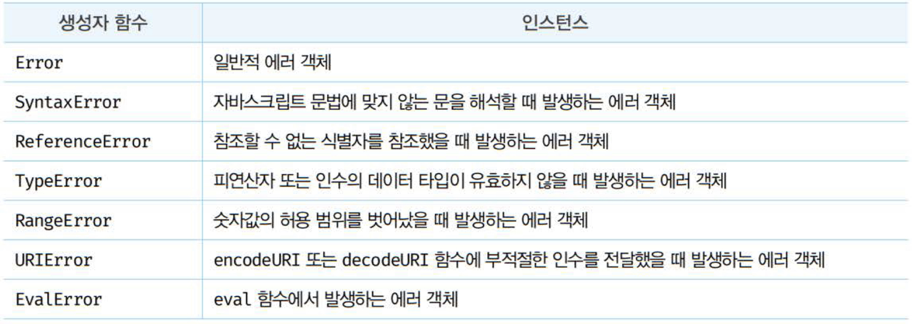
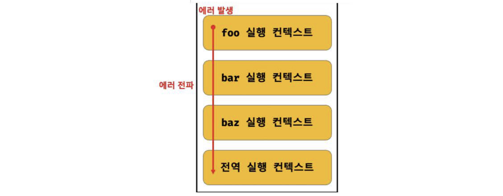

# 47장 에러 처리

<br>

## 47.1 에러 처리의 필요성

- 에러가 발생하지 않는 코드를 작성하는 것은 불가능
- 발생한 에러에 대처하지 않고 방치하면 프로그램 강제 종료됨

```js
console.log("[Start]");

foo(); // ReferenceError: foo is not defined
// 발생한 에러를 방치하면 프로그램은 강제 종료된다.

// 에러에 의해 프로그램이 강제 종료되어 아래 코드는 실행되지 않는다.
console.log("[End]");
```

<br>

- try...catch문을 사용해 에러에 적절히 대응하면 계속해서 코드를 실행시킬 수 있음

```js
console.log("[Start]");

try {
  foo();
} catch (error) {
  console.error("[에러 발생]", error);
  // [에러 발생] ReferenceError: foo is not defined
}

// 발생한 에러에 적절한 대응을 하면 프로그램이 강제 종료되지 않는다.
console.log("[End]");
```

<br>

- 직접적으로 에러를 발생시키지 않는 예외적인 상황에 적절히 대응하지 않으면 에러로 이어질 가능성이 큼

```js
// DOM에 button 요소가 존재하지 않으면 querySelector 메서드는 에러를 발생시키지 않고 null을 반환한다.
const $button = document.querySelector("button"); // null

$button.classList.add("disabled");
// TypeError: Cannot read property 'classList' of null
```

<br>

querySelector 메서드는 인수로 전달한 문자열이 CSS 선택자 문법에 맞지 않는 경우 에러를 발생시킨다.

```js
const $elem = document.querySelector("#1");
// DOMException: Failed to execute 'querySelector' on 'Document': '#1' is not a valid selector.
```

<br>

- querySelector 메서드는 인수로 전달한 CSS 선택자 문자열로 DOM에서 요소 노드를 찾을 수 없는 경우 에러를 발생시키지 않고 null을 반환한다.

- 이때 if 문 / 단축 평가 / 옵셔널 체이닝 연산자를 사용하지 않으면 다음 처리에서 에러로 이어질 가능성이 크다.

```js
// DOM에 button 요소가 존재하는 경우 querySelector 메서드는 에러를 발생시키지 않고 null을 반환한다.
const $button = document.querySelector("button"); // null
$button?.classList.add("disabled");
```

<br>

> 언제나 에러나 예외적인 상황이 발생할 수 있다는 것을 전제하고 이에 대응하는 코드를 작성하는 것이 중요하다.

<br>

---

<br>

## 47.2 try...catch...finally문

- 에러를 처리하는 두 가지 방법
  - 1. 예외적인 상황이 발생하면 반환하는 값(null 또는 -1)을 if문이나 단축평가, 옵셔널 체이닝 연산자를 통해 확인해서 처리하는 방법
  - 2. 에러 처리 코드를 미리 등록해두고 에러가 발생하면 에러 처리 코드로 점프하도록 하는 방법

<br>

> try...catch...finally문은 두 번째 방법이며 이 방법을 **"에러 처리(error handling)"**라 한다.

- 세 개의 코드 블록으로 구성된다 (finally문은 불필요하면 생략 가능)

```js
try {
  // 실행할 코드(에러가 발생할 가능성이 있는 코드)
} catch (err) {
  // err 변수 이름은 아무거나 상관 없음
  // try 코드 블록에서 에러가 발생하면 이 코드 블록의 코드가 실행된다.
  // err에는 try 코드 블록에서 발생한 Error 객체가 전달된다.
} finally {
  // 에러 발생과 상관없이 반드시 한 번 실행된다.
}
```

<br>

```js
console.log("[Start]");

try {
  // 실행할 코드(에러가 발생할 가능성이 있는 코드)
  foo();
} catch (err) {
  // try 코드 블록에서 에러가 발생하면 이 코드 블록의 코드가 실행된다.
  // err에는 try 코드 블록에서 발생한 Error 객체가 전달된다.
  console.error(err); // ReferenceError: foo is not defined
} finally {
  // 에러 발생과 상관없이 반드시 한 번 실행된다.
  console.log("finally");
}

// try...catch...finally 문으로 에러를 처리하면 프로그램이 강제 종료되지 않는다.
console.log("[End]");
```

<br>

---

<br>

## 47.3 Error 객체

- Error 생성자 함수는 에러 객체를 생성한다.
- Error 생성자 함수에는 에러를 상세히 설명하는 에러 메시지를 인수로 전달할 수 있다.

```js
const error = new Error("invalid");
```

<br>

Error 객체는 message 프로퍼티와 stack 프로퍼티를 갖는다:

- message 프로퍼티의 값: Error 생성자 함수에 인수로 전달한 에러 메시지
- stack 프로퍼티의 값: 에러를 발생시킨 콜스택의 호출 정보를 나타내는 문자열. 디버깅 목적으로 사용함.

<br>

자바스크립트는 7가지의 에러 객체를 생성할 수 있는 Error 생성자 함수를 제공한다. Error 생성자 함수를 제외한 여섯가지 생성자 함수가 생성한 에러 객체의 프로토타입은 모두 Error.prototype을 상속받는다.



```js
1 @ 1;    // SyntaxError: Invalid or unexpected token
foo();    // ReferenceError: foo is not defined
null.foo; // TypeError: Cannot read property 'foo' of null
new Array(-1); // RangeError: Invalid array length
decodeURIComponent('%'); // URIError: URI malformed
```

<br>

---

<br>

## 47.4 throw문

Error 생성자 함수로 에러 객체를 생성한다고 에러가 발생하는 것은 아니다.

> 에러 객체 생성과 에러 발생은 의미가 다르다.

```js
try {
  // 에러 객체를 생성한다고 에러가 발생하는 것은 아니다.
  new Error("something wrong");
} catch (error) {
  console.log(error);
}
```

<br>

에러를 발생시키려면 try 코드 블록에서 throw문으로 에러 객체를 던져야 한다.

```js
throw 표현식;
```

throw문의 표현식은 어떤 값이라도 상관 없지만 일반적으로 여러 객체를 지정한다. 에러를 던지면 catch문의 에러 변수가 생성되고 던져진 에러 객체가 할당된다. 그리고 catch 코드 블록이 실행되기 시작한다.

```js
try {
  // 에러 객체를 던지면 catch 코드 블록이 실행되기 시작한다.
  throw new Error("something wrong");
} catch (error) {
  console.log(error);
}
```

<br>

예를 들어, 외부에서 전달 받은 콜백 함수를 n번만큼 반복 호출하는 repeat 함수 구현해보자. repeat 함수는 두 번째 인수로 콜백 함수를 전달 받아야 한다. 두 번째 인수가 함수가 아니면 TypeError를 발생시키자.

repeat 함수는 에러를 발생시킬 가능성이 있으므로 try 코드 블록 내부에서 호출해야 한다.

```js
// 외부에서 전달받은 콜백 함수를 n번만큼 반복 호출한다
const repeat = (n, f) => {
  // 매개변수 f에 전달된 인수가 함수가 아니면 TypeError를 발생시킨다.
  if (typeof f !== "function") throw new TypeError("f must be a function");

  for (var i = 0; i < n; i++) {
    f(i); // i를 전달하면서 f를 호출
  }
};

try {
  repeat(2, 1); // 두 번째 인수가 함수가 아니므로 TypeError가 발생(throw)한다.
} catch (err) {
  console.error(err); // TypeError: f must be a function
}
```

<br>

---

<br>

## 47.5 에러의 전파

에러는 호출자 방향으로 전파된다. 즉, 에러는 콜스택의 아래 방향으로 전파된다.

```js
const foo = () => {
  throw Error("foo에서 발생한 에러"); // ④
};

const bar = () => {
  foo(); // ③
};

const baz = () => {
  bar(); // ②
};

try {
  baz(); // ①
} catch (err) {
  console.error(err);
}
```



throw된 에러를 캐치하지 않으면 호출자 방향으로 전파된다. 이때 throw된 에러를 캐치하여 적절히 대응하면 프로그램을 강제 종료시키지 않고 코드 실행 흐름을 복구할 수 있다. throw된 에러를 어디서도 캐치하지 않으면 프로그램은 강제 종료된다.

<br>

주의할 점!

비동기 함수인 setTimeout이나 프로미스 후속 처리 메서드의 콜백함수는 호출자가 없다.

setTimeout이나 프로미스 후속 처리 메서드의 콜백함수는는 태스크 큐나 마이크로태스크 큐에 일시 저장되었다가 콜 스택이 비면 이벤트 루프에 의해 콜 스택 최하단에 푸시되어 실행된다. 따라서 에러를 전파할 호출자가 존재하지 않는다.
